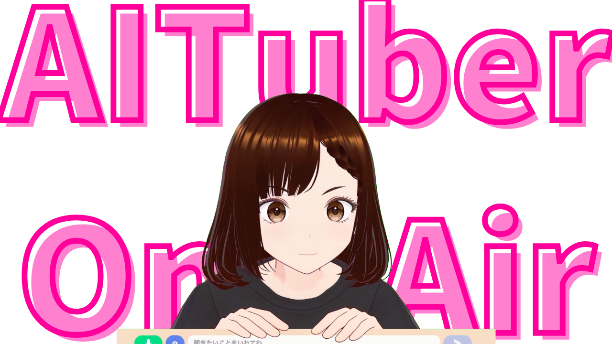
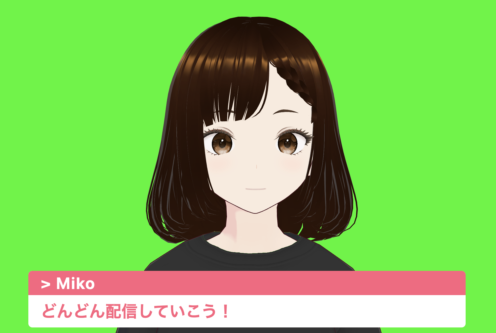
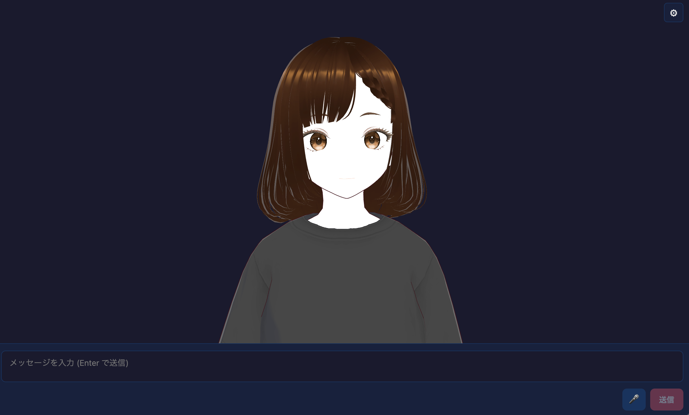
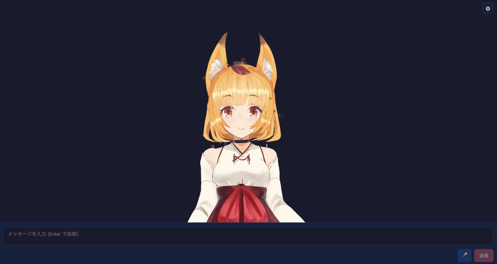
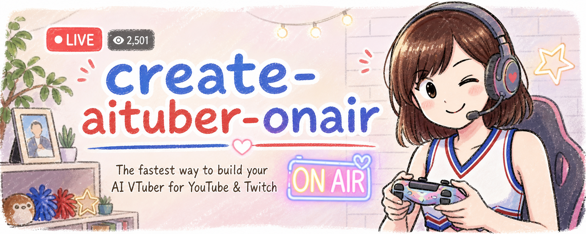
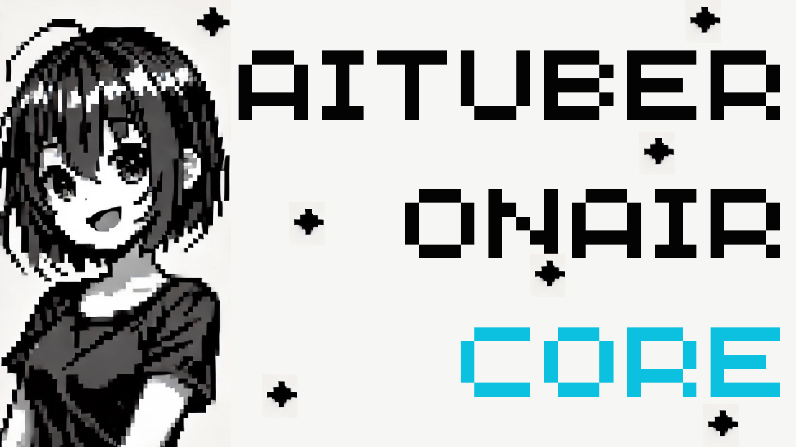
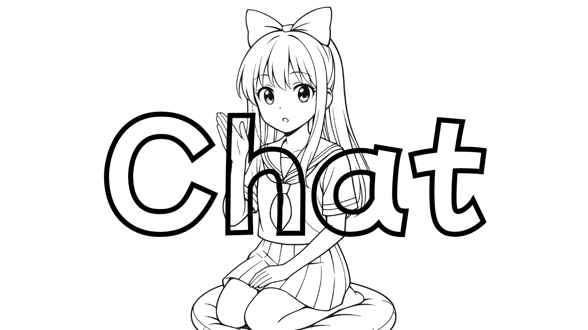
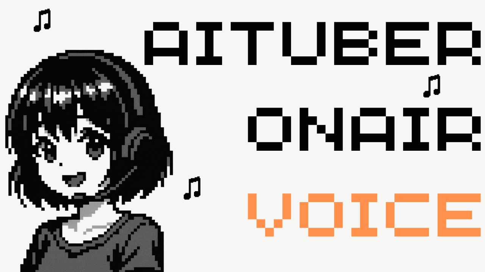

# AITuber OnAir

[](https://github.com/shinshin86/aituber-onair/actions/workflows/ci.yml)
[](https://deepwiki.com/shinshin86/aituber-onair)



[日本語版はこちら](./README_ja.md)

> **Build stream-ready AI VTubers with TypeScript**
>
> AITuber OnAir is an open source toolkit for building AI VTubers
> that can chat, speak, react to viewers, use memory, and run with
> PNG, VRM, or Live2D avatars. Start from the hosted web app, scaffold
> a starter app, self-host a working example, or assemble your own stack
> from modular TypeScript packages.

<p align="center">
  <a href="https://aituberonair.com">Try the hosted web app</a> ・
  <a href="./docs/quickstart.md">Quickstart</a> ・
  <a href="./docs/examples.md">Examples</a> ・
  <a href="./docs/avatar.md">Avatar Guide</a> ・
  <a href="#packages">Packages</a>
</p>



## What you can build

- AI VTubers that chat and speak with live viewers
- Streaming assistants that react to YouTube / Twitch comments
- AI character apps with text, voice, vision, and long-term memory
- Viewer relationship systems with points, levels, and achievements
- Browser- and Node.js-based integrations, composed from independent packages

## Start in 10 minutes

If you want the shortest path to a local AI VTuber:

```bash
npm create aituber-onair@latest my-aituber
cd my-aituber
npm run dev
```

Then open the app, choose a template, and configure your LLM / TTS provider
from **Settings**. See the [Quickstart](./docs/quickstart.md) for the full
walkthrough.

## Choose your path

### 1. Try the hosted web app

[AITuber OnAir](https://aituberonair.com) is a full, standalone AITuber streaming web app built on top of `@aituber-onair/core`. It's both the quickest way to experience the toolkit end-to-end and a working reference for what you can ship with it. No setup required.

### 2. Create a starter app

Use `create-aituber-onair` to scaffold your own app from the official
PNGTuber, VRM, Live2D, Pet, PuruPuru, PSD, or Inochi2D starter templates.

```bash
npm create aituber-onair@latest
```

The CLI asks for a project name, template, and whether to install
dependencies. You can also pass the project name up front:

```bash
npm create aituber-onair@latest my-aituber
cd my-aituber
npm run dev
```

For step-by-step setup and template selection, see
[Quickstart](./docs/quickstart.md).

### 3. Run an example app locally

Full, ready-to-run React apps built on `@aituber-onair/core`. Pick the
avatar style that fits your project. All of them share the same broad LLM / TTS
provider coverage and in-app **Settings** UI.

#### PNGTuber Chat — 2D PNG avatar


Swap in 4 PNG states (mouth/eyes open/close) and get real-time lip-sync driven from actual audio output. See [`packages/core/examples/react-pngtuber-app`](./packages/core/examples/react-pngtuber-app).

```bash
git clone https://github.com/shinshin86/aituber-onair.git
cd aituber-onair/packages/core/examples/react-pngtuber-app
npm install
npm run dev
```

#### PuruPuru PNGTuber Chat — 2D avatar with hair physics


Load a single-file `.purupuru` avatar package and get idle motion, blinking,
audio-driven lip-sync, hair spring physics, idle gaze turns with pseudo-depth
parallax, and emotion-driven reactions — no camera or tracking required. Miko,
the official AITuber OnAir character, is bundled as the default avatar. The
avatar format and motion design were created by rotejin in
[PuruPuruPNGTuber](https://github.com/rotejin/PuruPuruPNGTuber); this example is
an AITuber-oriented reimplementation. See
[`packages/core/examples/react-purupuru-app`](./packages/core/examples/react-purupuru-app).

```bash
git clone https://github.com/shinshin86/aituber-onair.git
cd aituber-onair/packages/core/examples/react-purupuru-app
npm install
npm run dev
```

#### VRM Chat — 3D VRM avatar



Render a 3D VRM avatar (`miko.vrm`) with optional idle VRMA animation, real-time mouth lip-sync driven from audio output, and camera controls (drag to rotate / wheel to zoom). See [`packages/core/examples/react-vrm-app`](./packages/core/examples/react-vrm-app).

```bash
git clone https://github.com/shinshin86/aituber-onair.git
cd aituber-onair/packages/core/examples/react-vrm-app
npm install
npm run dev
```

#### Live2D Chat — local Live2D folder loader


<p align="center">
  <small>
    Live2D sample model: Hiyori Momose. Illustration: Kani Biimu;
    Modeling: Live2D Inc. This content uses sample data owned and copyrighted
    by Live2D Inc. See
    <a href="https://www.live2d.com/en/learn/sample/">Live2D Sample Data</a>.
  </small>
</p>

Load a local Live2D model folder that contains `.model3.json`, render it in
the browser, and drive mouth movement from actual audio output volume. This
example intentionally does not bundle any Live2D assets. See
[`packages/core/examples/react-live2d-app`](./packages/core/examples/react-live2d-app).

```bash
git clone https://github.com/shinshin86/aituber-onair.git
cd aituber-onair/packages/core/examples/react-live2d-app
npm install
npm run dev
```

#### Inochi2D Chat — Inochi2D avatar (experimental)



Render an Inochi2D avatar on a WebGL stage with a prebuilt Inochi2D runtime, and
drive mouth movement from actual audio output volume. This example bundles the
Aka Inochi2D model for first-run display, and you can also load a local `.inx` /
`.inp` file or register another model in `public/inochi2d/manifest.json`. See
[`packages/core/examples/react-inochi2d-app`](./packages/core/examples/react-inochi2d-app).

```bash
git clone https://github.com/shinshin86/aituber-onair.git
cd aituber-onair/packages/core/examples/react-inochi2d-app
npm install
npm run dev
```

#### Pet Chat — animated Codex Pet-style sprite


Render a Codex Pet-compatible spritesheet, move it around the stage, and switch
animations from chat state, reply mood, and real-time audio volume. See
[`packages/core/examples/react-pet-app`](./packages/core/examples/react-pet-app).

```bash
git clone https://github.com/shinshin86/aituber-onair.git
cd aituber-onair/packages/core/examples/react-pet-app
npm install
npm run dev
```

#### PSD Tachie Chat — PSDTool / Anime2.5DRig-compatible 2D tachie avatar


Load a single PSD file at runtime, composite PSD layers on canvas, and drive
mouth/eye layers with real-time lip-sync and blinking. Supports both
PSDTool-style leading `!` forced-visible / leading `*` radio layers and
Anime2.5DRig-compatible layer names for motion mode. The bundled
`miko-anime25drig-cheer.psd` featuring Miko animates with zero setup. See
[`packages/core/examples/react-psd-app`](./packages/core/examples/react-psd-app).

```bash
git clone https://github.com/shinshin86/aituber-onair.git
cd aituber-onair/packages/core/examples/react-psd-app
npm install
npm run dev
```

#### Single Image Avatar Chat — audio-reactive motion

<p align="center">
  
  
</p>

Use one PNG or JPG and choose between jumping Bounce motion and gentler Puppet
Wobble motion driven by TTS output volume. The example includes illustration
and felt-puppet Miko images, plus a motion preview that works without an API
key. See
[`packages/core/examples/react-single-image-avatar-app`](./packages/core/examples/react-single-image-avatar-app).

```bash
git clone https://github.com/shinshin86/aituber-onair.git
cd aituber-onair/packages/core/examples/react-single-image-avatar-app
npm install
npm run dev
```

Open `http://localhost:5173` in any case, then set API keys and provider options in **Settings**.

See [Examples](./docs/examples.md) for the full example map and recommended
starting points.

### 4. Build your own with the packages

Install only what you need and drop it into your own app:

```bash
npm install @aituber-onair/chat
```

```ts
import { ChatServiceFactory } from '@aituber-onair/chat';

const chat = ChatServiceFactory.createChatService('openai', {
  apiKey: process.env.OPENAI_API_KEY!,
});

await chat.processChat(
  [{ role: 'user', content: 'Hello!' }],
  (partial) => process.stdout.write(partial),
  async (full) => console.log('\nDone:', full),
);
```

See each package README for provider setup and fuller usage.

## Documentation

- [Quickstart](./docs/quickstart.md): create a starter app, pick a template,
  configure providers, and run locally.
- [Examples](./docs/examples.md): choose from full AI VTuber apps, package
  examples, bot examples, and local runtime examples.
- [Avatar Guide](./docs/avatar.md): choose avatar styles and expand avatar
  expressions for richer AI character presentation.

## Packages

### [create-aituber-onair](./packages/create-aituber-onair/README.md)

<p align="center">
  
</p>

CLI for creating an AITuber OnAir app from an official starter template.
Includes PNGTuber, VRM, Live2D, Pet, PuruPuru, PSD, and Inochi2D templates.
Live2D does not bundle licensed model assets, and Inochi2D offers its large Aka
sample model as an optional integrity-checked download.
```bash
npm create aituber-onair@latest
```

### [@aituber-onair/core](./packages/core/README.md)

<p align="center">
  
</p>

Core runtime tying chat, voice, memory, and conversation context together for full AITuber experiences.
```bash
npm install @aituber-onair/core
```

### [@aituber-onair/chat](./packages/chat/README.md)

<p align="center">
  
</p>

Unified LLM layer across OpenAI, Claude, Gemini, Z.ai, Kimi, DeepSeek, Mistral, and OpenRouter — streaming, tool/function calling, vision, and MCP support included.
```bash
npm install @aituber-onair/chat
```

### [@aituber-onair/voice](./packages/voice/README.md)

<p align="center">
  
</p>

Standalone TTS library with VOICEVOX, VoicePeak, OpenAI TTS, MiniMax, AIVIS Speech, and more, plus emotion-aware synthesis.
```bash
npm install @aituber-onair/voice
```

### [@aituber-onair/transcription](./packages/transcription/README.md)

<p align="center">
  
</p>

Provider-neutral realtime microphone transcription with Web Speech and OpenAI
Realtime support through a shared session API.

```bash
npm install @aituber-onair/transcription
```

### [@aituber-onair/manneri](./packages/manneri/README.md)

<p align="center">
  
</p>

Detects repetitive conversation patterns and injects topic-diversification prompts to keep dialogue fresh.
```bash
npm install @aituber-onair/manneri
```

### [@aituber-onair/noise](./packages/noise/README.md)

<p align="center">
  
</p>

Post-generation rewrite engine that keeps AI character replies from landing too safely: detects predictable phrasing, builds structured friction, asks an LLM for rewrite candidates, and selects the safest non-generic response.
```bash
npm install @aituber-onair/noise
```

### [@aituber-onair/comment-intelligence](./packages/comment-intelligence/README.md)

<p align="center">
  
</p>

Filters live comments before they reach an AI character: selects one comment to answer, blocks unsafe input, summarizes ignored comments, and builds compact LLM context. Rules-first with optional LLM-assisted analysis.
```bash
npm install @aituber-onair/comment-intelligence
```

### [@aituber-onair/agent](./packages/agent/README.md)

<p align="center">
  
</p>

Embeddable runtime for giving an AI character a job inside your product:
host-controlled tools, policies, approvals, hooks, and events, with Chat and Codex app-server backends.

```bash
npm install @aituber-onair/agent
```

### [@aituber-onair/bushitsu-client](./packages/bushitsu-client/README.md)

<p align="center">
  
</p>

WebSocket chat client with React hooks, auto-reconnect, rate limiting, mentions, and voice integration. Browser and Node.js.
```bash
npm install @aituber-onair/bushitsu-client
```

### [@aituber-onair/kizuna](./packages/kizuna/README.md)

<p align="center">
  
</p>

Relationship / bond system (絆) for AI characters and viewers: points, achievements, emotion-based bonuses, level progression, persistent storage.
```bash
npm install @aituber-onair/kizuna
```

## Why AITuber OnAir

- Proven in production — powers [AITuber OnAir](https://aituberonair.com), a live AITuber streaming web app, so you're building on the same code path a real product ships on
- Pick any entry point: hosted web app, starter CLI, self-hosted example, or modular npm packages
- First-class coverage of the providers AITuber builders actually use — OpenAI / Claude / Gemini for chat, VOICEVOX / OpenAI TTS / AIVIS Speech and more for voice
- Chat, voice, streaming (YouTube / Twitch / WebSocket), and viewer relationships in a single, consistent stack
- MIT-licensed TypeScript — you keep control of hosting, data, and integrations

## Project structure

```txt
aituber-onair/
└── packages/
    ├── create-aituber-onair/ # npm create CLI with starter templates
    ├── core/             # AITuberOnAirCore, memory, orchestration
    ├── chat/             # LLM providers, streaming, tools, MCP
    ├── voice/            # TTS engines, emotion, playback
    ├── manneri/          # Conversation pattern detection
    ├── noise/            # Post-generation response rewriting
    ├── comment-intelligence/ # Live comment filtering and context building
    ├── agent/            # Embeddable AI-character agent runtime
    ├── bushitsu-client/  # WebSocket chat client + React hooks
    └── kizuna/           # Viewer relationship / bond system
```

## License

The software and documentation are licensed under the MIT License — see
[LICENSE](./LICENSE).

Bundled Miko avatar images, models, spritesheets, and packages are not covered
by the MIT License. They are governed by the authoritative Japanese
[Miko Character Usage Guidelines](https://miko.aituberonair.com/#terms); see
[Miko Asset Terms](./MIKO_ASSET_TERMS.md) for a short English summary. The assets may be distributed as an integral part of software, apps,
games, videos, websites, and other works or content, including third-party
projects. Standalone redistribution and asset collections are prohibited.

## Special Thanks

This project is based on [the work referenced here](https://x.com/shinshin86/status/1862806042603847905). Without the contributions of these pioneers, it would not exist.

---

## For contributors

Working on the monorepo itself:

```bash
git clone https://github.com/shinshin86/aituber-onair.git
cd aituber-onair
npm install
npm run build
npm run test
npm run fmt
```

### Agent Skills

Shared Agent Skills so Codex and Claude Code use the same workflow definitions.
See [`docs/agent-skills.md`](./docs/agent-skills.md) for the full guide,
including a
[copy-paste Google Colab local LLM request](./docs/agent-skills.md#google-colab-local-llm-quick-start).
Canonical sources live in `skills/`, with Claude Code runtime copies under
`.claude/skills/`.

### Releases

Releases are driven by manual version bumps + per-package `CHANGELOG.md`, published automatically by GitHub Actions on merge to `main`. Do **not** run `npm publish` directly.

- **Patch**: bug fixes, dependency updates
- **Minor**: new features, backward-compatible changes
- **Major**: breaking changes to public API

`release.yml` uses Changesets to publish packages, create tags (`@aituber-onair/<pkg>@x.y.z`), and create GitHub Releases for packages published in that run. If CI fails mid-run, re-running publishes the remainder but does **not** backfill Releases for already-published packages — create those manually from the package CHANGELOG (tag will already exist). `prerelease-next.yml` only updates the `next` prerelease tag.


## 🌐 Web Resources & Aesthetic Symbols Index
- [SYM 262D](https://dark-poetry-symbols-18.pages.dev/symbol/sym-262d/)
- [SYM 1F49B](https://moe-kaomoji-symbols-15.pages.dev/symbol/sym-1f49b/)
- [SYM 1D49F](https://coquette-aesthetic-symbols-29.pages.dev/symbol/sym-1d49f/)
- [SYM 1F620](https://simple-line-symbols-28.pages.dev/symbol/sym-1f620/)
- [SYM 2633](https://mech-gaming-tags-18.pages.dev/symbol/sym-2633/)
- [SYM 2672](https://moe-kaomoji-vault-94.pages.dev/symbol/sym-2672/)
- [SYM 2682](https://vintage-lace-fonts-79.pages.dev/symbol/sym-2682/)
- [SYM 1D450](https://vintage-bow-kaomoji-63.pages.dev/symbol/sym-1d450/)
- [SYM 1F648](https://cyber-clan-tags-15.pages.dev/symbol/sym-1f648/)
- [SYM 1F640](https://minimal-star-symbols-20.pages.dev/symbol/sym-1f640/)
- [SYM 1F92D](https://classic-poetry-fonts-16.pages.dev/symbol/sym-1f92d/)
- [SYM 26E0](https://soft-ribbon-fonts-77.pages.dev/symbol/sym-26e0/)
- [SYM 26CA](https://vintage-bow-kaomoji-63.pages.dev/symbol/sym-26ca/)
- [SYM 265F](https://synth-crosshair-text-47.pages.dev/symbol/sym-265f/)
- [TIKTOK CAPTIONS](https://mech-gaming-tags-18.pages.dev/ru/tiktok-captions/)
- [SYM 1F61D](https://classic-poetry-fonts-16.pages.dev/symbol/sym-1f61d/)
- [SYM 1F47D](https://neon-matrix-symbols-87.pages.dev/symbol/sym-1f47d/)
- [SYM 1D434](https://vintage-lace-fonts-79.pages.dev/symbol/sym-1d434/)
- [TENDER GENTLE TEAR KAOMOJI](https://soft-ribbon-fonts-77.pages.dev/symbol/tender-gentle-tear-kaomoji/)
- [SYM 2672](https://vintage-lace-fonts-79.pages.dev/symbol/sym-2672/)
- [SYM 1D47F](https://pure-dot-symbols-31.pages.dev/symbol/sym-1d47f/)
- [SYM 1D413](https://cyber-clan-tags-15.pages.dev/symbol/sym-1d413/)
- [SYM 273B](https://clean-unicode-text-68.pages.dev/symbol/sym-273b/)
- [SYM 26D3](https://vintage-bow-kaomoji-63.pages.dev/symbol/sym-26d3/)
- [SYM 1F634](https://soft-ribbon-fonts-77.pages.dev/symbol/sym-1f634/)
- [SYM 26F0](https://matrix-hacker-fonts-85.pages.dev/symbol/sym-26f0/)
- [OPEN CENTRE STAR](https://classic-poetry-fonts-16.pages.dev/symbol/open-centre-star/)
- [DISCORD STATUS](https://simple-line-fonts-11.pages.dev/discord-status/)
- [ES](https://neon-glitch-fonts-25.pages.dev/es/)
- [SYM 26DA](https://vintage-bow-kaomoji-63.pages.dev/symbol/sym-26da/)
- [GEORGIAN LOVE HEART](https://chibi-faces-hub-88.pages.dev/symbol/georgian-love-heart/)
- [SYM 26C0](https://neon-futuristic-symbols-20.pages.dev/symbol/sym-26c0/)
- [SYM 1D41A](https://synthwave-game-tags-66.pages.dev/symbol/sym-1d41a/)
- [COQUETTE BOW RIBBON](https://cyber-clan-tags-15.pages.dev/symbol/coquette-bow-ribbon/)
- [SYM 1D46D](https://clean-space-text-47.pages.dev/symbol/sym-1d46d/)
- [SYM 1D457](https://vintage-lace-fonts-79.pages.dev/symbol/sym-1d457/)
- [RIGHT MATHEMATICAL WHITE SQUARE BRACKET](https://lace-and-ribbon-text-61.pages.dev/symbol/right-mathematical-white-square-bracket/)
- [ZODIAC CELESTIAL](https://cyber-clan-tags-15.pages.dev/pt/zodiac-celestial/)
- [SYM 1F97A](https://vintage-lace-symbols-54.pages.dev/symbol/sym-1f97a/)
- [SYM 2630](https://gothic-bio-fonts-24.pages.dev/symbol/sym-2630/)
- [SYM 26BC](https://vintage-bow-kaomoji-63.pages.dev/symbol/sym-26bc/)
- [KAOMOJI](https://anime-sparkle-text-56.pages.dev/ru/kaomoji/)
- [BLACK FOUR POINT STAR](https://pastel-princess-fonts-68.pages.dev/symbol/black-four-point-star/)
- [CUPID FEATHERY ARROW](https://simple-line-symbols-28.pages.dev/symbol/cupid-feathery-arrow/)
- [SYM 1D499](https://synthwave-game-tags-66.pages.dev/symbol/sym-1d499/)
- [SAGITTARIUS ZODIAC ARCHER](https://mech-gaming-tags-18.pages.dev/symbol/sagittarius-zodiac-archer/)
- [SYM 2658](https://mecha-matrix-symbols-75.pages.dev/symbol/sym-2658/)
- [SYM 1F62E](https://lace-and-ribbon-text-61.pages.dev/symbol/sym-1f62e/)
- [SYM 1F480](https://lace-and-ribbon-text-61.pages.dev/symbol/sym-1f480/)
- [VIRGO ZODIAC MAIDEN](https://anime-sparkle-text-56.pages.dev/symbol/virgo-zodiac-maiden/)
- [BRACKETS](https://clean-unicode-text-68.pages.dev/ja/brackets/)
- [SYM 260A](https://pure-line-unicode-95.pages.dev/symbol/sym-260a/)
- [SYM 2675](https://gothic-bio-fonts-24.pages.dev/symbol/sym-2675/)
- [SYM 2668](https://minimal-star-symbols-28.pages.dev/symbol/sym-2668/)
- [SYM 1D458](https://moe-kaomoji-vault-94.pages.dev/symbol/sym-1d458/)
- [SYM 1D47C](https://kawaii-kaomoji-hub-45.pages.dev/symbol/sym-1d47c/)
- [SYM 1D406](https://kawaii-kaomoji-hub-45.pages.dev/symbol/sym-1d406/)
- [SYM 1D420](https://clean-space-text-47.pages.dev/symbol/sym-1d420/)
- [SYM 1F619](https://vintage-bow-kaomoji-63.pages.dev/symbol/sym-1f619/)
- [TIKTOK CAPTIONS](https://pastel-princess-fonts-68.pages.dev/pt/tiktok-captions/)
- [SYM 26FE](https://cyber-clan-tags-24.pages.dev/symbol/sym-26fe/)
- [MUSIC WEATHER](https://coquette-aesthetic-symbols-76.pages.dev/vi/music-weather/)
- [ZODIAC CELESTIAL](https://vintage-bow-kaomoji-63.pages.dev/vi/zodiac-celestial/)
- [SYM 1D492](https://aesthetic-bullet-points-76.pages.dev/symbol/sym-1d492/)
- [SYM 26EE](https://raven-gothic-text-44.pages.dev/symbol/sym-26ee/)
- [SYM 2638](https://gothic-bio-fonts-24.pages.dev/symbol/sym-2638/)
- [SYM 26D5](https://lace-and-ribbon-text-61.pages.dev/symbol/sym-26d5/)
- [SYM 1D439](https://vintage-lace-fonts-79.pages.dev/symbol/sym-1d439/)
- [SYM 1D45D](https://archival-rune-symbols-42.pages.dev/symbol/sym-1d45d/)
- [SYM 26AE](https://aesthetic-bullet-points-76.pages.dev/symbol/sym-26ae/)
- [BLACK FLORETTE FLOWER](https://classic-poetry-fonts-16.pages.dev/symbol/black-florette-flower/)
- [SYM 1F609](https://dollcore-bio-symbols-12.pages.dev/symbol/sym-1f609/)
- [CHEERING FIGHTING FIST KAOMOJI](https://simple-line-symbols-28.pages.dev/symbol/cheering-fighting-fist-kaomoji/)
- [SYM 26D5](https://synthwave-bio-maker-62.pages.dev/symbol/sym-26d5/)
- [SYM 1F922](https://mech-gaming-tags-18.pages.dev/symbol/sym-1f922/)
- [SYM 1F636](https://coquette-aesthetic-symbols-76.pages.dev/symbol/sym-1f636/)
- [SYM 1F638](https://clean-space-text-47.pages.dev/symbol/sym-1f638/)
- [SYM 265F](https://mecha-hacker-kaomoji-26.pages.dev/symbol/sym-265f/)
- [SYM 1FAE0](https://dollcore-bio-symbols-12.pages.dev/symbol/sym-1fae0/)
- [SYM 1F92A](https://lace-and-ribbon-text-61.pages.dev/symbol/sym-1f92a/)
- [SYM 2641](https://aesthetic-bullet-points-76.pages.dev/symbol/sym-2641/)
- [HEARTS](https://vintage-bow-fonts-72.pages.dev/vi/hearts/)
- [SYM 2670](https://minimal-star-symbols-95.pages.dev/symbol/sym-2670/)
- [SYM 1F63F](https://anime-sparkle-text-56.pages.dev/symbol/sym-1f63f/)
- [SYM 1F975](https://lace-and-ribbon-text-61.pages.dev/symbol/sym-1f975/)
- [CURVED HEART BLOOMY](https://delicate-pink-text-22.pages.dev/symbol/curved-heart-bloomy/)
- [SYM 1D41D](https://vintage-bow-kaomoji-63.pages.dev/symbol/sym-1d41d/)
- [SYM 1D490](https://synth-crosshair-text-47.pages.dev/symbol/sym-1d490/)
- [SYM 265C](https://mecha-matrix-symbols-75.pages.dev/symbol/sym-265c/)
- [SYM 1D466](https://zen-space-symbols-89.pages.dev/symbol/sym-1d466/)
- [HIGH VOLTAGE LIGHTNING](https://delicate-pink-text-22.pages.dev/symbol/high-voltage-lightning/)
- [SYM 1D445](https://aesthetic-bullet-points-76.pages.dev/symbol/sym-1d445/)
- [SYM 26F8](https://vintage-lace-symbols-54.pages.dev/symbol/sym-26f8/)
- [SYM 1D48C](https://aesthetic-bullet-points-76.pages.dev/symbol/sym-1d48c/)
- [SYM 1D497](https://gothic-bio-fonts-55.pages.dev/symbol/sym-1d497/)
- [SYM 1F62A](https://soft-ribbon-fonts-77.pages.dev/symbol/sym-1f62a/)
- [SYM 26B5](https://cyber-clan-tags-15.pages.dev/symbol/sym-26b5/)
- [SYM 1F49D](https://minimal-star-symbols-63.pages.dev/symbol/sym-1f49d/)
- [INSTAGRAM BIO](https://occult-runic-fonts-23.pages.dev/ja/instagram-bio/)
- [GAMING WEAPONS](https://gothic-bio-fonts-55.pages.dev/ru/gaming-weapons/)
- [SYM 1F62B](https://mecha-matrix-symbols-75.pages.dev/symbol/sym-1f62b/)
- [BRACKETS](https://pastel-princess-fonts-68.pages.dev/vi/brackets/)
- [CROSSED SWORDS](https://pastel-princess-fonts-68.pages.dev/symbol/crossed-swords/)
- [SYM 26A2](https://cyber-clan-tags-15.pages.dev/symbol/sym-26a2/)
- [DAGGER BLADE](https://soft-ribbon-fonts-77.pages.dev/symbol/dagger-blade/)
- [SYM 26A6](https://vintage-bow-fonts-72.pages.dev/symbol/sym-26a6/)
- [SYM 1D46B](https://minimal-star-symbols-20.pages.dev/symbol/sym-1d46b/)
- [SYM 26D6](https://kawaii-kaomoji-hub-45.pages.dev/symbol/sym-26d6/)
- [HEARTS](https://anime-sparkle-text-56.pages.dev/pt/hearts/)
- [SYM 1F499](https://vampiric-text-craft-82.pages.dev/symbol/sym-1f499/)
- [WHITE STAR](https://delicate-pink-text-22.pages.dev/symbol/white-star/)
- [SYM 2646](https://cyber-clan-tags-15.pages.dev/symbol/sym-2646/)
- [SYM 268F](https://minimal-star-symbols-63.pages.dev/symbol/sym-268f/)
- [STARS](https://pastel-princess-fonts-68.pages.dev/stars/)
- [SYM 268D](https://minimal-star-symbols-63.pages.dev/symbol/sym-268d/)
- [SYM 1D437](https://minimal-star-symbols-63.pages.dev/symbol/sym-1d437/)
- [SYM 1D47A](https://scholarly-unicode-vault-92.pages.dev/symbol/sym-1d47a/)
- [SYM 26D9](https://lace-and-ribbon-text-61.pages.dev/symbol/sym-26d9/)
- [SYM 1F607](https://gothic-bio-fonts-24.pages.dev/symbol/sym-1f607/)
- [HOLLOW STAR](https://delicate-pink-text-22.pages.dev/symbol/hollow-star/)
- [SYM 1F607](https://vampiric-text-craft-82.pages.dev/symbol/sym-1f607/)
- [SYM 26EE](https://vampiric-text-craft-82.pages.dev/symbol/sym-26ee/)
- [SUPER SHY BLUSHING KAOMOJI](https://classic-poetry-fonts-16.pages.dev/symbol/super-shy-blushing-kaomoji/)
- [SYM 26D6](https://lace-and-ribbon-text-61.pages.dev/symbol/sym-26d6/)
- [SYM 1D400](https://dark-scholarly-symbols-65.pages.dev/symbol/sym-1d400/)
- [SYM 268B](https://coquette-aesthetic-symbols-76.pages.dev/symbol/sym-268b/)
- [SYM 26E4](https://monochrome-bio-text-12.pages.dev/symbol/sym-26e4/)
- [SYM 1F61B](https://soft-angel-symbols-33.pages.dev/symbol/sym-1f61b/)
- [SYM 1D46D](https://synthwave-game-tags-66.pages.dev/symbol/sym-1d46d/)
- [SYM 1F61D](https://angel-core-bios-50.pages.dev/symbol/sym-1f61d/)
