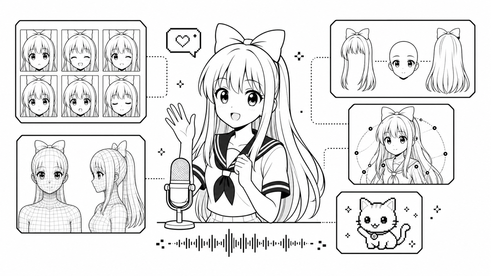

# Avatar Guide

[日本語版はこちら](./avatar.ja.md)

AITuber OnAir is not only a chat and voice toolkit. It is also a starting
point for building richer AI character presentation with PNG, PuruPuru
PNGTuber, VRM, Live2D, Inochi2D, PSD, and animated pet avatars.

This guide explains which avatar style to start with and where to extend avatar
assets when you want more expressive AI characters.

## Avatar Styles

### PNGTuber

Use PNGTuber assets when you want the shortest path to a lightweight 2D avatar.
The PNGTuber example uses four image states:

- eyes open / mouth closed
- eyes open / mouth open
- eyes closed / mouth closed
- eyes closed / mouth open

Start from
[`packages/core/examples/react-pngtuber-app`](../packages/core/examples/react-pngtuber-app).

### PuruPuru PNGTuber

Use PuruPuru PNGTuber when you want a livelier 2D avatar without preparing
tracking or 3D assets. A single `.purupuru` package combines six face states
with front/back hair layers, and the example drives idle motion, blinking,
audio lip-sync, hair spring physics, idle gaze turns, and emotion-driven
reactions. Miko, the official AITuber OnAir character, is bundled as the
default avatar. The avatar format and motion design were created by rotejin in
[PuruPuruPNGTuber](https://github.com/rotejin/PuruPuruPNGTuber).

Start from
[`packages/core/examples/react-purupuru-app`](../packages/core/examples/react-purupuru-app).

To create your own `.purupuru` avatar, you can use the ImageGen-based asset
production kit described below.

### VRM

Use VRM when you want a 3D avatar with camera control, idle motion, lip-sync,
and expression presets. The VRM example renders a local `.vrm` model and can
apply available expressions from reply emotion tags.

Start from
[`packages/core/examples/react-vrm-app`](../packages/core/examples/react-vrm-app).

### Live2D

Use Live2D when you already have a Cubism model folder and want a 2D character
with model-driven motion. The Live2D example loads a local `.model3.json` model
folder that you have the right to use.

Start from
[`packages/core/examples/react-live2d-app`](../packages/core/examples/react-live2d-app).

### Inochi2D

Use Inochi2D when you want to try a rigged 2D avatar on a WebGL stage. The
example loads `.inx` / `.inp` models and drives audio lip-sync, speaking
expressions when supported, drag and zoom controls, and tap or flick reactions.
It bundles the Aka model for first-run display, and motion-enabled models can be
registered through the manifest.

Start from
[`packages/core/examples/react-inochi2d-app`](../packages/core/examples/react-inochi2d-app).

### PSD

Use PSD when you want to load a layered 2D character from a single `.psd`
file. The PSD example composites layers on a canvas and binds mouth and eye
layers to audio lip-sync and blinking. Compatible files can use either
PSDTool-style static layer switching or Anime2.5DRig-compatible idle motion
and hair physics. A bundled motion sample works without additional setup.

Start from
[`packages/core/examples/react-psd-app`](../packages/core/examples/react-psd-app).

### Pet

Use the pet example when you want a compact animated companion instead of a
human-style avatar. It uses a Codex Pet-compatible spritesheet and changes
animation from chat state, reply mood, and audio volume.

Start from
[`packages/core/examples/react-pet-app`](../packages/core/examples/react-pet-app).

## Extending Avatar Expressions

AITuber OnAir examples are designed so richer avatar assets can improve the
final presentation without changing the core chat or voice pipeline.

## Related Tool: PuruPuru PNGTuber Asset Production Kit

The [PuruPuru PNGTuber Asset Production Kit](https://github.com/shinshin86/PuruPuruPNGTuber/tree/codex/add-imagegen-asset-production-kit/asset-production)
provides a production workflow for turning character images created with
ImageGen or manual editing into the layer structure expected by PuruPuru
PNGTuber.

Its character brief, ImageGen prompt templates, asset checklists, and layout
guides help you prepare the eight required images: six face states combining
two eye states with three mouth states, plus front and back hair layers. It also
includes templates for optional `items/` layers such as hair accessories, hats,
glasses, and body layers.

The finished assets are normalized as transparent PNGs on the same canvas and
at the same coordinates. The inspection harness checks required files, PNG
format, canvas sizes, transparency, and alignment differences between face
states, then produces a contact sheet and review JSON. Example prompts are
included for delegating character design, asset creation, inspection, and
`.purupuru` package creation to Codex and ImageGen.

Automated checks cannot determine whether front and back hair are separated
semantically, whether the drawing style stays consistent across expressions,
or whether deformation looks natural. Perform the final review and adjustment
in the PuruPuru PNGTuber browser app. After creating a `.purupuru` package,
start the AITuber OnAir PuruPuru PNGTuber example and choose the file from the
Visual section in Settings.

Check the rights and usage terms for generated images, source images, reference
images, and accessory artwork separately from the production kit's license.

For VRM avatars, the bundled example can use expression names such as `happy`,
`sad`, `surprised`, `relaxed`, `mouthSmileLeft`, `mouthSmileRight`,
`browInnerUp`, and eye-related expressions when the loaded VRM provides them.
Unsupported expressions are ignored gracefully, so a basic VRM still works, but
an expression-rich VRM can react more naturally.

## Related Tool: VRM Expression Agent Harness

[VRM Expression Agent Harness](https://github.com/shinshin86/vrm-expression-agent-harness)
is a companion repository for extending VRM expressions model by model with
Codex or Claude Code.

Use it when you have a VRM file and want to inspect the model internals,
identify available morph targets, derive code-addressable expression presets,
verify the result in a local WebUI, and document exactly what changed.

It is useful for preparing VRM models with:

- emotion presets such as `happy`, `angry`, `sad`, `relaxed`, and `surprised`
- visemes such as `aa`, `ih`, `ou`, `ee`, and `oh`
- blink expressions
- ARKit-like expression parts such as `jawOpen`, `mouthSmileLeft`,
  `mouthFrownRight`, `eyeWideLeft`, and `browInnerUp`

The harness is intentionally not a universal batch converter. Expression
quality depends on the actual VRM model: mesh layout, morph target names,
existing expression clips, and license constraints. The workflow is designed to
inspect and verify each model before producing an extended VRM.

After preparing an extended VRM, place it in the VRM example's `public/avatar/`
directory and update the loaded file path if needed.

## Related Tool: Live2D Motion WebUI

[live2d-add-motion-sample-web-ui](https://github.com/shinshin86/live2d-add-motion-sample-web-ui)
is a companion repository for generating and registering `.motion3.json`
motions within the parameters of an existing Live2D model, without using
Cubism Editor, and previewing them in a browser.

It analyzes the model's parameters, safe value ranges, and physics-driven
outputs, then generates motions from model-specific definitions. An independent
validator checks the generated files, and a headless Chrome workflow captures
peak poses for visual review. The repository also includes a working guide for
AI agents such as Codex and Claude Code, so you can delegate model setup, motion
design, generation, and verification.

The tool does not add new parameters, rigs, or meshes to a model. The motions
you can create and their quality depend on the parameters and existing motions
the model already provides, and each model needs its own motion definitions.

After generating and verifying motions, place the complete generated model
folder—including the updated `.model3.json` and all referenced assets—under
[`packages/core/examples/react-live2d-app/models/`](../packages/core/examples/react-live2d-app/models/).
Check the terms for the model and its source assets before moving, modifying,
publishing, or redistributing them.

## Related Resources and License Checks

These links explain the formats, tools, and related projects behind each avatar
style. Before reusing, modifying, publishing, or redistributing avatar assets,
check the terms for the specific tool, model, sample data, and source artwork
you use.

| Avatar style | Source or reference | Notes |
|---|---|---|
| PNGTuber | [Easy PNGTuber](https://github.com/rotejin/EasyPNGTuber) | Easy PNGTuber is an MIT-licensed tool for preparing four PNGTuber image states. The tool license does not decide the rights for the source character image or generated avatar assets, so check those separately. |
| PuruPuru PNGTuber | [PuruPuruPNGTuber](https://github.com/rotejin/PuruPuruPNGTuber) | PuruPuruPNGTuber is an Apache-2.0 local web app by rotejin for building rich PNGTubers from expression-swap PNGs and hair layers. The AITuber OnAir example is an AITuber-oriented reimplementation of its format and motion. The tool license does not decide the rights for source character images or generated avatar assets, so check those separately. |
| VRM | [vrm.dev](https://vrm.dev/en/) | vrm.dev is the official information site for VRM, a glTF-based 3D humanoid avatar format. Each `.vrm` model may include its own license metadata or external usage terms, so confirm the model-specific conditions before use. |
| Live2D | [Live2D](https://www.live2d.com/en/) | Live2D is the official site for Cubism tools and SDKs. Model assets, sample data, Cubism Editor, and Cubism SDK can be covered by separate terms, including the [sample data terms](https://www.live2d.com/en/learn/sample/model-terms/) and [SDK release license](https://www.live2d.com/en/sdk/license/). |
| Pet | [Codex Pets](https://developers.openai.com/codex/app/settings#codex-pets) | Codex Pets are optional animated companions in the Codex app. The AITuber OnAir pet example uses a Codex Pet-compatible spritesheet style; check the rights for any spritesheet artwork you create, adapt, or distribute. |

## Ready-to-use Miko Assets

If you want to try AITuber OnAir but do not yet have avatar assets, the project
provides free Miko assets:

[Miko Character Usage Guidelines and Downloads](https://miko.aituberonair.com/)

Miko is the official character of AITuber OnAir. The page provides assets such as
a VRM model, PNGTuber image states, and three-view reference images. The
PuruPuru PNGTuber example also bundles a ready-to-use Miko `.purupuru` package
as its default avatar. The linked
guideline page describes the current permissions, prohibited uses, attribution
guidance, and redistribution limits. Review the latest page before using,
modifying, sharing, or redistributing the assets.

Miko avatar assets bundled in this repository are not covered by the
repository's MIT License. The authoritative Japanese
[Miko Character Usage Guidelines](https://miko.aituberonair.com/#terms) permit
redistribution as an integral part of software, apps, games, videos, websites,
and other works or content, including third-party projects. Standalone
redistribution and asset collections are prohibited. See
[Miko Asset Terms](../MIKO_ASSET_TERMS.md) for a short English summary.

## License Notes

Generated or modified avatar assets may remain subject to the licenses and
usage terms of their source assets, tools, sample data, or reference artwork.
Before sharing an extended VRM, Live2D model, PNG avatar, or spritesheet, check
the relevant license and attribution requirements.
