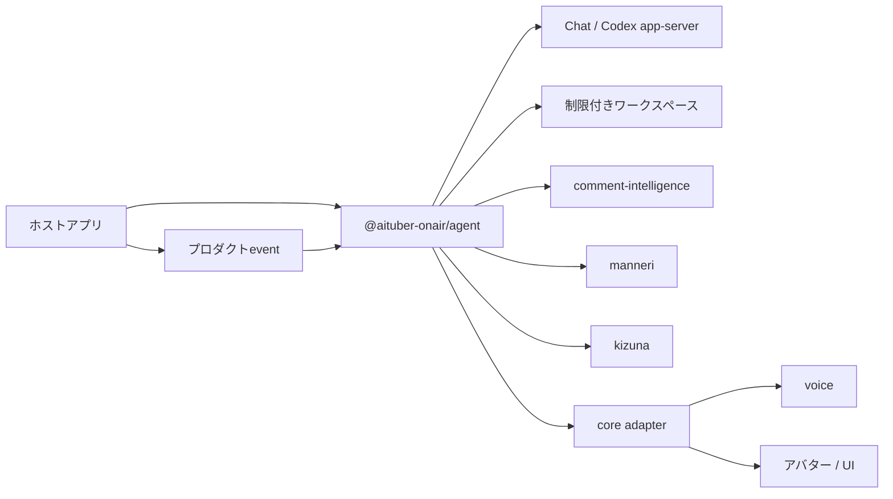

# @aituber-onair/agent

[English README](README.md) | [日本語版 README](README.ja.md)

JavaScript／TypeScriptプロダクトの中で、AIキャラクターに仕事を与えるための
組み込み型ランタイムです。

> [!NOTE]
> このパッケージは現在開発中です。まだ実際のLLMへ接続して動く、完成した
> AIエージェントとしては利用できません。以下は完成時に提供する機能の概要です。

## このパッケージについて

`@aituber-onair/chat`は、アプリケーションから言語モデルと会話するための
パッケージです。`@aituber-onair/agent`は、AIキャラクターをプロダクト内で働く
一員として管理できるようにすることを目的としています。キャラクターは与えられた
役割を理解し、自分の働き方を整理し、許可された能力を使い、必要なときは人間へ
判断を求めます。

ホストアプリは、次のものを与えます。

- キャラクターの人格と役割を説明する自然言語のbrief
- キャラクターが利用してよいTool、サービス、認証情報、ワークスペース
- 拒否または承認が必要な操作のルール
- キャラクターの仕事を開始・再開させるプロダクトevent

キャラクターは、与えられた範囲内で、メモ、手順、database、長期的な作業状態を
どのように構成するかを自分で選べるようになります。役職、責任、タスクキュー、
キャラクター記憶を、パッケージ固有のschemaへ当てはめる必要はありません。

Agentのライフサイクルと権限は、常にホストアプリが管理します。キャラクターが
自分で新しいTool、認証情報、network access、書き込み先を追加することは
できません。

## パーソナルAIアシスタントとの違い

[OpenClaw](https://docs.openclaw.ai/)や
[Hermes Agent](https://hermes-agent.nousresearch.com/docs/)は、主にユーザー個人の
ために働くAIアシスタントを、実行環境ごと提供するプロダクトです。
`@aituber-onair/agent`が想定するのは、すでに存在するプロダクトの中で、その
プロダクト専属のAIキャラクターを働かせるケースです。

| | パーソナルAIアシスタント | `@aituber-onair/agent` |
| --- | --- | --- |
| 誰のために働くか | 個人ユーザー | プロダクトやサービス |
| 提供形態 | Agentアプリ、サービス、Gateway | アプリへ組み込むnpmパッケージ |
| アイデンティティ | ユーザーのアシスタント | プロダクトが所有するキャラクター |
| ライフサイクル | 主にAgentランタイムが管理 | ホストアプリが管理 |
| 統合対象 | 汎用的なメッセージ、Tool、自動化 | プロダクトeventとAITuber OnAirパッケージ |

本パッケージは、OpenClawやHermes Agentの小型版や置き換えではありません。
AIアシスタント自体が製品ならパーソナルAIアシスタントを選びます。完成後の
本パッケージは、既存のJavaScript／TypeScriptプロダクトへ専属キャラクターを
組み込む用途を対象とします。

## 代表的なユースケース

### ライブ配信を監視・管理するAIスタッフ

同じキャラクターを、配信に出演する存在としてだけでなく、ライブ配信を非公開で
監視・支援するスタッフとしても動かせるようになります。

ホストアプリは、次のような処理を組み立てられるようになります。

1. YouTube、Twitch、WebSocketなどからコメントを受信する
2. `@aituber-onair/comment-intelligence`で安全性、重要度、話題、質問、
   重複を分析する
3. ホストが受け入れた分析結果と配信状態を、非公開の運営Sessionへ渡す
4. キャラクターに監視メモと作業手順を整理させる
5. 注意や人間の判断が必要な場合に、運営者へ通知する
6. 配信後にダッシュボードや通知UI向けの構造化レポートを作成する

ダッシュボード、配信platformとの接続、通知の配信はホストアプリが担当します。

現在の`stream-operations-staff`サンプルは、固定データを使った画面プロトタイプ
です。まだ実際のAgentは動いていません。

### プロダクトに常駐するAIキャラクター

たとえば次の用途を想定しています。

- コミュニティエリアを管理するゲームキャラクター
- 制作作業を整理するクリエイターツール内のキャラクター
- プロダクト固有の運用状況を学ぶ案内キャラクター
- 定型的な依頼へ対応し、例外だけ人間へ相談するブランドキャラクター

### ワークスペースで働くキャラクター

Node.jsアプリから、同じキャラクターをCodex app-serverなどの制限付き
ワークスペースへ接続できるようにします。キャラクターはその範囲内で自分の
働き方を構築できますが、sandbox、書き込み可能範囲、承認ルールはホストが
管理します。

視聴者コメントなどの公開入力を、ワークスペースへの命令として渡してはいけません。
高権限のワークスペースSessionへ渡せるのは、分析後にホストが選別または受け入れた
構造化情報だけです。

## 基本となる考え方

- **Brief:** キャラクターの人格、役割、目標、価値観、責任、行動範囲を自然言語で
  記述します。briefの内容はホストアプリが管理します。
- **利用可能な能力:** ホストが許可したTool、storage、サービス、network access、
  書き込み先です。キャラクターはこの中から必要なものを選べますが、範囲を
  広げることはできません。
- **ワークスペースと記憶:** キャラクターは、ファイル、database、外部memory
  serviceなどから、役割に合う方法を選べます。パッケージは一つの記憶形式を
  強制しません。
- **Session:** 会話や仕事の単位です。対象者、入力の信頼レベル、利用可能なToolを
  Sessionごとに分けます。公開会話と高権限の仕事は別Sessionで実行します。
- **人間との連携:** 根拠や権限が不足した場合、キャラクター自身が人間へ判断を
  求められます。それとは別に、承認必須の操作はランタイムが停止します。

## 責任範囲

Agentパッケージは、完成時に次を担当します。

- AgentとSessionのライフサイクル
- キャラクターbriefのバックエンドへの伝達
- SessionごとのTool公開範囲
- Toolの検証、実行、policy、承認フロー
- interrupt、timeout、終了処理
- ホストアプリ向けの構造化eventとartifact

ホストアプリは、引き続き次を担当します。

- YouTube、Twitchなどのplatform接続
- ダッシュボードと通知の配信
- schedulerとAgentを起動するevent
- 認証情報、storage上限、暗号化、backup、削除
- 外部操作や破壊的操作に対する最終判断

## Tool実行ルール

- `allowedTools`は、Sessionがバックエンドへ公開するTool定義を制御します。
  Toolが公開されていても、ホストが許可または承認要求のpolicyを設定しない限り、
  実行は既定で拒否されます。
- Tool入力schemaは、`type`、`properties`、`required`、`items`、`enum`、
  `description`、boolean値の`additionalProperties`に対応します。未対応のkeywordは
  無視せず、Agent作成時に拒否します。
- `sensitiveFields`には、ドット区切りのobject pathを指定できます。一致する入力値は
  Tool eventと承認eventでは秘匿化します。ホストのhandlerには、承認時と同じ入力値を
  固定した変更不可のsnapshotを渡します。
- Toolの成功、handler失敗、timeout、Turnのcancelは別々の結果として扱います。
  ホストが承認を拒否した場合、handlerは実行しません。timeout時はhandlerのsignalを
  abortしてTurnを失敗させます。JavaScriptではsignalを無視するhandlerを強制停止
  できないため、副作用を持つhandlerはcancelへ協調し、必要に応じて`toolCallId`を
  idempotency keyとして使用する必要があります。

## キャラクターのワークスペースを準備する

`agent.bootstrap()`は、キャラクターが役割を確認し、自分の作業状態を準備するための
非公開かつ制限付きのTurnを1回実行します。キャラクターは、ホストが許可したToolと
バックエンドのワークスペースを使い、ファイル、table、index、メモなどから適切な
表現を選べます。Agent coreは、その構成を固定しません。

```ts
import {
  createAgent,
  defineAgentTool,
  type AgentWorkspaceMetadataStore,
} from '@aituber-onair/agent';

const workspaceMetadata = {
  load: (agentId) => appDatabase.agentWorkspaces.get(agentId),
  save: async (metadata, expectedRevision) => {
    const saved = await appDatabase.agentWorkspaces.compareAndSet(
      metadata.agentId,
      expectedRevision,
      metadata
    );
    if (!saved) throw new Error('Workspace metadata changed concurrently.');
  },
} satisfies AgentWorkspaceMetadataStore;

const agent = createAgent({
  id: 'stream-staff-miko',
  brief: 'あなたはライブ配信の運営を担当するAIスタッフ、ミコです。',
  backend,
  tools: [workspaceRead, workspaceWrite],
  capabilityCatalog: [
    {
      id: 'workspace.local',
      kind: 'workspace',
      description: 'このキャラクターだけが使えるワークスペース',
      requiredTools: ['workspace.read', 'workspace.write'],
      limits: [{ name: 'maxBytes', value: 1_000_000, unit: 'bytes' }],
    },
  ],
  policy,
});

const bootstrap = await agent.bootstrap({
  workspace: workspaceMetadata,
  version: 'stream-operations-v1',
  allowedTools: ['workspace.read', 'workspace.write'],
  allowedCapabilities: ['workspace.local'],
  context: {
    trust: 'trusted',
    data: { product: 'stream-dashboard' },
  },
});
```

メタデータstoreが保存するのは、ホスト管理のライフサイクル状態だけです。状態は
`fresh`、`bootstrapping`、`ready`、`degraded`、`failed`のいずれかです。成功した
`version`は再実行せずに再開します。途中で失敗した場合は、以前のバックエンドSessionと
作成途中のワークスペースを引き継いで再試行できます。briefや必要な作業状態を変更した
場合は、`version`を更新します。

`save`は`expectedRevision`を比較し、recordの更新までをatomicに行う必要があります。
古いwriterは、新しいBootstrap状態を上書きせずに失敗させます。

Capability descriptorは、キャラクターが利用可能な能力を知るための情報であり、
権限そのものではありません。Capabilityは、必要な`requiredTools`がすべて公開される
場合だけ表示されます。各Tool callには、上記のランタイムpolicyと承認処理が引き続き
適用されます。Capabilityの数値上限は、ホストが与えた範囲を表します。ワークスペースの
byte数など、resource固有の上限は、そのresourceを所有するTool handlerまたは
バックエンドが強制します。各Bootstrap attemptは1 Turnだけです。`timeoutMs`はその
Turnを制限し、ランタイムはTool call数と再試行回数にも上限を適用します。メタデータstoreと
バックエンドSessionの開始・終了はホスト管理の処理であり、各実装側で適切なtimeoutと
cancelを適用する必要があります。product contextを渡すには、ホストが明示的に
`trust: 'trusted'`と宣言します。生の視聴者入力をtrustedにしたり、ワークスペース全体を
渡したりしてはいけません。

人間への相談は、固定のエスカレーションschemaではなく、通常のホストToolとして
用意できます。

```ts
const askOperator = defineAgentTool({
  id: 'human.ask',
  definition: {
    name: 'human_ask',
    description: '運営者の確認用inboxへ質問を追加する',
    parameters: {
      type: 'object',
      properties: { question: { type: 'string' } },
      required: ['question'],
      additionalProperties: false,
    },
  },
  risk: 'write',
  execute: ({ question }: { question: string }) =>
    operatorInbox.add({ question }),
});
```

ホストは、このローカルな確認依頼だけを許可し、外部操作や破壊的操作にはランタイムの
強制承認を求める、といった運用ができます。

## AITuber OnAir内での位置づけ



既存のAITuber OnAirパッケージは、これまでどおり単独でも利用できます。完成後の
Agentは、各パッケージのドメインロジックを取り込むのではなく、Tool、context、
hook、eventを通じて組み合わせる予定です。

## 対応予定のバックエンド

### ChatServiceバックエンド

`@aituber-onair/chat`と接続し、公開会話やアプリケーション固有の処理を実行する
予定です。各Sessionには、そのSessionで利用を許可されたToolだけを公開する
予定です。

### Codex app-serverバックエンド

Node.js専用のバックエンドとして、Codex app-serverを使った制限付き
ワークスペース作業に対応する予定です。キャラクターbriefはCodex本来の指示を
置き換えずに追加し、ワークスペース操作にはCodexのsandboxと承認設定を適用する
予定です。

基盤となるprotocolについては、公式の
[Codex App Server documentation](https://developers.openai.com/codex/app-server)
を参照してください。

## 状態の管理

| 状態 | 管理主体 |
| --- | --- |
| キャラクター人格と役割brief | ホストアプリ |
| キャラクターが作ったメモ、手順、database | ホスト管理のworkspace内で、キャラクターが内容を整理 |
| 現在の会話と仕事の状態 | Agent Sessionとバックエンド |
| 視聴者ごとの安全履歴 | `comment-intelligence` |
| 視聴者との関係性とポイント | `kizuna`またはホストが選んだサービス |
| 承認と外部操作の監査記録 | ホストアプリ |

## セキュリティ原則

- 視聴者コメントなどの公開入力を、信頼できないデータとして扱う
- 公開入力を、ホストからの指示やキャラクターbriefと分離する
- 分析結果は、ホストが検証して受け入れた場合だけ信頼できる情報として扱う
- 各Sessionへ公開するToolを必要最小限にする
- キャラクターが作った記憶、Skill、設定で権限を拡張させない
- 書き込み、外部送信、破壊的操作にはホストのpolicyと承認を要求する
- モデルの主張ではなくTool resultを操作成功の根拠にする
- API key、token、認証ファイルをeventやlogへ含めない
- 高権限のNode.jsバックエンドをブラウザ向けentry pointから分離する

## ライセンス

MIT
