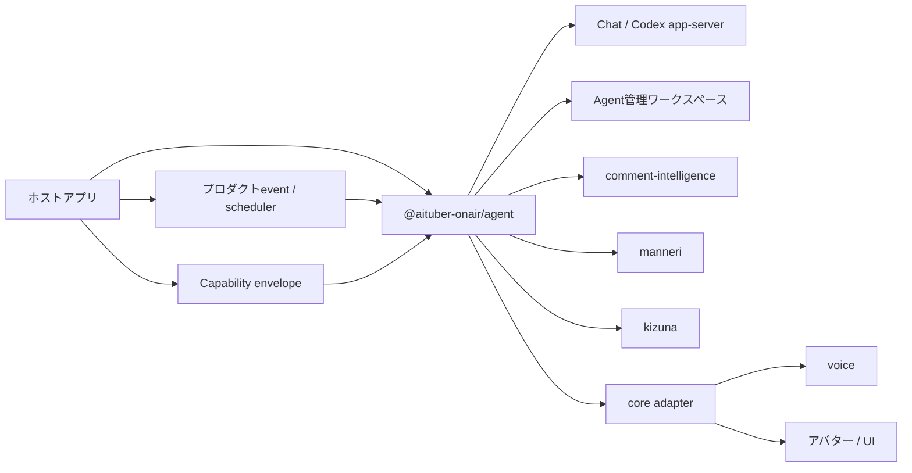

# @aituber-onair/agent

[English README](README.md) | [日本語版 README](README.ja.md)

JavaScript／TypeScriptプロダクトの中で、AIキャラクターに仕事を与えるための
組み込み可能なランタイムです。

このREADMEは、パッケージの公開設計契約を定義するもので、バージョンごとの
利用可否一覧ではありません。各動作の説明は、準拠する実装が満たすべき要件であり、
すべてのバージョンで記載した経路を実行できるという主張ではありません。型だけの
exportやbackendのcapability flagだけでは、end-to-endで利用できることを意味しません。

## 概要

`@aituber-onair/chat`は、言語モデルと会話するための統一インターフェースを
提供します。`@aituber-onair/agent`は、キャラクターが与えられた役割を理解し、
自分の働き方を組み立て、ホストプロダクトの境界内で行動するための
ライフサイクルと制御層を追加します。

ホストは次を提供します。

- キャラクター人格と依頼する役割を記述した自然言語のbrief
- 境界を定めたTool、サービス、認証情報、ワークスペースへのアクセス
- 強制されるpolicyと承認ルール
- Agentを起動または誘導するアプリケーションevent

Agentはその範囲内で、必要な能力を選択し、自分用のメモやデータ構造を作り、
手順を発展させ、有用な状態を保持し、役割や根拠が不足したときに人間へ相談
できます。パッケージは、役職、責任、タスクキュー、キャラクター記憶のschemaを
固定しません。

エージェンティックな行動は、常にホストアプリのライフサイクル内で行われます。
ホストはAgentを継続的に利用可能な状態へ置けますが、このパッケージが管理外の
daemonを作成したり、自分で認証情報を取得したり、モデルが作った状態を権限境界
として扱ったりすることはありません。

## パーソナルAIアシスタントとの違い

[OpenClaw](https://openclaw.ai/)や
[Hermes Agent](https://hermes-agent.nousresearch.com/)は、ユーザーが独立した
実行環境を持つ完成されたパーソナルAIアシスタントを求める場合の有力な選択肢
です。`@aituber-onair/agent`が主に対象とするのは別のユースケースです。
プロダクト開発者が、そのプロダクトに属するキャラクターへ役割を与え、既存の
JavaScript／TypeScriptアプリケーション内で働かせる場合に使用します。

| 観点 | OpenClawやHermes AgentなどのパーソナルAI | `@aituber-onair/agent` |
| --- | --- | --- |
| 主体 | ユーザーのために働くアシスタント | プロダクト内で働くキャラクター |
| 主な提供形態 | 完成されたAgentアプリ、サービス、Gateway | ホストアプリへ組み込むnpmパッケージ |
| ライフサイクルの所有者 | 通常はAgentランタイムが常駐プロセスと画面を管理 | ホストアプリがAgentを開始、再開、中断、終了 |
| アイデンティティ | 個人向けに調整されたアシスタント | 公開・非公開の役割を横断するプロダクト所有のキャラクター |
| 自己構成 | 個人アシスタント環境を整理 | ホストから与えられた能力の範囲内で仕事を整理 |
| 統合の中心 | 汎用channel、Tool、Skill、自動化 | typed eventとAITuber OnAirの音声、アバター、コメント、関係性パッケージ |
| 信頼モデル | 一般的なユーザー、channel、Tool制御 | 公開された未信頼入力と非公開の高権限Sessionを明示的に分離 |

本パッケージは、両プロジェクトの小型版や置き換えを目的としません。AI
アシスタントそのものが製品ならパーソナルAIランタイムを選び、すでに存在する
製品の中でAIキャラクターを生活・就業させたい場合は
`@aituber-onair/agent`を選びます。

バックエンド境界により、Agent harnessを競合ではなく実行エンジンとして扱う
余地も残します。同じキャラクターが、公開会話ではChatServiceを使い、制限付き
ワークスペース作業ではCodex app-serverを使っても、ホストは一つの
アプリケーションレベルの人格と権限モデルを維持できます。

## 代表的なユースケース

### ライブ配信を監視・管理するAIスタッフ

同じキャラクター人格を、視聴者と話す出演者としてだけでなく、ライブ配信を
監視し、配信運営を支援する非公開のAIスタッフとして動かせます。

ホストアプリは、次のような処理を組み立てられます。

1. YouTube、Twitch、WebSocketなどからコメントを受信する
2. `@aituber-onair/comment-intelligence`で安全性、重要度、話題、質問、
   重複を分析する
3. 信頼された分析結果と配信状態を運営Sessionへ渡す
4. キャラクター自身に監視メモと作業手順を整理させる
5. 注意事項、傾向、人間の判断が必要な事柄を運営者へ通知する
6. 配信後にダッシュボードや通知UI向けの構造化レポートを作成する

Agentは構造化event、メッセージ、artifactを返します。ダッシュボードの描画、
配信platform eventの受信、通知の配信はホストアプリが担当します。

### プロダクトに常駐するAIキャラクター

JavaScript／TypeScriptプロダクトは、Sessionをまたいでキャラクターを利用可能な
状態にし、アプリケーションeventから起動できます。たとえば次の用途です。

- コミュニティエリアを管理するゲームキャラクター
- 制作作業を整理するクリエイターツール内のキャラクター
- プロダクト固有の運用状況を学ぶ案内キャラクター
- 顧客へ対応し、例外だけ人間へ引き上げるブランドキャラクター

ホストが適切な能力を与えた場合、キャラクターは自分用のファイル、database
schema、チェックリスト、業務メモを設計できます。ホストが許可した
ワークスペース、network、認証情報、副作用の権限を自分で拡張することは
できません。

### キャラクター運営スタッフ

- 配信や制作で出たアイデアをメモへ整理する
- Agent自身が選んだ表現でフォローアップタスクを作成する
- 告知、返信、メール、SNS投稿の下書きを作る
- 成功した作業やユーザーの訂正から再利用可能な手順を発展させる
- 根拠または権限が不足した場合に人間へ判断を求める
- ランタイムpolicyが承認を要求する副作用操作を一時停止する

### ワークスペースキャラクター

Node.jsアプリから、同じキャラクター人格を制限付きのワークスペース
バックエンドへ接続できます。キャラクターは環境を調べ、適切な仕事の仕組みを
構築できますが、ワークスペース操作にはサンドボックス、書き込み可能範囲、
承認の制約が適用されます。

視聴者コメントをワークスペースへの命令として渡してはいけません。高権限
Sessionへ追加できるのは、ホストが明示的に選択したデータ、または信頼された
分析レイヤーが生成したデータだけです。

## パッケージの責務

設計上、Agentパッケージは次を担当します。

- Agentのアイデンティティと自然言語briefの伝達
- AgentとAgentSessionのライフサイクル
- 自己構成された状態のbootstrapと再開境界
- バックエンド能力の確認
- Toolの登録、検証、実行、結果処理
- Session単位のTool公開範囲
- 強制される権限policyと承認event
- cancellation、interrupt、timeout、dispose
- 構造化されたAgentEventとAgentArtifact

Agentパッケージは、意図的に次を定義しません。

- 役職、責任、タスク、エスカレーションのドメインモデル
- 必須となる一つの記憶schemaまたはdatabase engine
- `@aituber-onair/chat`が提供するLLM provider実装
- `comment-intelligence`のコメント安全性判定と優先度付け
- `manneri`のマンネリ検出
- `kizuna`の関係性スコア
- `core`の音声合成、アバター、アプリケーション統合
- YouTubeやTwitchのAPI client
- ダッシュボード描画
- OSのスケジューリング
- 制限のないshell、ファイル、network、認証情報へのアクセス

## AITuber OnAir内での位置づけ



| パッケージ | 主な責務 |
| --- | --- |
| `@aituber-onair/chat` | LLM provider向け会話・生成インターフェース |
| `@aituber-onair/agent` | キャラクター人格、自己構成、Session、強制権限、行動 |
| `@aituber-onair/core` | Agent／Chat出力と音声、アバター、アプリeventの接続 |
| `@aituber-onair/comment-intelligence` | コメント安全性、優先度、要約、Agentの判断材料 |
| `@aituber-onair/manneri` | 会話や返答案のマンネリ検出 |
| `@aituber-onair/noise` | キャラクター応答の後処理と表現調整 |
| `@aituber-onair/kizuna` | 視聴者との関係性とポイント |

各ドメインパッケージは単独でも利用できます。AgentはTool、hook、context、eventを
通じてそれらを組み合わせます。

## 公開型

base entry pointは、実行環境に依存しないAgent factory、型、型付きエラーを
公開します。

```ts
import { createAgent } from '@aituber-onair/agent';

const agent = createAgent({
  id: 'stream-operations-miko',
  brief: `
    あなたはライブ配信運営を担当するAIキャラクターのMikoです。
    落ち着いた人格を維持しながら、配信者が配信へ集中できるよう支援してください。
    自分用の業務メモと手順を整理し、観測事実と提案を分けてください。
    権限または根拠が不足した場合は運営者へ確認してください。
  `,
  backend,
  tools,
});
```

```ts
import type {
  Agent,
  AgentArtifact,
  AgentBackend,
  AgentBackendCapabilities,
  AgentBackendTool,
  AgentEvent,
  AgentHook,
  AgentPolicy,
  AgentRunInput,
  AgentRunResult,
  AgentSession,
  AgentToolSpec,
} from '@aituber-onair/agent';
```

バックエンド固有の型は、専用entry pointから読み込みます。

```ts
import type {
  ChatServiceBackend,
  ChatServiceBackendCapabilities,
  ChatServiceBackendOptions,
  ChatServiceFactoryInput,
} from '@aituber-onair/agent/chat';

import type {
  CodexAppServerBackend,
  CodexAppServerBackendCapabilities,
  CodexAppServerBackendOptions,
} from '@aituber-onair/agent/codex-app-server';
```

baseと`/chat` entry pointはブラウザで利用でき、Node.js固有のプロセス連携は
`/codex-app-server`の背後へ分離されます。

## コア概念

### Agent brief

briefは、キャラクター人格と与えられた役割を記述する自然言語の種です。名前、
背景、価値観、話し方、プロダクトとの関係、目標、責任、行動境界などを、
パッケージが定めるschemaへ分解せずに記述できます。

briefはホストが所有する権威ある入力です。Agentは自分用の業務メモを書き、
手順を改善できますが、生成した状態でbriefを暗黙に上書きしたり、新しい権限を
得たりすることはできません。

### Capability envelope

ホストは、Agentが利用可能なTool、storage、サービス、認証情報、network、
書き込み可能範囲、副作用の最大集合を決めます。Agentはその集合の中から必要な
能力を調べて選択できますが、範囲外の権限を作ることはできません。

Sessionの`allowedTools`が、バックエンドのモデルへ公開するTool descriptorを
制御します。policyを実装するruntimeでは、Agent自身のメモに異なる記述があっても、
そのpolicyが最終的な権限境界です。

### 自己構成とbootstrap

新しいワークスペースを初めて利用する際、対応するバックエンドはAgentが次を
行うのを支援できます。

1. briefを解釈する
2. 利用可能な能力とプロダクトcontextを調べる
3. 仕事の表現方法を選ぶ
4. 必要に応じてメモ、database、index、手順、チェックリストを作る
5. 役割を再開する方法を記録する
6. 構築結果をeventまたはartifactで報告する

これは固定フォルダやdatabase templateではなく、境界が定められ、繰り返し可能な
ライフサイクルです。ブラウザAgentはホスト提供のstorage Toolを利用でき、
Codex backendのAgentは許可されたfilesystem root内で作業できます。quota、暗号化、
削除、backup、migration policyはホストが所有します。

### Agent

一つの安定したアプリケーション上のアイデンティティとbriefに、バックエンド、
capability envelope、hook、強制policyを組み合わせた実行単位です。

同じAgentから、対象者と権限が異なる複数のSessionを作成できます。
`createAgent({ id, brief, backend, ... })`は、Sessionを開始する前にホスト所有の
定義を検証し、backend capabilityのsnapshotを作成します。

### AgentSession

会話または業務の状態を保持する単位です。Sessionは次を識別します。

- 目的と対象者
- 入力の信頼レベル
- 現在利用可能なTool
- 会話と一時context
- バックエンド側のSession ID
- 実行中のTurn

権限はキャラクターや自己作成したワークスペース状態ではなく、Sessionに属します。

### AgentBackend

LLMまたはAgent harnessとの接続を抽象化します。text、streaming、Tool、interrupt、
resume、approval、詳細eventなどのcapabilityを明示します。

利用できないcapabilityは暗黙に模倣せず、型付きエラーとして返します。

### Toolと強制policy

`AgentToolSpec`は、安定した論理ID、モデル向け定義、リスクレベル、handler、
timeout、機微field metadataを組み合わせます。runtimeはhandlerと強制用metadataを
保持し、backendへ渡すのは論理IDとモデル向け定義だけを持つ
`AgentBackendTool`です。

AgentはあるToolが役割に必要だと判断できますが、現在のSessionで呼び出せるかは、
Tool実行に対応するruntimeが決定します。そのpolicyはSession、信頼レベル、Tool、
引数、リスクに応じて`allow`、`deny`、`require-approval`を返します。モデルへの
指示とAgent自身が作った記憶は権限境界ではありません。

### ワークスペースと記憶

パッケージは、意味記憶、エピソード記憶、手続き記憶、関係性、タスク記憶の
interfaceを規定しません。適切な能力が利用可能な場合、Agentは役割に合った
通常ファイル、database、外部memory service、その他の表現を選択できます。

プロダクト固有の状態は既存の所有者に残します。たとえば視聴者の安全状態は
`comment-intelligence`が所有し、認証情報、監査記録、storageのライフサイクルは
ホストが所有します。

### 人間との連携

設計上、人間の関与を異なる二つの経路へ分離します。

- **ソフトエスカレーション:** Agentが根拠、権限、役割の明確さが不足していると
  判断し、ホスト提供の通信Toolで人間へ判断を求める
- **ハード承認:** ランタイムpolicyが副作用操作を停止し、ホストが承認要求を
  解決するまで待つ

Agentは前者を選択できますが、後者を迂回することはできません。

### AgentEvent

UI、log、音声システム、ダッシュボード向けのdiscriminated event語彙です。
SessionとTurnのライフサイクル、メッセージ、Tool実行、承認要求、artifact、
interrupt、失敗、終了を扱い、各runtimeは宣言したcapabilityに対応するeventを
出力します。

eventは進行状況と結果を公開し、モデルの非公開推論は含めません。Agentが作った
業務状態は、ホストが許可したToolまたはbackend resultで確認された場合にのみ、
信頼できる実行証拠になります。

## 信頼境界とSession分離

同じキャラクター人格を共有しても、Session間で権限を共有しません。

### 出演者Session

- 入力: 視聴者コメントなどの未信頼データ
- 目的: 安全な会話と配信進行
- Tool: コメント分析、返答レビュー、関係性参照
- 禁止: shell、ファイル変更、外部投稿、認証済みサービスへの書き込み

### ライブ配信運営スタッフSession

- 入力: 配信者の依頼と信頼された分析結果
- 目的: 監視、整理、提案、レポート作成
- Tool: Agentワークスペース、分析、下書き、読み取り系連携
- 書き込み: 強制policyと承認の対象

### ワークスペースSession

- 入力: 所有者または運営者の明示的な依頼
- 目的: リポジトリやローカル作業の支援
- バックエンド: Codex app-serverなど
- アクセス: サンドボックス、承認、書き込み可能範囲で制御
- UI: 対象、作業ディレクトリ、diff、承認内容を表示

`inputTrust`はホストの申告であり、型システムが証明するものではありません。
ホストが記述する`instruction`、会話データの`input`、補助情報の`context`を別の
fieldにします。未信頼入力は、Agent briefの書き換え、非公開能力の有効化、
Tool呼び出しの許可を行えません。

## 実行原則

この設計に準拠する実行経路は、次の保証を満たします。

1. ホストが安定したID、自然言語brief、バックエンド、capability envelopeから
   Agentを作成する
2. 新しいAgentは与えられたワークスペース内に業務状態をbootstrapし、再開する
   Agentは既存状態を読み込む
3. ホストがSessionを開始し、命令を会話inputとcontextから分離して渡す
4. ランタイムがSessionのtrustと強制Tool policyを適用する
5. バックエンドへ、そのSessionから見える能力だけを渡す
6. handler実行前にTool引数を検証する
7. 承認が必要な副作用操作を一時停止する
8. Agentはホスト提供の人間連携Toolを通じて曖昧さをエスカレーションできる
9. Tool resultをバックエンドへ戻してTurnを継続する
10. ホストがeventとartifactをUI、音声、アバター、storage、次回の起動へ接続する

外部操作の成功は、Toolまたはbackend resultが返った場合にのみ確定します。

## バックエンド境界

### ChatServiceBackend

Chat backend契約は`@aituber-onair/chat`の`ChatService`interfaceと接続します。ホストが
Session単位のfactoryを渡し、そのfactoryはSessionから見えるprovider-safeなTool
定義だけを受け取ります。

`@aituber-onair/chat`はoptional peer dependencyであり、利用アプリは必要な
バックエンドパッケージだけをインストールできます。

### CodexAppServerBackend

Codex app-server backend契約は、Node.js専用の`/codex-app-server` entry pointに
属します。利用アプリはCodex実行ファイルのパスを明示するか、PATH探索へ
opt-inします。

Agent briefはCodexのbase instructionsを置き換えず、高優先度のキャラクター・
役割命令へ変換します。ワークスペース操作にはバックエンドのサンドボックスと
承認フローを適用します。

基盤となるprotocolについては、公式の
[Codex App Server documentation](https://developers.openai.com/codex/app-server)
を参照してください。

## Toolとhook

Toolを実行する実装は、文書化されたJSON Schema subsetを使用します。未対応の
Schema keywordは無視せず拒否し、不正な入力をhandlerへ渡しません。

hookに対応する実装では、input、context構築、Tool実行、返答案review、output
後処理、Turn完了後の記録にhookを使用します。各hookは
`onError: 'fail-turn' | 'skip'`を宣言します。安全性、検証、redaction、承認を
担うhookは`fail-turn`を使用し、失敗時に出力やTool実行を続行しません。

代表的な組み合わせは次のとおりです。

- `comment-intelligence`: input前処理またはコメント分析Tool
- `manneri`: 返答案の送信前review
- `noise`: キャラクター表現のoutput後処理
- `kizuna`: 関係性contextとTurn完了後の更新

## 状態の所有権

| 状態 | 主な所有者 |
| --- | --- |
| 権威ある人格・役割brief | ホストアプリ |
| Agentが作った業務メモ、手順、database | 与えられたワークスペース内のAgent |
| 現在のTurnと会話状態 | AgentSessionとバックエンド |
| 視聴者ごとの安全履歴 | `comment-intelligence` |
| 関係性データとポイント | `kizuna`またはホストが選択したサービス |
| 承認、外部操作、失敗の監査 | ホストアプリ |

ホストは永続化境界、暗号化、quota、削除、backup、ユーザーによる確認を管理します。
Agentが管理できるのは、その境界内にある自分の業務状態の構成だけです。

## セキュリティ原則

- 視聴者コメントと公開されたプロダクト入力は未信頼データとして扱う
- 未信頼データをAgentへの命令と権威あるbriefから分離する
- trust labelはホストの申告であり、証明ではないものとして扱う
- Agentが選択できる能力をホストが与えた範囲内に限定する
- 自己作成した記憶、Skill、設定で権限を拡張させない
- Tool allowlistはSessionごとに最小化する
- 書き込み、外部送信、破壊的操作には明示的なpolicyを要求する
- 承認画面には操作、対象、理由、作業ディレクトリを表示する
- モデルの主張ではなくTool resultを操作成功の根拠にする
- API key、token、認証ファイルをeventやlogへ含めない
- 長時間操作と自己構成にcancellation、timeout、quota、上限を設定する
- safety hookまたはSchema validationの失敗時はfail-closedにする
- 実験的なバックエンド機能は安定APIから分離する
- 高権限バックエンドはブラウザ向けentry pointから読み込まない

## 互換性方針

- 自然言語briefをprovider固有のprompt形式から分離する
- 役割、タスクキュー、記憶システムへパッケージ固有schemaを要求しない
- バックエンド固有機能はcapabilityと専用subpathへ分離する
- 実験的機能には明示的なopt-inを要求する
- 既存のAITuber OnAirパッケージを単独でも利用できる状態に保つ
- provider SDKは必須依存にせず、利用アプリが必要なものだけを導入する
- 外部Agent runtimeは、検証済みadapterがない限り対応を主張しない

## ライセンス

MIT
