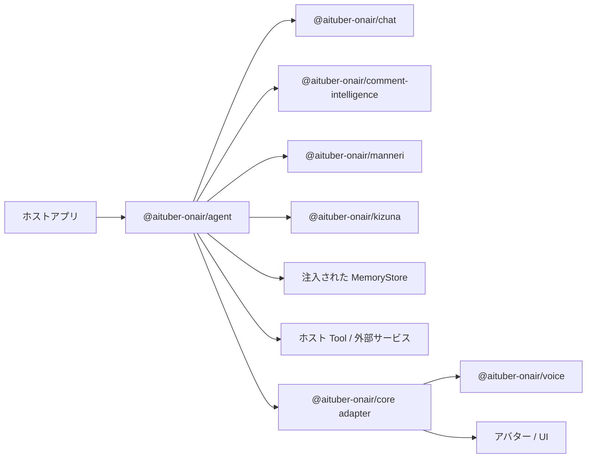

# @aituber-onair/agent

[English README](README.md) | [日本語版 README](README.ja.md)

キャラクター人格、Session、記憶、Tool、権限、承認、イベントを組み合わせ、
AI キャラクターが継続的かつ制御された行動を取るためのエージェント
ランタイムです。

## 概要

`@aituber-onair/chat`は、言語モデルと会話するための統一インターフェースを
提供します。`@aituber-onair/agent`は、同じキャラクター人格を持つ AI
スタッフを動かすために、次のランタイム概念を追加します。

- 持ち運び可能なキャラクター設定
- 対象者と権限が異なる Session
- ホストが管理する Tool と承認ポリシー
- 所有者を明確にしたメモリー
- 通常実行とストリーミング実行のイベント
- 専用 entry point で分離されたバックエンド能力

エージェンティックな行動は、常にホストアプリのライフサイクルと管理範囲内で
行われます。パッケージが管理外のバックグラウンドプロセスを作成したり、
モデルへ暗黙に Tool 権限を与えたりすることはありません。

## 代表的なユースケース

### ライブ配信を監視・管理する AI スタッフ

同じキャラクター人格を、視聴者と話す出演者としてだけでなく、ライブ配信を
監視し、配信運営を支援する非公開の AI スタッフとして動かせます。

ホストアプリは、次のような処理を組み立てられます。

1. YouTube、Twitch、WebSocket などからコメントを受信する
2. `@aituber-onair/comment-intelligence`で安全性、重要度、話題、質問、
   重複を分析する
3. 分析結果を配信状態と運営ポリシーに組み合わせる
4. 注意事項、質問の傾向、注目コメント、話題の変化を運営者へ通知する
5. 配信後にダッシュボードや通知 UI 向けの構造化レポートを作成する

Agent は構造化イベント、メッセージ、artifact を返します。ダッシュボードの
描画と通知の配信はホストアプリが担当します。

### クリエイター向け AI スタッフ

- 配信や制作で出たアイデアをメモに整理する
- 次回までの ToDo を作成する
- 告知、返信、メール、SNS 投稿の下書きを作る
- ホストが提供する Tool で過去の決定や好みを検索する
- 外部へ影響する操作をユーザー承認まで一時停止する

### キャラクター運営アシスタント

- 会話のマンネリ化を送信前に検査する
- 視聴者との関係性に応じて応答方針を変える
- キャラクターらしさを保ちながら、安全上必要な表現へ調整する
- 配信中と配信後で、同じ人格の役割と利用 Tool を切り替える

### ワークスペースエージェント

Node.js アプリから、同じキャラクター人格を制限付きのワークスペース
バックエンドへ接続できます。ワークスペース操作には専用 Session を使用し、
サンドボックス、書き込み可能範囲、承認の制約を適用します。

視聴者コメントをワークスペースへの命令として渡してはいけません。運営者向け
Session へ追加できるのは、信頼された分析レイヤーが生成した構造化データです。

## パッケージの責務

Agent パッケージは次を担当します。

- CharacterProfile とバックエンド命令への人格変換
- Agent と AgentSession のライフサイクル
- Tool の登録、検証、実行、結果処理
- Session 単位の Tool 公開範囲
- 権限ポリシーと承認イベント
- バックエンド能力の確認
- メモリーインターフェースと明示的なコンテキスト選択
- cancellation、interrupt、timeout、dispose
- 構造化された AgentEvent と AgentArtifact

次の責務は Agent パッケージに含めません。

- `@aituber-onair/chat`が提供する LLM provider 実装
- `comment-intelligence`のコメント安全性判定と優先度付け
- `manneri`のマンネリ検出
- `kizuna`の関係性スコア
- `core`の音声合成、アバター、アプリケーション統合
- YouTube や Twitch の API client
- ダッシュボード描画
- OS のスケジューリング
- 制限のないシェルまたはファイルアクセス

## AITuber OnAir 内での位置づけ



| パッケージ                            | 主な責務                                         |
| ------------------------------------- | ------------------------------------------------ |
| `@aituber-onair/chat`                 | LLM provider 向け会話・生成インターフェース     |
| `@aituber-onair/agent`                | 人格、Session、Tool、記憶、Policy、承認、行動   |
| `@aituber-onair/core`                 | Agent/Chat 出力と音声、アバター、アプリの接続   |
| `@aituber-onair/comment-intelligence` | コメント安全性、優先度、要約、Agent の判断材料 |
| `@aituber-onair/manneri`              | 会話や返答案のマンネリ検出                      |
| `@aituber-onair/noise`                | キャラクター応答の後処理と表現調整              |
| `@aituber-onair/kizuna`               | 視聴者との関係性とポイント                      |

各ドメインパッケージは単独でも利用できます。Agent は Tool、hook、context、
event を通じてそれらを組み合わせます。

## 公開型

base entry point は、実行環境に依存しない Agent factory、型、型付きエラーを
公開します。

```ts
import { createAgent } from '@aituber-onair/agent';

import type {
  Agent,
  AgentArtifact,
  AgentBackend,
  AgentBackendCapabilities,
  AgentEvent,
  AgentHook,
  AgentMemoryStore,
  AgentPolicy,
  AgentRunInput,
  AgentRunResult,
  AgentSession,
  AgentToolSpec,
  CharacterProfile,
} from '@aituber-onair/agent';
```

バックエンド固有の型は、専用 entry point から読み込みます。

```ts
import type {
  ChatServiceBackend,
  ChatServiceBackendCapabilities,
  ChatServiceBackendOptions,
  ChatServiceFactoryInput,
} from '@aituber-onair/agent/chat';

import type {
  CodexAppServerBackend,
  CodexAppServerBackendCapabilities,
  CodexAppServerBackendOptions,
} from '@aituber-onair/agent/codex-app-server';
```

base と`/chat` entry point はブラウザで利用でき、Node.js 固有のプロセス連携は
`/codex-app-server`の背後へ分離されます。

## コア概念

### CharacterProfile

次の情報を持つ、持ち運び可能なキャラクター定義です。

- ID と表示名
- 役割と自己認識
- 特徴、価値観、優先事項
- 話し方、語彙、禁止表現
- ユーザーとの関係
- 境界と行動原則

CharacterProfile は provider 固有の prompt 文字列ではありません。
バックエンド adapter が適切な命令形式へ変換します。

### Agent

一つの CharacterProfile に、バックエンド、Tool、メモリー、hook、policy を
組み合わせた実行単位です。

同じ Agent から、目的と権限が異なる複数の Session を作成できます。
`createAgent({ character, backend, ... })`で作成し、Session を開始する前に
CharacterProfile の検証と backend capability の snapshot を行います。

### AgentSession

会話または業務の状態を保持する単位です。Session は次を識別します。

- 目的と対象者
- 入力の信頼レベル
- 利用可能な Tool
- 会話と一時コンテキスト
- バックエンド側の Session ID
- 実行中の Turn

権限はキャラクターではなく Session に属します。

### AgentBackend

LLM またはエージェントハーネスとの接続を抽象化します。text、streaming、
Tool、interrupt、resume、approval、詳細 event などの capability を明示します。

利用できない capability は暗黙に模倣せず、型付きエラーとして返します。

### AgentToolSpec

次の要素を組み合わせた Tool 定義です。

- policy と監査 event で使う安定した論理 Tool ID
- モデルへ提示する定義
- リスクレベル
- ホスト側 handler
- timeout
- 機微フィールドの metadata

`comment-intelligence`と`manneri`が公開する Tool 定義の所有権は各パッケージに
残し、Agent の Tool 登録と構造互換にします。

### AgentPolicy

Session、信頼レベル、Tool、引数、操作リスクに応じて、`allow`、`deny`、
`require-approval`のいずれかを返します。

Policy はランタイムコードで強制します。モデルへの指示は権限境界では
ありません。

### AgentMemoryStore

明示的に保存する JSON serializable なデータへ、名前空間付きの`get`、`set`、
`delete`、`list`を提供します。

会話履歴、キャラクター記憶、関係性データ、安全状態、業務メモは、それぞれ
所有者と保持方針を分けます。視聴者ごとの安全状態は
`comment-intelligence`が所有します。

### AgentEvent

UI、ログ、音声システム、ダッシュボード向けの discriminated union です。
次の event を扱います。

- `session.started`、`session.resumed`
- `turn.started`、`turn.completed`、`turn.interrupted`、`turn.failed`
- `message.delta`、`message.completed`
- `tool.requested`、`tool.started`、`tool.completed`
- `approval.requested`、`approval.resolved`
- `artifact.created`
- `session.closed`

event は進行状況と結果を公開し、モデルの非公開推論は含めません。

## 信頼境界と Session 分離

同じキャラクター人格を共有しても、Session 間で権限を共有しません。

### 出演者 Session

- 入力: 視聴者コメントなどの未信頼データ
- 目的: 安全な会話と配信進行
- Tool: コメント分析、返答レビュー、関係性参照
- 禁止: シェル、ファイル変更、外部投稿、認証済みサービスへの書き込み

### ライブ配信運営スタッフ Session

- 入力: 配信者の依頼とフィルタリング済み分析結果
- 目的: 要約、整理、提案、レポート作成
- Tool: メモ、ToDo、下書き、分析、読み取り系連携
- 書き込み: policy と承認の対象

### ワークスペース Session

- 入力: 所有者または運営者の明示的な依頼
- 目的: リポジトリやローカル作業の支援
- バックエンド: Codex app-server など
- アクセス: サンドボックス、承認、書き込み可能範囲で制御
- UI: 対象、作業ディレクトリ、diff、承認内容を表示

`inputTrust`はホストの申告であり、型システムが証明するものではありません。
ホストが記述する`instruction`、会話データの`input`、補助情報の`context`を
別フィールドにし、Tool policy と承認を最終的なセキュリティ境界とします。

## 実行原則

1. ホストが AgentSession を開始または再開する
2. ホストの命令を会話 input と context から分離して渡す
3. ランタイムが Session の trust と Tool policy を適用する
4. バックエンドへ、その Session から見える Tool だけを渡す
5. handler 実行前に Tool 引数を検証する
6. 承認が必要な副作用操作を一時停止する
7. Tool result をバックエンドへ戻して Turn を継続する
8. 最終結果としてメッセージと構造化 artifact を返す
9. ホストが event と artifact を UI、音声、アバター、保存先へ接続する

外部操作の成功は、Tool result が返った場合にのみ確定します。

## バックエンド境界

### ChatServiceBackend

Chat バックエンドは`@aituber-onair/chat`の`ChatService`インターフェースと
接続します。ホストが Session 単位の factory を渡し、その factory は Session
から見える provider-safe な Tool 定義だけを受け取ります。

`@aituber-onair/chat`は optional peer dependency であり、利用アプリは必要な
バックエンドパッケージだけをインストールできます。

### CodexAppServerBackend

Codex app-server バックエンドは、Node.js 専用の`/codex-app-server` entry point
に属します。利用アプリは Codex 実行ファイルのパスを明示するか、PATH 探索へ
opt-in します。

base API は制限のないシェル実行を公開しません。ワークスペース操作には
バックエンドのサンドボックスと承認フローを適用します。

基盤となる protocol については、公式の
[Codex App Server documentation](https://developers.openai.com/codex/app-server)
を参照してください。

## Tool と hook

Tool 定義は、文書化された JSON Schema subset を使用します。未対応の Schema
keyword は無視せず拒否し、不正な入力を handler へ渡しません。

hook は、次の決定的な処理に使用します。

- 入力の前処理
- context の構築
- Tool 実行の前後処理
- 返答案のレビュー
- 出力の後処理
- Turn 完了後の記録

各 hook は`onError: 'fail-turn' | 'skip'`を宣言します。安全性、検証、
redaction、承認を担う hook は`fail-turn`を使用し、失敗時に出力や Tool 実行を
続行しません。

代表的な組み合わせは次のとおりです。

- `comment-intelligence`: 入力前処理またはコメント分析 Tool
- `manneri`: 返答案の送信前レビュー
- `noise`: キャラクター表現の出力後処理
- `kizuna`: 関係性 context と Turn 完了後の更新

## メモリー方針

| 種類             | 例                               | 保持方針の所有者             |
| ---------------- | -------------------------------- | ---------------------------- |
| Turn context     | 現在の依頼と Tool result         | AgentSession                 |
| Session memory   | 配信テーマ、返答済みコメント     | ホスト policy または TTL     |
| Character memory | 好み、継続的な関係性、重要な決定 | 明示的な永続化 policy        |
| Safety state     | 視聴者ごとの安全履歴             | `comment-intelligence`       |
| Audit event      | 承認、外部操作、失敗             | ホストアプリの監査 policy    |

永続化、暗号化、削除、ユーザーによる確認・訂正は、注入された MemoryStore と
ホストアプリが管理します。

## セキュリティ原則

- 視聴者コメントは未信頼データとして扱う
- 未信頼データと Agent への命令を分離する
- trust label はホストの申告であり、証明ではないものとして扱う
- Tool allowlist は Session ごとに最小化する
- 書き込み、外部送信、破壊的操作には明示的な policy を要求する
- 承認画面には操作、対象、理由、作業ディレクトリを表示する
- モデルの主張ではなく Tool result を操作成功の根拠にする
- API key、token、認証ファイルを event や log へ含めない
- 長時間操作で cancellation と timeout を扱う
- safety hook または Schema validation の失敗時は fail-closed にする
- 実験的なバックエンド機能は安定 API から分離する
- 高権限バックエンドはブラウザ向け entry point から読み込まない

## 互換性方針

- 公開型と entry point の不要な破壊を避ける
- バックエンド固有機能は capability と専用 subpath へ分離する
- 実験的機能には明示的な opt-in を要求する
- 既存パッケージを単独でも利用できる状態に保つ
- provider SDK は必須依存にせず、利用アプリが必要なものだけを導入する

## ライセンス

MIT
