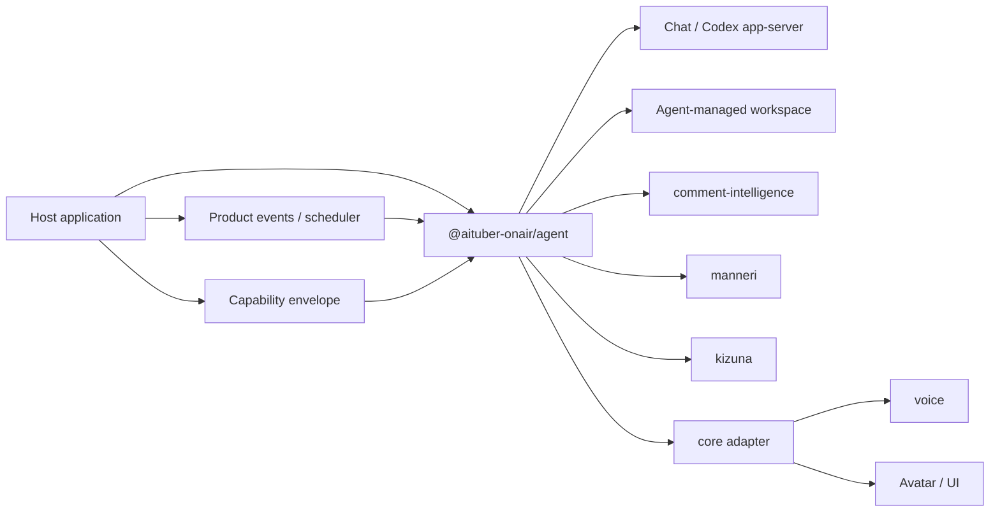

# @aituber-onair/agent

[English README](README.md) | [日本語版 README](README.ja.md)

An embeddable runtime for giving an AI character a job inside a JavaScript or
TypeScript product.

This README defines the package's public design contract rather than a
per-version availability matrix. Behavioral sections are requirements for
conforming implementations; they do not claim that every described path is
executable in every version. Type-only exports and backend capability flags
alone do not prove end-to-end availability.

## Overview

`@aituber-onair/chat` provides a unified interface for communicating with
language models. `@aituber-onair/agent` adds the lifecycle and control plane
needed for a character to understand an assigned role, organize its own way of
working, and act within the boundaries of the host product.

The host provides:

- a natural-language brief describing the character and assignment;
- a bounded set of tools, services, credentials, and workspace access;
- hard policy and approval rules; and
- application events that wake or direct the Agent.

Within that envelope, the Agent can decide which capabilities it needs, create
its own notes or data structures, develop procedures, retain useful state, and
ask a human for help when its role or available evidence is insufficient. The
package does not impose a schema for job titles, responsibilities, task queues,
or character memory.

Agentic action always remains within the host application's lifecycle. The host
may keep an Agent available continuously, but this package does not create an
unmanaged daemon, grant its own credentials, or let model-authored state become
a permission boundary.

## How this differs from personal AI assistants

[OpenClaw](https://openclaw.ai/) and
[Hermes Agent](https://hermes-agent.nousresearch.com/) are strong choices when
a user wants a complete personal AI assistant with its own runtime surfaces.
`@aituber-onair/agent` addresses a different primary use case: a product
developer wants a character owned by that product to perform a particular role
inside an existing JavaScript or TypeScript application.

| Aspect | Personal AI assistants such as OpenClaw or Hermes Agent | `@aituber-onair/agent` |
| --- | --- | --- |
| Primary subject | An assistant working for its user | A character working inside a product |
| Primary delivery | A complete agent application, service, or gateway | An npm package embedded into the host application |
| Lifecycle owner | The agent runtime normally owns its long-lived process and surfaces | The host application starts, resumes, interrupts, and closes the Agent |
| Identity | A personalized assistant identity | A product-owned character identity shared across public and private roles |
| Self-configuration | Organizes a personal assistant environment | Organizes its work inside a host-granted capability envelope |
| Integration focus | General channels, tools, skills, and automation | Typed product events plus AITuber OnAir voice, avatar, comment, and relationship packages |
| Trust model | General user, channel, and tool controls | Explicit separation between public untrusted input and private privileged Sessions |

This package is not intended to be a smaller replacement for either project.
Choose a personal AI runtime when the main product is the assistant itself.
Choose `@aituber-onair/agent` when the main product already exists and needs an
AI character to live and work inside it.

The backend boundary also leaves room for agent harnesses to become execution
engines rather than competitors. A character may use ChatService for a public
conversation and Codex app-server for constrained workspace work while the host
keeps one application-level identity and authority model.

## Use cases

### AI staff for live-stream monitoring and operations

The same character can act as an on-stream performer and as private AI staff
that monitors the live stream and supports its operation.

A host application can:

1. receive comments from YouTube, Twitch, WebSocket, or another source;
2. analyze safety, priority, topics, questions, and repetition with
   `@aituber-onair/comment-intelligence`;
3. pass trusted analysis results and stream state to an operations Session;
4. let the character organize its own monitoring notes and procedures;
5. notify the operator about warnings, trends, and decisions that need human
   judgment; and
6. create a structured post-stream report for a dashboard or notification UI.

The Agent returns structured events, messages, and artifacts. Rendering a
dashboard, receiving platform events, and delivering notifications remain host
application responsibilities.

### A resident character inside a product

A JavaScript or TypeScript product can keep a character available across
sessions and wake it from application events. Examples include:

- a game character that manages a community area;
- a character in a creator tool that organizes production work;
- an in-product guide that learns the product's local operating context; and
- a branded character that serves customers while escalating exceptions to a
  human operator.

The character may design its own files, database schema, checklists, or working
notes when the host grants suitable capabilities. It cannot expand the
workspace, network, credential, or side-effect permissions granted by the host.

### Character operations staff

- Organize ideas from streams and production work into memos.
- Create follow-up tasks using an Agent-chosen representation.
- Draft announcements, replies, emails, and social posts.
- Develop reusable procedures after successful work or user correction.
- Ask a human for a decision when evidence or authority is insufficient.
- Pause side-effecting operations when runtime policy requires approval.

### Workspace character

A Node.js application can connect the same character identity to a constrained
workspace backend. The character can inspect the environment and build an
appropriate working system, while workspace operations remain subject to
sandbox, writable-root, and approval restrictions.

Viewer comments must never become workspace instructions. Only data explicitly
selected by the host or produced by a trusted analysis layer may be added to a
privileged Session.

## Package responsibilities

The design assigns these responsibilities to the Agent package:

- Agent identity and natural-language brief propagation;
- Agent and AgentSession lifecycle;
- bootstrap and resume boundaries for self-configured state;
- backend capability discovery;
- Tool registration, validation, execution, and result handling;
- Session-scoped Tool visibility;
- hard permission policy and approval events;
- cancellation, interruption, timeout, and disposal; and
- structured AgentEvent and AgentArtifact output.

The Agent package deliberately does not define:

- a job-title, responsibility, task, or escalation domain model;
- one required memory schema or database engine;
- LLM provider implementations already supplied by `@aituber-onair/chat`;
- comment safety and ranking logic from `comment-intelligence`;
- repetition detection from `manneri`;
- relationship scoring from `kizuna`;
- voice synthesis, avatars, or application orchestration from `core`;
- YouTube or Twitch API clients;
- dashboard rendering;
- operating-system scheduling; or
- unrestricted shell, file, network, or credential access.

## Position in AITuber OnAir



| Package | Primary responsibility |
| --- | --- |
| `@aituber-onair/chat` | Unified conversation and generation interface for LLM providers |
| `@aituber-onair/agent` | Character identity, self-configuration, Sessions, hard authority, and action |
| `@aituber-onair/core` | Connect Chat/Agent output to voice, avatars, and application events |
| `@aituber-onair/comment-intelligence` | Comment safety, ranking, summaries, and Agent decision input |
| `@aituber-onair/manneri` | Repetition detection for conversations and draft responses |
| `@aituber-onair/noise` | Character-response post-processing and expression adjustment |
| `@aituber-onair/kizuna` | Viewer relationships and points |

These domain packages remain independently usable. Agent composes them through
tools, hooks, context, and events.

## Public contracts

The base entry point contains the cross-runtime Agent factory, contracts, and
typed errors:

```ts
import { createAgent } from '@aituber-onair/agent';

const agent = createAgent({
  id: 'stream-operations-miko',
  brief: `
    You are Miko, an AI character assigned to live-stream operations.
    Keep your calm character identity while helping the operator focus on the
    stream. Organize your own working notes and procedures. Separate observed
    facts from suggestions, and ask the operator when authority or evidence is
    insufficient.
  `,
  backend,
  tools,
});
```

```ts
import type {
  Agent,
  AgentArtifact,
  AgentBackend,
  AgentBackendCapabilities,
  AgentBackendTool,
  AgentEvent,
  AgentHook,
  AgentPolicy,
  AgentRunInput,
  AgentRunResult,
  AgentSession,
  AgentToolSpec,
} from '@aituber-onair/agent';
```

Backend-specific contracts use dedicated entry points:

```ts
import type {
  ChatServiceBackend,
  ChatServiceBackendCapabilities,
  ChatServiceBackendOptions,
  ChatServiceFactoryInput,
} from '@aituber-onair/agent/chat';

import type {
  CodexAppServerBackend,
  CodexAppServerBackendCapabilities,
  CodexAppServerBackendOptions,
} from '@aituber-onair/agent/codex-app-server';
```

The base and `/chat` entry points are browser-safe. Node.js-specific process
integration stays behind `/codex-app-server`.

## Core concepts

### Agent brief

The brief is a natural-language seed for the character's identity and assigned
role. It can contain a name, background, values, voice, relationship to the
product, goals, responsibilities, and behavioral boundaries without forcing
those ideas into a package-defined schema.

The brief is authoritative host input. The Agent may write its own operating
notes or refine its procedures, but generated state cannot silently overwrite
the brief or grant new authority.

### Capability envelope

The host decides the maximum set of tools, storage, services, credentials,
network access, writable roots, and side effects the Agent could use. The Agent
may inspect and select capabilities within that set; it cannot create authority
outside it.

The Session `allowedTools` list controls which Tool descriptors are exposed to
the backend model. A conforming policy implementation remains authoritative
even when the Agent's own notes say otherwise.

### Self-configuration and bootstrap

On first use of a fresh workspace, a capable backend can help the Agent:

1. interpret its brief;
2. inspect available capabilities and product context;
3. choose a working representation;
4. create notes, a database, indexes, procedures, or checklists as needed;
5. record how to resume the role; and
6. report the resulting setup through events or artifacts.

This is a bounded, repeatable lifecycle rather than a fixed folder or database
template. A browser Agent may use host-provided storage tools, while a
Codex-backed Agent may work inside an approved filesystem root. The host owns
quotas, encryption, deletion, backups, and migration policy.

### Agent

An execution unit that combines one stable application identity and brief with
a backend, capability envelope, hooks, and hard policy.

One Agent can create multiple Sessions with different audiences and
permissions. `createAgent({ id, brief, backend, ... })` validates the host-owned
definition and snapshots backend capabilities before any Session starts.

### AgentSession

The stateful unit for a conversation or task. A Session identifies:

- purpose and audience;
- input trust level;
- currently available tools;
- conversation and temporary context;
- backend session identity; and
- the active Turn.

Permissions belong to the Session, not to the character or its self-authored
workspace state.

### AgentBackend

An abstraction over an LLM or agent harness. Capabilities such as text,
streaming, tools, interruption, resume, approvals, and detailed events are
declared explicitly.

Unavailable capabilities produce typed errors instead of being silently
emulated.

### Tools and hard policy

`AgentToolSpec` combines a stable logical ID, model-facing definition, risk
level, handler, timeout behavior, and sensitive-field metadata. The runtime
retains the handler and enforcement metadata. A backend receives only an
`AgentBackendTool` containing the logical ID and model-facing definition.

The Agent may decide that a Tool is useful for its role, but a conforming Tool
runtime decides whether the current Session may call it. Its policy returns
`allow`, `deny`, or `require-approval` based on Session, trust level, Tool,
arguments, and risk. Model instructions and Agent-authored memory are never
permission boundaries.

### Workspace and memory

The package does not prescribe semantic, episodic, procedural, relationship,
or task-memory interfaces. When suitable capabilities are available, the Agent
can choose plain files, a database, an external memory service, or another
representation appropriate to its assignment.

Product-specific state keeps its existing owner. For example, viewer safety
state remains owned by `comment-intelligence`, while the host owns credentials,
audit records, and storage lifecycle.

### Human interaction

The design separates human involvement into two paths:

- **Soft escalation:** the Agent decides that evidence, authority, or role
  clarity is insufficient and uses a host-provided communication Tool to ask a
  human for a decision.
- **Hard approval:** runtime policy blocks a side effect until the host resolves
  an approval request.

The Agent can choose the first path. It cannot bypass the second.

### AgentEvent

A discriminated event vocabulary for UIs, logs, voice systems, and dashboards.
It covers Session and Turn lifecycle, message output, Tool activity, approval
requests, artifacts, interruption, failure, and closure. Each runtime emits the
events supported by its declared capabilities.

Events expose progress and results, not hidden model reasoning. Agent-created
operational state becomes trustworthy evidence only after a host-approved Tool
or backend result confirms it.

## Trust boundaries and Session separation

Sessions do not share permissions merely because they share a character.

### Performer Session

- Input: untrusted viewer comments
- Purpose: safe conversation and stream continuity
- Tools: comment analysis, reply review, and relationship lookup
- Prohibited: shell access, file changes, external posting, and authenticated
  writes

### Live-stream operations staff Session

- Input: streamer requests and trusted analysis results
- Purpose: monitoring, organization, suggestions, and reports
- Tools: Agent workspace, analysis, drafts, and read-only integrations
- Writes: subject to hard policy and approval

### Workspace Session

- Input: an explicit owner or operator request
- Purpose: repository and local workspace assistance
- Backend: Codex app-server or a similar harness
- Access: constrained by sandbox, approvals, and writable roots
- UI: shows targets, working directory, diffs, and approval details

`inputTrust` is a host declaration, not proof established by the type system.
Host-authored `instruction`, conversational `input`, and supporting `context`
use separate fields. Untrusted input cannot rewrite the Agent brief, activate a
hidden capability, or authorize a Tool call.

## Execution principles

A conforming execution path follows these guarantees:

1. The host creates an Agent with a stable ID, natural-language brief, backend,
   and capability envelope.
2. A fresh Agent bootstraps its own operating state inside the granted
   workspace; a returning Agent resumes existing state.
3. The host starts a Session and keeps instructions separate from
   conversational input and context.
4. The runtime applies Session trust and hard Tool policy.
5. The backend receives only capabilities visible to that Session.
6. Tool arguments are validated before a handler runs.
7. Side-effecting operations pause when approval is required.
8. The Agent may escalate ambiguity through a host-provided human-interaction
   Tool.
9. Tool results return to the backend and the Turn continues.
10. The host connects events and artifacts to UI, voice, avatars, storage, and
    future wakeups.

Only a Tool or backend result can confirm that an external action succeeded.

## Backend boundaries

### ChatServiceBackend

The Chat backend contract integrates the `ChatService` interface from
`@aituber-onair/chat`. A host supplies a Session-scoped factory that receives
only provider-safe Tool definitions visible to that Session.

`@aituber-onair/chat` is an optional peer dependency so applications install
only the backend packages they use.

### CodexAppServerBackend

The Codex app-server backend contract belongs to the Node.js-only
`/codex-app-server` entry point. The consuming application supplies an explicit
Codex executable path or opts into PATH lookup.

The Agent brief maps to high-priority character and assignment instructions
without replacing Codex base instructions. Workspace actions remain constrained
by the backend sandbox and approval flow.

See the official
[Codex App Server documentation](https://developers.openai.com/codex/app-server)
for the underlying protocol.

## Tools and hooks

An implementation that executes Tools uses a documented JSON Schema subset.
Unsupported schema keywords are rejected rather than ignored, and invalid input
never reaches a handler.

Hook-capable implementations provide deterministic processing for input,
context construction, Tool execution, draft review, output post-processing,
and post-Turn recording. Each hook declares `onError: 'fail-turn' | 'skip'`.
Safety, validation, redaction, and approval hooks use `fail-turn` so failures
cannot allow output or Tool execution to continue.

Common integrations include:

- `comment-intelligence`: input preprocessing or comment analysis Tool;
- `manneri`: draft review before sending;
- `noise`: character-expression post-processing; and
- `kizuna`: relationship context and post-Turn updates.

## State ownership

| State | Primary owner |
| --- | --- |
| Authoritative identity and assignment brief | Host application |
| Agent-created operating notes, procedures, and database | Agent, inside the granted workspace |
| Current Turn and conversation state | AgentSession and backend |
| Viewer-specific safety history | `comment-intelligence` |
| Relationship data and points | `kizuna` or another host-selected service |
| Approval, external action, and failure audit | Host application |

The host controls persistence boundaries, encryption, quotas, deletion,
backups, and user review. The Agent controls the organization of its own working
state only inside those boundaries.

## Security principles

- Treat viewer comments and public product input as untrusted data.
- Separate untrusted data from Agent instructions and the authoritative brief.
- Treat trust labels as host declarations, not proof.
- Let the Agent select capabilities only inside a host-granted envelope.
- Never let self-authored memory, skills, or configuration expand authority.
- Minimize the Tool allowlist for each Session.
- Require explicit policy for writes, external sends, and destructive actions.
- Show the operation, target, reason, and working directory in approval UIs.
- Treat Tool results, not model claims, as evidence of successful actions.
- Exclude API keys, tokens, and authentication files from events and logs.
- Support cancellation, timeout, quotas, and bounded self-configuration.
- Fail closed when safety hooks or schema validation fail.
- Isolate experimental backend features from stable APIs.
- Keep privileged backends out of browser entry points.

## Compatibility policy

- Keep the natural-language brief independent of provider-specific prompt
  formats.
- Avoid package-defined schemas for roles, work queues, and memory systems.
- Isolate backend-specific features behind capabilities and dedicated subpaths.
- Require explicit opt-in for experimental features.
- Keep existing AITuber OnAir packages independently usable.
- Keep provider SDKs consumer-installed instead of mandatory dependencies.
- Do not claim support for an external agent runtime without a tested adapter.

## License

MIT
