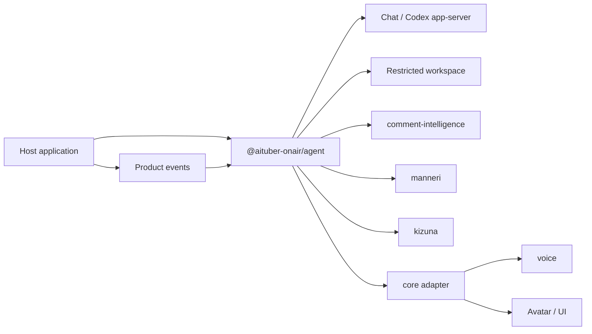

# @aituber-onair/agent

[English README](README.md) | [日本語版 README](README.ja.md)

An embeddable runtime for giving an AI character a job inside a JavaScript or
TypeScript product.

## What this package is

`@aituber-onair/chat` lets an application communicate with language models.
`@aituber-onair/agent` turns an AI character into a managed member
of a product: a character that understands its assignment, organizes its work,
uses approved capabilities, and asks a human for help when necessary.

The host application provides:

- a natural-language brief describing the character and its assignment;
- the tools, services, credentials, and workspace the character may use;
- rules for operations that must be denied or approved; and
- product events that start or resume the character's work.

Within those limits, the character can choose how to organize its notes,
procedures, database, and long-term working state. The package does not force
applications to use fixed schemas for job titles, responsibilities, task
queues, or character memory.

The host application always owns the Agent's lifecycle and authority. The
character cannot grant itself new tools, credentials, network access, or
writable locations.

## How it differs from personal AI assistants

[OpenClaw](https://docs.openclaw.ai/) and
[Hermes Agent](https://hermes-agent.nousresearch.com/docs/) are primarily
complete runtimes for an assistant that works for its user.
`@aituber-onair/agent` is designed for a different situation: a developer
already has a product and wants an AI character to work inside it.

| | Personal AI assistant | `@aituber-onair/agent` |
| --- | --- | --- |
| Works for | An individual user | A product or service |
| Delivered as | An agent application, service, or gateway | An npm package embedded in an application |
| Identity | The user's assistant | A character owned by the product |
| Lifecycle | Managed mainly by the agent runtime | Managed by the host application |
| Integration | General messaging, tools, and automation | Product events and AITuber OnAir packages |

This package is not intended to replace OpenClaw or Hermes Agent. Choose a
personal AI assistant when the assistant itself is the product. Choose this
package when an existing JavaScript or TypeScript product needs its own managed
AI character.

## Use cases

### AI staff for live-stream monitoring and operations

The same character can appear on a live stream and also work
privately as staff that monitors and supports the stream.

A host application can:

1. receive comments from YouTube, Twitch, WebSocket, or another source;
2. analyze safety, priority, topics, questions, and repetition with
   `@aituber-onair/comment-intelligence`;
3. give analysis accepted by the host, together with the stream state, to a
   private operations Session;
4. let the character organize monitoring notes and operating procedures;
5. notify an operator when attention or human judgment is required; and
6. create a structured post-stream report for a dashboard or notification UI.

The dashboard, platform connections, and notification delivery remain the
responsibility of the host application.

The `stream-operations-staff` example runs an Agent with separate public and
private Sessions against a deterministic local backend. It uses fixed comment
data so the Tool, policy, event, and artifact flow can be tried without API
credentials. It is not a Codex app-server or LLM demo.

### A resident character inside a product

Examples include:

- a game character that manages a community area;
- a character in a creator tool that organizes production work;
- an in-product guide that learns the product's operating context; and
- a brand character that handles routine requests and asks a human to resolve
  exceptions.

### A workspace character

A Node.js application will be able to connect the same character to a
restricted workspace backend such as Codex app-server. The character may build
its own way of working inside that workspace, while sandbox, writable-root, and
approval rules remain under host control.

Public input such as viewer comments must never become workspace instructions.
Only structured information selected or accepted by the host after analysis may
enter a privileged workspace Session.

## Core model

- **Brief:** A natural-language description of the character's identity, role,
  goals, values, responsibilities, and boundaries. It remains owned by the host
  application.
- **Available capabilities:** The tools, storage, services, network access, and
  writable locations granted by the host. The character may choose from them
  but cannot expand them.
- **Workspace and memory:** The character may choose files, a database, an
  external memory service, or another suitable representation. The package does
  not require one memory format.
- **Session:** A conversation or task context with its own audience, input trust
  level, and available tools. Public and privileged work use separate Sessions.
- **Human involvement:** The character may ask a human when its evidence or
  authority is insufficient. Separately, the runtime pauses operations that
  require mandatory approval.

## Responsibilities

The Agent package handles:

- Agent and Session lifecycle;
- delivery of the character brief to each backend;
- Session-specific tool visibility;
- tool validation, execution, policy, and approval flow;
- interruption, timeout, and cleanup; and
- structured events and artifacts for the host application.

The host application remains responsible for:

- YouTube, Twitch, and other platform connections;
- dashboards and notification delivery;
- scheduling and wake-up events;
- credentials, storage limits, encryption, backup, and deletion; and
- the final decision about external or destructive operations.

## Connect to @aituber-onair/chat

Install both packages and create the ChatService through a factory. The factory
runs once for each Agent Session and receives only the Tool definitions visible
to that Session.

```ts
import { ChatServiceFactory } from '@aituber-onair/chat';
import { createAgent } from '@aituber-onair/agent';
import { createChatServiceBackend } from '@aituber-onair/agent/chat';

export function createStreamStaff(apiKey: string) {
  const backend = createChatServiceBackend({
    provider: 'openai',
    createChatService: ({ tools }) =>
      ChatServiceFactory.createChatService('openai', {
        apiKey,
        tools,
      }),
  });

  return createAgent({
    id: 'stream-staff-miko',
    brief: 'You are Miko, AI staff responsible for stream operations.',
    backend,
    tools: [analyzeComments],
    policy: {
      defaultDecision: 'deny',
      allowTools: ['comments.analyze'],
    },
  });
}
```

Start separate Sessions for public conversation and private operations. The
brief becomes one system message. Each Turn adds the host instruction, context,
and conversational input as separate messages, so viewer text is never copied
into the system message.

```ts
const publicSession = await agent.startSession({
  purpose: 'Respond to public comments',
  audience: 'public',
  inputTrust: 'untrusted',
  allowedTools: ['comments.analyze'],
});

const result = await publicSession.run({
  instruction: 'Respond only when a reply is useful.',
  input: {
    kind: 'viewer-comment',
    data: { text: viewerComment },
  },
});
```

Built-in Chat provider names use `ChatServiceFactory` capability metadata as a
fallback. Supply `capabilities` explicitly for a custom provider. Providers
without Tool support receive an empty Tool list; for example, the current
`codex-sdk` Chat provider is text-only and returns completed text rather than
streaming deltas.

The backend keeps conversation and Tool history inside each Session and limits
one Turn to six provider Tool rounds by default. Set `maxToolRounds` to a lower
positive integer when needed. `AbortSignal` and Agent timeouts stop the Agent
Turn and ignore late results. The generic `ChatService` interface does not
guarantee that an already-running provider request is cancelled at the network
transport layer.

## Tool execution rules

- `allowedTools` controls which Tool definitions a Session exposes to its
  backend. Tool execution is still denied by default unless the host supplies a
  policy that allows it or requests approval.
- Tool input schemas support `type`, `properties`, `required`, `items`, `enum`,
  `description`, and boolean `additionalProperties`. Unsupported keywords are
  rejected when the Agent is created instead of being silently ignored.
- `sensitiveFields` accepts dot-separated object paths. Matching input values
  are redacted in Tool and approval events, while the original validated values
  are copied into the immutable snapshot passed to the host handler. Approval
  and execution therefore use the same input values.
- Tool success, handler failure, timeout, and Turn cancellation remain distinct
  results. A host approval denial never runs the handler. A timeout aborts the
  handler's signal and fails the Turn; JavaScript cannot forcibly stop a
  handler that ignores that signal, so side-effecting handlers must cooperate
  with cancellation and use `toolCallId` as an idempotency key where needed.

## Bootstrapping a character workspace

`agent.bootstrap()` gives a character one bounded, private Turn to inspect its
assignment and prepare its own operating state. The Agent may choose files,
tables, indexes, notes, or another representation through the Tools and backend
workspace that the host has granted. Agent core does not define their layout.

```ts
import {
  createAgent,
  defineAgentTool,
  type AgentWorkspaceMetadataStore,
} from '@aituber-onair/agent';

const workspaceMetadata = {
  load: (agentId) => appDatabase.agentWorkspaces.get(agentId),
  save: async (metadata, expectedRevision) => {
    const saved = await appDatabase.agentWorkspaces.compareAndSet(
      metadata.agentId,
      expectedRevision,
      metadata
    );
    if (!saved) throw new Error('Workspace metadata changed concurrently.');
  },
} satisfies AgentWorkspaceMetadataStore;

const agent = createAgent({
  id: 'stream-staff-miko',
  brief: 'You are Miko, AI staff responsible for stream operations.',
  backend,
  tools: [workspaceRead, workspaceWrite],
  capabilityCatalog: [
    {
      id: 'workspace.local',
      kind: 'workspace',
      description: 'A workspace limited to this character',
      requiredTools: ['workspace.read', 'workspace.write'],
      limits: [{ name: 'maxBytes', value: 1_000_000, unit: 'bytes' }],
    },
  ],
  policy,
});

const bootstrap = await agent.bootstrap({
  workspace: workspaceMetadata,
  version: 'stream-operations-v1',
  allowedTools: ['workspace.read', 'workspace.write'],
  allowedCapabilities: ['workspace.local'],
  context: {
    trust: 'trusted',
    data: { product: 'stream-dashboard' },
  },
});
```

The metadata store contains only host-owned lifecycle state: `fresh`,
`bootstrapping`, `ready`, `degraded`, or `failed`. A successful `version` is not
run again. A failed attempt can resume the previous backend Session and any
partial workspace state. Bump `version` when the brief or required operating
state changes.

`save` must compare `expectedRevision` and update the record atomically. A
stale writer must reject instead of overwriting a newer bootstrap operation.

Capability descriptors are discovery metadata, not permission grants. A
capability is shown only when all of its `requiredTools` are visible, and every
Tool call still passes through the runtime policy and approval path described
above. Numeric capability limits describe the host's envelope; the Tool handler
or backend that owns the resource must enforce limits such as workspace bytes.
Each bootstrap attempt is limited to one Turn. `timeoutMs` bounds that Turn,
and the runtime also limits Tool calls and retry attempts. Metadata storage and
backend Session start/close are host-owned operations; their implementations
must apply appropriate timeouts and cancellation. Bootstrap accepts product
context only with an explicit `trust: 'trusted'` host assertion. Do not mark raw
viewer input as trusted or inject the entire workspace.

Asking a human is an ordinary host Tool rather than a fixed escalation schema:

```ts
const askOperator = defineAgentTool({
  id: 'human.ask',
  definition: {
    name: 'human_ask',
    description: 'Add a question to the operator review inbox',
    parameters: {
      type: 'object',
      properties: { question: { type: 'string' } },
      required: ['question'],
      additionalProperties: false,
    },
  },
  risk: 'write',
  execute: ({ question }: { question: string }) =>
    operatorInbox.add({ question }),
});
```

The host may allow this local review request while still requiring a hard
runtime approval for external or destructive Tools.

## Position in AITuber OnAir



The existing AITuber OnAir packages remain independently usable. Agent combines
them through tools, context, hooks, and events rather than moving their
domain logic into one large package.

## Codex app-server integration

The dedicated Node.js entry point is separate from the ChatService backend. The
runtime adapter is not available yet. It is intended for restricted workspace
work through Codex app-server, where the character brief is added without
replacing Codex's base instructions and workspace actions remain subject to
Codex sandbox and approval settings.

See the official
[Codex App Server documentation](https://developers.openai.com/codex/app-server)
for the underlying protocol.

## State management

| State | Managed by |
| --- | --- |
| Character identity and assignment brief | Host application |
| Character-created notes, procedures, and database | Host-managed workspace; the character organizes the content |
| Current conversation and task state | Agent Session and backend |
| Viewer safety history | `comment-intelligence` |
| Viewer relationships and points | `kizuna` or a host-selected service |
| Approvals and external-operation audit | Host application |

## Safety principles

- Treat viewer comments and other public input as untrusted data.
- Keep untrusted data separate from host instructions and the character brief.
- Treat analysis output as trusted only after the host validates and accepts it.
- Expose only the minimum tools required by each Session.
- Never let character-created memory, skills, or configuration expand
  permissions.
- Require host policy and approval for writes, external sends, and destructive
  operations.
- Treat tool results, not model claims, as evidence that an action succeeded.
- Keep API keys, tokens, and authentication files out of events and logs.
- Keep privileged Node.js backends separate from browser entry points.

## License

MIT
