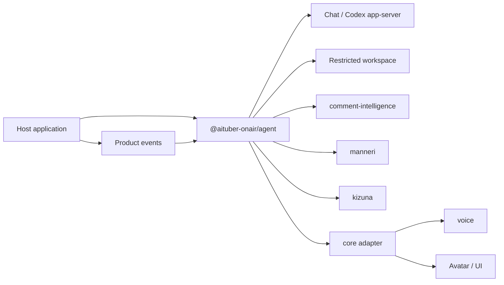

# @aituber-onair/agent

[English README](README.md) | [日本語版 README](README.ja.md)

An embeddable runtime for giving an AI character a job inside a JavaScript or
TypeScript product.

> [!NOTE]
> This package is under development and is not yet usable as a complete
> LLM-backed agent. The sections below describe the product being built.

## What this package is

`@aituber-onair/chat` lets an application communicate with language models.
`@aituber-onair/agent` is intended to turn an AI character into a managed member
of a product: a character that understands its assignment, organizes its work,
uses approved capabilities, and asks a human for help when necessary.

The host application will provide:

- a natural-language brief describing the character and its assignment;
- the tools, services, credentials, and workspace the character may use;
- rules for operations that must be denied or approved; and
- product events that start or resume the character's work.

Within those limits, the character will be able to choose how to organize its
notes, procedures, database, and long-term working state. The package will not
force applications to use fixed schemas for job titles, responsibilities, task
queues, or character memory.

The host application will always own the Agent's lifecycle and authority. The
character will not be able to grant itself new tools, credentials, network
access, or writable locations.

## How it differs from personal AI assistants

[OpenClaw](https://docs.openclaw.ai/) and
[Hermes Agent](https://hermes-agent.nousresearch.com/docs/) are primarily
complete runtimes for an assistant that works for its user.
`@aituber-onair/agent` is intended for a different situation: a developer
already has a product and wants an AI character to work inside it.

| | Personal AI assistant | `@aituber-onair/agent` |
| --- | --- | --- |
| Works for | An individual user | A product or service |
| Delivered as | An agent application, service, or gateway | An npm package embedded in an application |
| Identity | The user's assistant | A character owned by the product |
| Lifecycle | Managed mainly by the agent runtime | Managed by the host application |
| Integration | General messaging, tools, and automation | Product events and AITuber OnAir packages |

This package is not intended to replace OpenClaw or Hermes Agent. Choose a
personal AI assistant when the assistant itself is the product. When complete,
this package is intended for existing JavaScript or TypeScript products that
need their own AI character.

## Use cases

### AI staff for live-stream monitoring and operations

The same character will be able to appear on a live stream and also work
privately as staff that monitors and supports the stream.

A host application will be able to:

1. receive comments from YouTube, Twitch, WebSocket, or another source;
2. analyze safety, priority, topics, questions, and repetition with
   `@aituber-onair/comment-intelligence`;
3. give analysis accepted by the host, together with the stream state, to a
   private operations Session;
4. let the character organize monitoring notes and operating procedures;
5. notify an operator when attention or human judgment is required; and
6. create a structured post-stream report for a dashboard or notification UI.

The dashboard, platform connections, and notification delivery remain the
responsibility of the host application.

The existing `stream-operations-staff` example is a visual prototype that uses
fixed data. It does not yet run an actual Agent.

### A resident character inside a product

Examples include:

- a game character that manages a community area;
- a character in a creator tool that organizes production work;
- an in-product guide that learns the product's operating context; and
- a brand character that handles routine requests and asks a human to resolve
  exceptions.

### A workspace character

A Node.js application will be able to connect the same character to a
restricted workspace backend such as Codex app-server. The character may build
its own way of working inside that workspace, while sandbox, writable-root, and
approval rules remain under host control.

Public input such as viewer comments must never become workspace instructions.
Only structured information selected or accepted by the host after analysis may
enter a privileged workspace Session.

## Core model

- **Brief:** A natural-language description of the character's identity, role,
  goals, values, responsibilities, and boundaries. It remains owned by the host
  application.
- **Available capabilities:** The tools, storage, services, network access, and
  writable locations granted by the host. The character may choose from them
  but cannot expand them.
- **Workspace and memory:** The character may choose files, a database, an
  external memory service, or another suitable representation. The package does
  not require one memory format.
- **Session:** A conversation or task context with its own audience, input trust
  level, and available tools. Public and privileged work use separate Sessions.
- **Human involvement:** The character may ask a human when its evidence or
  authority is insufficient. Separately, the runtime pauses operations that
  require mandatory approval.

## Responsibilities

The Agent package is intended to handle:

- Agent and Session lifecycle;
- delivery of the character brief to each backend;
- Session-specific tool visibility;
- tool validation, execution, policy, and approval flow;
- interruption, timeout, and cleanup; and
- structured events and artifacts for the host application.

The host application remains responsible for:

- YouTube, Twitch, and other platform connections;
- dashboards and notification delivery;
- scheduling and wake-up events;
- credentials, storage limits, encryption, backup, and deletion; and
- the final decision about external or destructive operations.

## Position in AITuber OnAir

The existing AITuber OnAir packages remain independently usable. Agent will
combine them through tools, context, hooks, and events rather than moving their
domain logic into one large package.

## Planned backends

### ChatService backend

The ChatService backend will connect to `@aituber-onair/chat` for public
conversation and application-defined workflows. Each Session will receive only
the tools it is allowed to see.

### Codex app-server backend

The Node.js-only Codex backend will support restricted workspace work through
Codex app-server. The character brief will be applied without replacing Codex's
base instructions, and workspace actions will remain subject to Codex sandbox
and approval settings.

See the official
[Codex App Server documentation](https://developers.openai.com/codex/app-server)
for the underlying protocol.

## State management

| State | Managed by |
| --- | --- |
| Character identity and assignment brief | Host application |
| Character-created notes, procedures, and database | Host-managed workspace; the character organizes the content |
| Current conversation and task state | Agent Session and backend |
| Viewer safety history | `comment-intelligence` |
| Viewer relationships and points | `kizuna` or a host-selected service |
| Approvals and external-operation audit | Host application |

## Safety principles

- Treat viewer comments and other public input as untrusted data.
- Keep untrusted data separate from host instructions and the character brief.
- Treat analysis output as trusted only after the host validates and accepts it.
- Expose only the minimum tools required by each Session.
- Never let character-created memory, skills, or configuration expand
  permissions.
- Require host policy and approval for writes, external sends, and destructive
  operations.
- Treat tool results, not model claims, as evidence that an action succeeded.
- Keep API keys, tokens, and authentication files out of events and logs.
- Keep privileged Node.js backends separate from browser entry points.

## License

MIT
