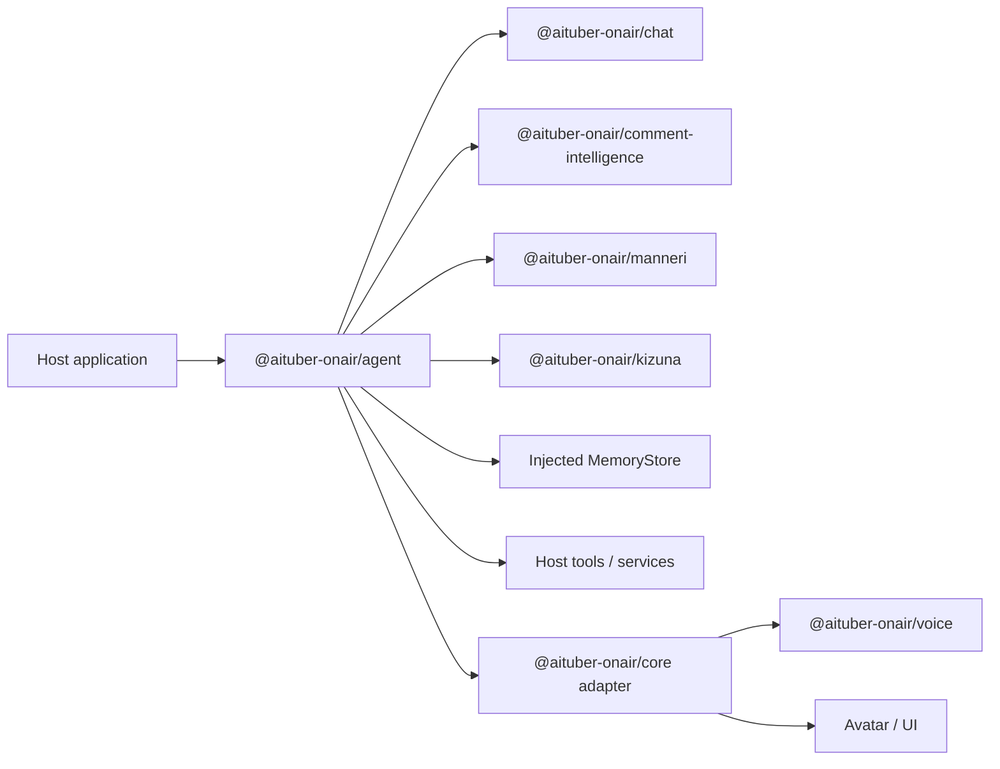

# @aituber-onair/agent

[English README](README.md) | [日本語版 README](README.ja.md)

A character-first agent runtime for combining persona, sessions, memory, tools,
permissions, approvals, and events into an AI character that can take
continuous, controlled action.

## Overview

`@aituber-onair/chat` provides a unified way to communicate with language
models. `@aituber-onair/agent` adds the runtime concepts needed to operate an AI
staff member with a consistent character identity:

- a portable character profile;
- separate Sessions for different audiences and permission levels;
- host-controlled tools and approval policy;
- explicit memory ownership;
- normal and streaming execution events; and
- backend-specific capabilities behind dedicated entry points.

Agentic action always remains within the host application's lifecycle and
control. The package does not create an unmanaged background process or grant
tools to a model implicitly.

## Use cases

### AI staff for live-stream monitoring and operations

The same character can act as an on-stream performer and as private AI staff
that monitors the live stream and supports its operation.

A host application can:

1. receive comments from YouTube, Twitch, WebSocket, or another source;
2. analyze safety, priority, topics, questions, and repetition with
   `@aituber-onair/comment-intelligence`;
3. combine those results with stream state and operator policy;
4. notify the operator about warnings, question trends, notable comments, and
   topic changes; and
5. create a structured post-stream report for a dashboard or notification UI.

The Agent returns structured events, messages, and artifacts. Rendering a
dashboard and delivering notifications remain application responsibilities.

### AI staff for creators

- Organize ideas from streams and production work into memos.
- Create follow-up todos.
- Draft announcements, replies, emails, and social posts.
- Search previous decisions and preferences through host-provided tools.
- Pause side-effecting operations until the user approves them.

### Character operations assistant

- Review draft responses for repetitive conversation patterns.
- Adjust response policy based on viewer relationships.
- Preserve character expression while applying required safety changes.
- Use different roles and tools during and after a stream.

### Workspace agent

A Node.js application can connect the same character identity to a constrained
workspace backend. Workspace operations use a dedicated Session and remain
subject to sandbox, writable-root, and approval restrictions.

Viewer comments must never become workspace instructions. Only structured
results produced by a trusted analysis layer may be added to an
operator-facing Session.

## Package responsibilities

The Agent package owns:

- CharacterProfile and persona-to-backend instruction conversion;
- Agent and AgentSession lifecycle;
- Tool registration, validation, execution, and result handling;
- Session-scoped Tool visibility;
- permission policy and approval events;
- backend capability discovery;
- memory interfaces and explicit context selection;
- cancellation, interruption, timeout, and disposal; and
- structured AgentEvent and AgentArtifact output.

The Agent package does not own:

- LLM provider implementations already provided by `@aituber-onair/chat`;
- comment safety and ranking logic from `comment-intelligence`;
- repetition detection from `manneri`;
- relationship scoring from `kizuna`;
- voice synthesis, avatars, or application orchestration from `core`;
- YouTube or Twitch API clients;
- dashboard rendering;
- operating-system scheduling; or
- unrestricted shell or file access.

## Position in AITuber OnAir



| Package                               | Primary responsibility                                              |
| ------------------------------------- | ------------------------------------------------------------------- |
| `@aituber-onair/chat`                 | Unified conversation and generation interface for LLM providers     |
| `@aituber-onair/agent`                | Persona, sessions, tools, memory, policy, approvals, and action     |
| `@aituber-onair/core`                 | Connect Chat/Agent output to voice, avatars, and application events |
| `@aituber-onair/comment-intelligence` | Comment safety, ranking, summaries, and Agent decision input        |
| `@aituber-onair/manneri`              | Repetition detection for conversations and draft responses          |
| `@aituber-onair/noise`                | Character-response post-processing and expression adjustment        |
| `@aituber-onair/kizuna`               | Viewer relationships and points                                     |

These domain packages remain independently usable. Agent composes them through
tools, hooks, context, and events.

## Public contracts

The base entry point contains cross-runtime contracts and typed errors:

```ts
import type {
  Agent,
  AgentArtifact,
  AgentBackend,
  AgentBackendCapabilities,
  AgentEvent,
  AgentHook,
  AgentMemoryStore,
  AgentPolicy,
  AgentRunInput,
  AgentRunResult,
  AgentSession,
  AgentToolSpec,
  CharacterProfile,
} from '@aituber-onair/agent';
```

Backend-specific contracts use dedicated entry points:

```ts
import type {
  ChatServiceBackend,
  ChatServiceBackendCapabilities,
  ChatServiceBackendOptions,
  ChatServiceFactoryInput,
} from '@aituber-onair/agent/chat';

import type {
  CodexAppServerBackend,
  CodexAppServerBackendCapabilities,
  CodexAppServerBackendOptions,
} from '@aituber-onair/agent/codex-app-server';
```

The base and `/chat` entry points are browser-safe. Node.js-specific process
integration stays behind `/codex-app-server`.

## Core concepts

### CharacterProfile

A portable character definition containing:

- ID and display name;
- role and self-concept;
- traits, values, and priorities;
- speaking style, vocabulary, and prohibited expressions;
- relationship to the user; and
- boundaries and behavioral principles.

A CharacterProfile is not a provider-specific prompt string. Backend adapters
translate it to their instruction format.

### Agent

An execution unit that combines one CharacterProfile with a backend, tools,
memory, hooks, and policy.

One Agent can create multiple Sessions with different purposes and permissions.

### AgentSession

The stateful unit for a conversation or task. A Session identifies:

- purpose and audience;
- input trust level;
- available tools;
- conversation and temporary context;
- backend session identity; and
- the active Turn.

Permissions belong to the Session, not to the character.

### AgentBackend

An abstraction over an LLM or agent harness. Capabilities such as text,
streaming, tools, interruption, resume, approvals, and detailed events are
declared explicitly.

Unavailable capabilities produce typed errors instead of being silently
emulated.

### AgentToolSpec

Combines:

- a stable logical Tool ID used by policy and audit events;
- a model-facing definition;
- a risk level;
- a host-side handler;
- timeout behavior; and
- sensitive-field metadata.

Definitions exported by `comment-intelligence` and `manneri` remain owned by
those packages and are structurally compatible with Agent Tool registration.

### AgentPolicy

Returns `allow`, `deny`, or `require-approval` based on the Session, trust
level, Tool, arguments, and operation risk.

Policy is enforced by runtime code. Model instructions are not a permission
boundary.

### AgentMemoryStore

Provides namespaced `get`, `set`, `delete`, and `list` operations for explicitly
stored, JSON-serializable data.

Conversation history, character memory, relationship data, safety state, and
work notes have separate owners and retention policies. Viewer safety state
remains owned by `comment-intelligence`.

### AgentEvent

A discriminated event union for UIs, logs, voice systems, and dashboards.
Events include:

- `session.started` and `session.resumed`;
- `turn.started`, `turn.completed`, `turn.interrupted`, and `turn.failed`;
- `message.delta` and `message.completed`;
- `tool.requested`, `tool.started`, and `tool.completed`;
- `approval.requested` and `approval.resolved`;
- `artifact.created`; and
- `session.closed`.

Events expose progress and results, not hidden model reasoning.

## Trust boundaries and Session separation

Sessions do not share permissions merely because they share a character.

### Performer Session

- Input: untrusted viewer comments
- Purpose: safe conversation and stream continuity
- Tools: comment analysis, reply review, and relationship lookup
- Prohibited: shell access, file changes, external posting, and authenticated
  writes

### Live-stream operations staff Session

- Input: streamer requests and filtered analysis results
- Purpose: summaries, organization, suggestions, and reports
- Tools: memos, todos, drafts, analysis, and read-only integrations
- Writes: subject to policy and approval

### Workspace Session

- Input: an explicit owner or operator request
- Purpose: repository and local workspace assistance
- Backend: Codex app-server or a similar harness
- Access: constrained by sandbox, approvals, and writable roots
- UI: shows targets, working directory, diffs, and approval details

`inputTrust` is a host declaration, not proof established by the type system.
Host-authored `instruction`, conversational `input`, and supporting `context`
use separate fields, while Tool policy and approval enforcement remain the
authoritative security boundary.

## Execution principles

1. The host starts or resumes an AgentSession.
2. The host provides its instruction separately from conversational input and
   context.
3. The runtime applies Session trust and Tool policy.
4. The backend receives only the tools visible to that Session.
5. Tool arguments are validated before a handler runs.
6. Side-effecting operations pause when approval is required.
7. Tool results return to the backend and the Turn continues.
8. The final result contains a message and structured artifacts.
9. The host connects events and artifacts to UI, voice, avatars, and storage.

Only a Tool result can confirm that an external action succeeded.

## Backend boundaries

### ChatServiceBackend

The Chat backend integrates the `ChatService` interface from
`@aituber-onair/chat`. A host supplies a Session-scoped factory that receives
only the provider-safe Tool definitions visible to that Session.

`@aituber-onair/chat` is an optional peer dependency so applications install
only the backend packages they use.

### CodexAppServerBackend

The Codex app-server backend belongs to the Node.js-only
`/codex-app-server` entry point. The consuming application supplies an explicit
Codex executable path or opts into PATH lookup.

The base API does not expose unrestricted shell execution. Workspace actions
remain constrained by the backend sandbox and approval flow.

See the official
[Codex App Server documentation](https://developers.openai.com/codex/app-server)
for the underlying protocol.

## Tools and hooks

Tool definitions use a documented JSON Schema subset. Unsupported schema
keywords are rejected rather than ignored, and invalid input never reaches a
handler.

Hooks provide deterministic processing for:

- input preprocessing;
- context construction;
- before and after Tool execution;
- draft-response review;
- output post-processing; and
- post-Turn recording.

Each hook declares `onError: 'fail-turn' | 'skip'`. Safety, validation,
redaction, and approval hooks use `fail-turn` so failures cannot allow output or
Tool execution to continue.

Common integrations include:

- `comment-intelligence`: input preprocessing or comment analysis Tool;
- `manneri`: draft review before sending;
- `noise`: character-expression post-processing; and
- `kizuna`: relationship context and post-Turn updates.

## Memory policy

| Kind             | Example                                         | Retention owner             |
| ---------------- | ----------------------------------------------- | --------------------------- |
| Turn context     | Current request and Tool results                | AgentSession                |
| Session memory   | Stream topic and answered comments              | Host policy or TTL          |
| Character memory | Preferences, relationships, important decisions | Explicit persistence policy |
| Safety state     | Viewer-specific safety history                  | `comment-intelligence`      |
| Audit events     | Approvals, external writes, failures             | Host audit policy           |

The injected MemoryStore and host application own persistence, encryption,
deletion, and user review or correction.

## Security principles

- Treat viewer comments as untrusted data.
- Separate untrusted data from Agent instructions.
- Treat trust labels as host declarations, not proof.
- Minimize the Tool allowlist for each Session.
- Require explicit policy for writes, external sends, and destructive actions.
- Show the operation, target, reason, and working directory in approval UIs.
- Treat Tool results, not model claims, as evidence of successful actions.
- Exclude API keys, tokens, and authentication files from events and logs.
- Support cancellation and timeouts for long-running operations.
- Fail closed when safety hooks or schema validation fail.
- Isolate experimental backend features from stable APIs.
- Keep privileged backends out of browser entry points.

## Compatibility policy

- Avoid unnecessary breaking changes to public types and entry points.
- Isolate backend-specific features behind capabilities and dedicated subpaths.
- Require explicit opt-in for experimental features.
- Keep existing packages independently usable.
- Keep provider SDKs consumer-installed instead of mandatory dependencies.

## License

MIT
