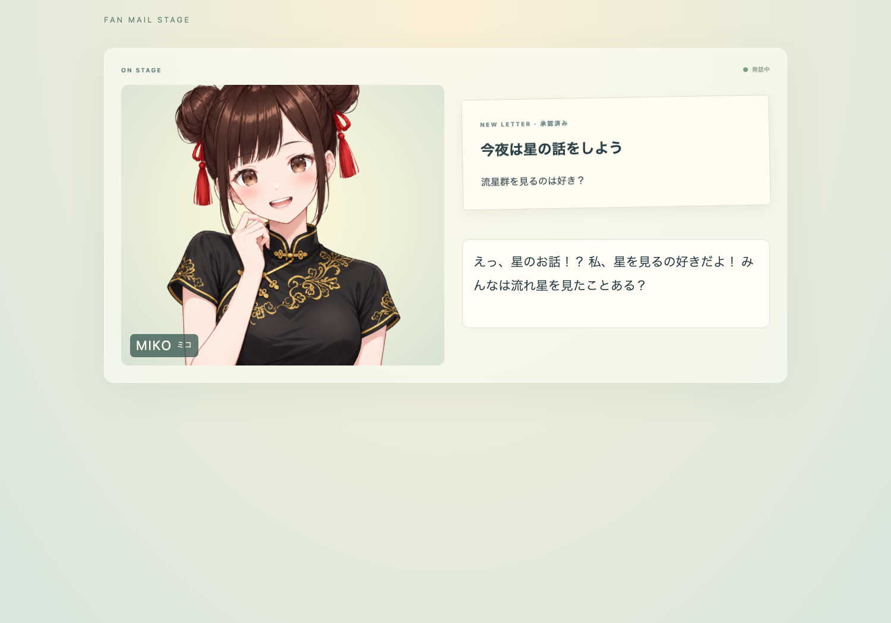

# Fan Mail Stage



[日本語](README.ja.md)

A local React + Node example of `@aituber-onair/agent` for reading viewers' fan
mail on stream. Any program can write a mail-event JSON file into the inbox
directory. Miko automatically drafts a Japanese reaction, which the operator
can review, edit, approve, or reject. Only approved text appears on the separate
broadcast page and in the local outbox.

The default mock backend requires no model credentials or Cursor CLI. It chooses
deterministic responses for stars, food, and other topics. The UI labels these
as mock responses on the operator page. Cursor ACP is available for model-generated reactions.

## Run

Requires Node.js 20+ and npm. From the repository root:

```sh
npm ci
npm run build
cd packages/agent/examples/fan-mail-stage
npm ci
npm run dev
```

Open `http://127.0.0.1:4520/operator` for review and
`http://127.0.0.1:4520/stage` for broadcast. Use only the stage route in OBS.
The server binds to `127.0.0.1` and rejects other Host/Origin headers.
`PORT` changes the port. The `dev` command builds both client and server before
starting; restart it after source changes.

In another terminal, from this example directory:

```sh
npm run send-test-mail
npm run send-test-mail -- --subject 'ミコちゃんへ' --body '好きな料理は？'
npm run send-test-mail -- --preset injection
npm run send-test-mail -- --preset sensitive
```

New mail generates a draft automatically. Enable audio in the private preview
before sending mail, review all three public fields, then click the approval
button. The broadcast page has its own audio setting; enable it before approving.
Audio is off initially to avoid two tabs speaking at once. Browser Speech uses
the browser's Japanese voice, if available. AivisSpeech requires a running local
engine at `http://127.0.0.1:10101` and offers a fetched speaker list. Browser
autoplay rules may require interaction with the broadcast page. Failed audio
does not block text publication. Changing the audio setting cancels its queue;
previous reactions are not replayed when audio is enabled.

In OBS, open **Interact** for the stage browser source and hover just below the
subtitles to reveal the audio settings button (keyboard focus also reveals it).
Enable audio, close the settings, and move the pointer away before broadcasting.
The button is hidden when idle; the backend label appears only on the operator page.

## Data flow

```text
inbox/*.json → validation / deduplication → Agent Session (untrusted)
            → operator draft / private Miko preview
            → human approval → stage API → subtitles / voice / mesh avatar
                             → data/outbox/<hash>.json
```

States are `received`, `generating`, `ready_for_review`, `approved`, `rejected`,
`invalid`, `quarantined`, and `generation_failed`. Sensitive-looking input is
quarantined before any model call. Explicit release starts generation; it does
not approve publication. Failed generation can be retried. Each mail gets a
fresh Agent Session, a host-owned brief, `inputTrust: 'untrusted'`, no domain
tools, and automatic denial of backend approval requests. Only Agent event
types are retained in the operator history.

`/api/operator` exposes private review data; `/api/stage` returns only approved
reactions. The browser renders text as text, never HTML. This is a single-user
local example, not an authenticated service: anyone with access to this local
server can open the operator API. Do not expose it through a proxy or tunnel.

## External inbox and JSON format

```sh
MAIL_EVENT_INBOX_DIR=/path/to/inbox npm run dev
MAIL_EVENT_INBOX_DIR=/path/to/inbox npm run send-test-mail
```

Without the variable, the inbox is `data/inbox/` inside this example. Relative
environment paths resolve from the launching process's working directory.
An external program can write directly into the configured directory. No
copying step or mail-specific service is required. For example, a mail-triggered
automation agent can produce the same JSON as the included CLI.

Exactly these seven fields are required:

```json
{
  "schemaVersion": 1,
  "eventId": "mail-001",
  "source": "example-mailer",
  "receivedAt": "2026-01-01T00:00:00Z",
  "aliasTag": "fan-mail",
  "subject": "ミコちゃんへ",
  "bodyText": "流星群を見てみたいな。ミコちゃんは星を見るの好き？"
}
```

Files are limited to 32 KiB. String limits are 100 characters for `eventId`,
`source`, and `aliasTag`; 40 for ISO `receivedAt`; 200 for `subject`; 8,000 for
`bodyText`. Fields must be nonempty. `eventId` starts with an ASCII letter or
digit and otherwise permits letters, digits, `_`, `.`, and `-`. Unsupported
versions, extra fields, control characters, symlinks, and nonregular files are
rejected. `source` and `aliasTag` are sender-supplied labels, not proof of identity.

Write a temporary file in the same directory, then rename it atomically:

```js
import { randomUUID } from 'node:crypto';
import { writeFile, rename } from 'node:fs/promises';
import { join } from 'node:path';

const inbox = '/path/to/inbox';
const id = randomUUID();
const event = {
  schemaVersion: 1, eventId: id, source: 'external-program',
  receivedAt: new Date().toISOString(), aliasTag: 'fan-mail',
  subject: 'ミコちゃんへ', bodyText: '今日のご飯は何がいいかな？'
};
const temporary = join(inbox, `.${id}.tmp`);
await writeFile(temporary, JSON.stringify(event), { flag: 'wx', mode: 0o600 });
await rename(temporary, join(inbox, `${id}.json`));
```

The server combines startup scanning, `fs.watch`, and 500 ms rescans. A file must
remain unchanged for at least 350 ms before reading. Hidden files, non-JSON
files, and `*.tmp.json` / `*.part.json` / `*.partial.json` are ignored. Stability
checks cannot detect a writer paused for longer than the interval; atomic rename
is the supported producer contract. Within each scan files are ordered by
modification time, with filename as a tie-breaker. Accepted events are generated
serially. Repeated `eventId` values are ignored, including after a restart.

## Cursor ACP

Install Cursor CLI following the [Cursor CLI installation guide](https://cursor.com/docs/cli/installation),
then run `agent login`. The backend starts the locally installed `agent acp`
process and uses its saved login; usage is charged to that Cursor account.

```sh
MAIL_AGENT_BACKEND=cursor-acp npm run dev
# Optional executable/model selection:
CURSOR_AGENT_PATH=/path/to/agent CURSOR_MODEL='default[]' MAIL_AGENT_BACKEND=cursor-acp npm run dev
```

The sample uses `ask` mode, a fresh empty temporary workspace outside the
repository, no domain tools, and denies approval requests. It does not authorize
file editing or shell execution. Cursor CLI is an external process, and its
read-only mode is not an operating-system sandbox. Do not use a privileged CLI
configuration or place private files in its workspace. Common secret environment
variables are cleared for the child process. Login data is managed by Cursor,
not included in the prompt. `CURSOR_MODEL` must match a model ID your CLI exposes.

**With real mail, its contents are sent to the model backend through Cursor.**
Release quarantined input only if that transmission is appropriate. Heuristic
quarantine does not guarantee the absence of sensitive information. Always
review the subject, excerpt, and speech before approval. The mock backend stays
local and does not send mail to a model service.

## Local storage and scope

`data/state.json` contains private mail and review state. `data/outbox/` contains
only approved `eventId`, public subject/excerpt, speech, backend, and approval
time, using a hashed filename rather than an input-derived path. All `data/`
files are gitignored. Incoming files are never moved or deleted automatically.
Interrupted generation becomes retryable after restart. There is no automatic
retention policy: stop the server and archive/remove test data when needed. Keep
one server process per example data directory. This small example loads its
history in memory and is intended for modest local inboxes.

No IMAP/SMTP, mail account access, outgoing mail, posting, attachments, or HTML
email rendering is implemented.

## Checks and assets

```sh
npm run fmt
npm run typecheck
npm run build
npm test
npm run lint
```

Tests cover ingestion, startup scans, external directories, atomic writing,
deduplication, validation, quarantine, untrusted Agent input, generation failures,
public-data separation, rejection, approval races, and outbox persistence.

The mesh avatar runtime and Miko's qipao assets are copied from
`packages/core/examples/react-mesh-avatar-app`; the lightweight audio hook is
adapted from `stream-operations-staff`. No Core dependency is required.
**Miko assets are not covered by the repository's MIT license.** See
[MIKO_ASSET_TERMS.md](MIKO_ASSET_TERMS.md) and the authoritative
[Miko Character Usage Guidelines](https://miko.aituberonair.com/#terms).
