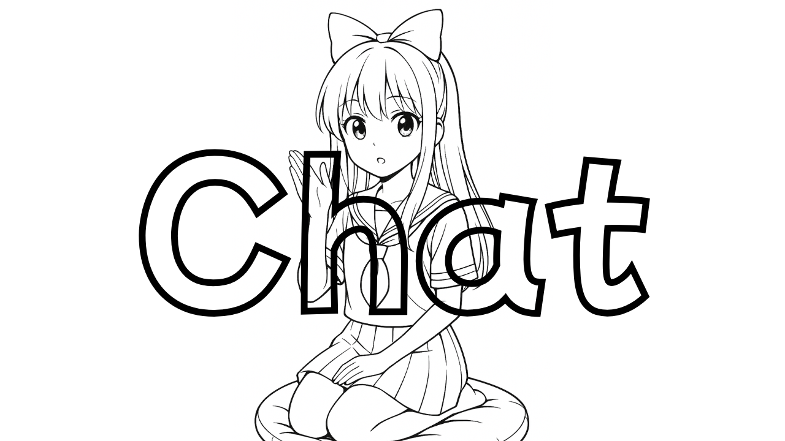

# @aituber-onair/chat



AITuber OnAirのチャット・LLM API統合ライブラリです。このパッケージは、OpenAI、ローカルLLM含むOpenAI互換プロバイダー、Claude、Gemini、OpenRouter、Z.ai、Kimi等の様々なAIチャットプロバイダーとやり取りするための統一されたインターフェースを提供します。

## 機能

- 🤖 **複数のAIプロバイダー対応**: OpenAI、ローカルLLM含むOpenAI互換プロバイダー、Claude (Anthropic)、Google Gemini、OpenRouter、Z.ai、Kimi
- 🔄 **統一されたインターフェース**: 異なるプロバイダー間での一貫したAPI
- 🛠️ **ツール・関数呼び出し**: AI関数呼び出しの自動反復処理をサポート
- 💬 **ストリーミングレスポンス**: リアルタイムストリーミングチャット応答
- 🖼️ **ビジョン対応**: ビジョン対応モデルでの画像処理
- 📝 **感情検出**: AI応答からの感情抽出
- 🎯 **応答長制御**: プリセットまたはカスタムトークン制限での応答長設定
- 🔌 **Model Context Protocol (MCP)**: MCP サーバーサポート

## インストール

```bash
npm install @aituber-onair/chat
```

## UMDビルド（ブラウザ/GAS）

本パッケージは既定で ESM/CJS を提供します。バンドラ無し環境（`<script>`読み込みのブラウザ、Google Apps Script）向けに UMD/IIFE バンドルも利用できます。

- グローバル名: `AITuberOnAirChat`
- 出力: `dist/umd/aituber-onair-chat.js`, `dist/umd/aituber-onair-chat.min.js`

モノレポ直下でUMDをビルド:

```bash
# 依存をインストール
npm ci

# chatパッケージをビルド
npm -w @aituber-onair/chat run build
```

### ブラウザ（UMD）

```html
<!doctype html>
<html>
  <head>
    <meta charset="utf-8" />
    <script src="/dist/umd/aituber-onair-chat.min.js"></script>
  </head>
  <body>
    <script>
      const chat = AITuberOnAirChat.ChatServiceFactory.createChatService('openai', {
        apiKey: 'your-api-key'
      });
      // ブラウザではストリーミング利用可
    </script>
  </body>
  </html>
```

### Google Apps Script（GAS）

GASはストリーミング不可・Fetch API非対応です。提供アダプターと非ストリーミングヘルパーを使用してください。

手順:
- UMDをビルドし、`dist/umd/aituber-onair-chat.min.js` をGASプロジェクトにスクリプトとして追加（例: `lib.gs`）。claspを使う場合はプロジェクト配下に配置してプッシュ。
- 別ファイル（例: `main.js`）で以下を利用:

```javascript
async function testChat() {
  // UrlFetchAppを使うfetchを注入
  AITuberOnAirChat.installGASFetch();

  const chat = AITuberOnAirChat.ChatServiceFactory.createChatService('openai', {
    apiKey: PropertiesService.getScriptProperties().getProperty('OPENAI_API_KEY')
  });

  const text = await AITuberOnAirChat.runOnceText(chat, [
    { role: 'user', content: 'Hello!' }
  ]);

  Logger.log(text);
}
```

注意:
- 実行ランタイムはV8。ストリーミング不可のため `chatOnce(..., false)`/`runOnceText` を使用。
- スクリプトプロパティに `OPENAI_API_KEY` を設定。
- 実例は `packages/chat/examples/gas-basic` を参照。`appsscript.json` は任意（近年のGASは既定でV8ランタイム）。タイムゾーン等をカスタムしたい場合のみ追加してください。

## 使用方法

### 基本的なチャット

```typescript
import { ChatServiceFactory, ChatServiceOptions } from '@aituber-onair/chat';

// チャットサービスを作成
const options: ChatServiceOptions = {
  apiKey: 'your-api-key',
  model: 'gpt-4' // オプション、指定がない場合はプロバイダーのデフォルトを使用
};

const chatService = ChatServiceFactory.createChatService('openai', options);

// シンプルなチャット処理
const messages = [
  { role: 'system', content: 'あなたは親切なアシスタントです。' },
  { role: 'user', content: 'こんにちは！元気ですか？' }
];

await chatService.processChat(
  messages,
  (partialText) => {
    // ストリーミング応答を処理
    console.log('部分:', partialText);
  },
  async (completeText) => {
    // 完全な応答を処理
    console.log('完了:', completeText);
  }
);
```

### プロバイダー別の使用方法

#### OpenAI

```typescript
const openaiService = ChatServiceFactory.createChatService('openai', {
  apiKey: process.env.OPENAI_API_KEY,
  model: 'gpt-5.1',
  reasoning_effort: 'none', // 最速モード（効率化推論を無効化）
  verbosity: 'medium'
});
```

Chat Completionsを使う場合:

```typescript
endpoint: 'https://api.openai.com/v1/chat/completions';
```

##### OpenAI互換API（ローカルLLM向け）最短手順

```typescript
const localCompatibleService = ChatServiceFactory.createChatService(
  'openai-compatible',
  {
    apiKey: process.env.OPENAI_COMPAT_API_KEY || 'dummy-key',
    model: process.env.OPENAI_COMPAT_MODEL || 'your-local-model',
    endpoint:
      process.env.OPENAI_COMPAT_ENDPOINT ||
      'http://127.0.0.1:18080/v1/chat/completions',
  },
);
```

注意:
- `endpoint` は省略記法ではなく、完全URLで指定してください。
- 接続先サーバーは OpenAI互換API 契約を満たす必要があります。
- 本パッケージは特定のローカルLLM製品に依存しません。

#### OpenAI互換（ローカル/セルフホスト）

公式OpenAI利用と互換エンドポイント利用を明確に分離したい場合は、
`openai-compatible` を使用してください。

```typescript
const compatibleService = ChatServiceFactory.createChatService(
  'openai-compatible',
  {
    apiKey: process.env.OPENAI_COMPAT_API_KEY || 'dummy-key',
    endpoint: 'http://127.0.0.1:18080/v1/chat/completions',
    model: 'your-local-model',
  },
);
```

注意:
- `openai-compatible` は `endpoint` と `model` の指定が必須です。
- `openai-compatible` では `apiKey` は任意です。
- `openai-compatible` では `mcpServers` は利用できません。
- 既存の `openai` プロバイダーの挙動は変更されません。

`reasoning_effort` の選択肢はモデルによって異なります。GPT-5（5.0）では `'minimal' | 'low' | 'medium' | 'high'` が有効で、GPT-5.1 では `'minimal'` の代わりに `'none'` を利用できます（GPT-5.1 の新しいデフォルト）。`'none'` を使うと推論フェーズを完全にスキップし、高速応答を優先できます。一方で GPT-5.1 では `'minimal'` はサポートされない点に注意してください。

**GPT-5ファミリーの概要**

- `gpt-5.1` – 複雑な推論、広範な世界知識、コードやマルチステップのエージェントタスク向け。
- `gpt-5` – 旧フラッグシップ（後方互換目的で提供されるが、現在は 5.1 が推奨）。
- `gpt-5-mini` – コスト最適化された推論/チャットモデル。速度と能力のバランスが良い。
- `gpt-5-nano` – 指示追従や分類などの高スループット処理に向いた軽量モデル。

### OpenAI互換対応範囲

必須:
- 非ストリーム応答（`stream: false`）
- ストリーム応答（`stream: true` / SSE）
- 会話履歴の継続参照（`messages`）
- エラー処理（特に4xxとタイムアウト）

ベストエフォート:
- tools/function calling
- vision入力
- JSONモードの厳密互換

### OpenAI互換APIトラブルシューティング

- CORS: ブラウザ環境では互換サーバーが
  `Access-Control-Allow-Origin` と
  `Access-Control-Allow-Headers` を返す必要があります。
- Authorization: `apiKey` を指定した場合は
  `Authorization: Bearer <apiKey>` を送信します。
  `apiKey` 未指定時は Authorization ヘッダーを送信しません。
  サーバー側が期待するトークン形式を確認してください。
- model名: 互換サーバーごとに利用可能なモデルIDが異なります。
  エンドポイントが受け付ける正確なモデル名を指定してください。
- ストリーム互換: `stream: true` では OpenAI互換のSSE形式
  （`data: {...}` + `data: [DONE]`）を想定しています。
  形式が異なる場合、ストリーム解析に失敗する可能性があります。

### 互換プローブ（自動検証）

`examples/compat-probe` で互換性を自動検証できます:

```bash
npm -w @aituber-onair/chat run compat:probe
```

CI/ローカルで再現性を高める場合は
`examples/mock-openai-server` を併用してください。

#### Claude (Anthropic)

```typescript
const claudeService = ChatServiceFactory.createChatService('claude', {
  apiKey: process.env.ANTHROPIC_API_KEY,
  model: 'claude-sonnet-4-6'
});
```

#### Google Gemini

```typescript
const geminiService = ChatServiceFactory.createChatService('gemini', {
  apiKey: process.env.GOOGLE_API_KEY,
  model: 'gemini-pro'
});
```

#### OpenRouter

```typescript
const openRouterService = ChatServiceFactory.createChatService('openrouter', {
  apiKey: process.env.OPENROUTER_API_KEY,
  model: 'openai/gpt-oss-20b:free', // 無料利用枠モデル
  // オプション: 分析用アプリ情報を追加
  appName: 'あなたのアプリ名',
  appUrl: 'https://your-app-url.com'
});
```

**OpenRouterの重要な注意事項:**
- `gpt-oss-20b:free`モデルでは、技術的制限によりトークン制限が自動的に無効化されます
- 応答の長さを制御するには、プロンプト内で指示してください（例：「40文字以内で返答してください」）
- 無料階層にはレート制限があります（20リクエスト/分）
- サポート対象モデル（キュレーション済み）:
  - `openai/gpt-oss-20b:free`
  - `openai/gpt-5.1-chat`, `openai/gpt-5.1-codex`, `openai/gpt-5-mini`, `openai/gpt-5-nano`
  - `openai/gpt-4o`, `openai/gpt-4.1-mini`, `openai/gpt-4.1-nano`
  - `anthropic/claude-opus-4`, `anthropic/claude-sonnet-4`
  - `anthropic/claude-3.7-sonnet`, `anthropic/claude-3.5-sonnet`, `anthropic/claude-haiku-4.5`
  - `google/gemini-2.5-pro`, `google/gemini-2.5-flash`, `google/gemini-2.5-flash-lite-preview-09-2025`
  - `z-ai/glm-4.7-flash`, `z-ai/glm-4.5-air`, `z-ai/glm-4.5-air:free`
  - `moonshotai/kimi-k2.5`

#### Z.ai（GLM）

```typescript
const zaiService = ChatServiceFactory.createChatService('zai', {
  apiKey: process.env.ZAI_API_KEY,
  model: 'glm-5',
  visionModel: 'glm-4.6V-Flash', // 任意: ビジョン対応モデル
  responseFormat: { type: 'json_object' } // 任意: JSONモード
});
```

注意:
- Z.aiはOpenAI互換のChat Completionsを利用します。
- テキスト対応モデル: `glm-5`, `glm-4.7`, `glm-4.7-FlashX`, `glm-4.7-Flash`, `glm-4.6`
- ビジョン対応モデル: `glm-4.6V`, `glm-4.6V-FlashX`, `glm-4.6V-Flash`
- `thinking` はデフォルトで無効化しています。

#### Kimi（Moonshot）

```typescript
const kimiService = ChatServiceFactory.createChatService('kimi', {
  apiKey: process.env.MOONSHOT_API_KEY,
  model: 'kimi-k2.5',
  // Optional: エンドポイント/ベースURLの上書き
  // endpoint: 'https://api.moonshot.ai/v1/chat/completions',
  // baseUrl: 'https://api.moonshot.ai/v1',
  thinking: { type: 'enabled' }
});
```

注意:
- KimiはOpenAI互換のChat Completionsを利用します。
- ツール使用時は`thinking`を`{ type: 'disabled' }`に強制します。

自前ホスティング例:

```typescript
const kimiService = ChatServiceFactory.createChatService('kimi', {
  apiKey: process.env.MOONSHOT_API_KEY,
  baseUrl: 'http://localhost:8000/v1',
  thinking: { type: 'disabled' }
});
```

注意:
- 自前ホスティングではthinking制御に`chat_template_kwargs`を使用します。

### ビジョンチャット

```typescript
const visionMessage = {
  role: 'user',
  content: [
    { type: 'text', text: 'この画像に何が見えますか？' },
    {
      type: 'image_url',
      image_url: {
        url: 'data:image/jpeg;base64,...', // または https:// URL
        detail: 'low' // 'low', 'high', または 'auto'
      }
    }
  ]
};

await chatService.processVisionChat(
  [visionMessage],
  (partial) => console.log(partial),
  async (complete) => console.log(complete)
);
```

### ツール・関数呼び出し

```typescript
import { ToolDefinition } from '@aituber-onair/chat';

const tools: ToolDefinition[] = [{
  name: 'get_weather',
  description: '指定された場所の現在の天気を取得',
  parameters: {
    type: 'object',
    properties: {
      location: { type: 'string', description: '都市名' }
    },
    required: ['location']
  }
}];

// ツール呼び出しはチャットサービスによって自動的に処理されます
// サービス作成時にツールハンドラーを設定してください
```

### 応答長制御

```typescript
// プリセット応答長を使用
const service = ChatServiceFactory.createChatService('openai', {
  apiKey: 'your-key',
  responseLength: 'medium' // 'veryShort', 'short', 'medium', 'long', 'veryLong'
});

// カスタムトークン制限を使用
const service = ChatServiceFactory.createChatService('openai', {
  apiKey: 'your-key',
  maxTokens: 500 // 直接トークン制限
});
```

### Model Context Protocol (MCP)

チャットパッケージは全てのプロバイダーでMCP（Model Context Protocol）サーバーをサポートしており、異なる実装アプローチを採用しています：

#### プロバイダー別MCP実装

**OpenAI & Claude**: 直接MCP統合
- プロバイダーのネイティブMCPサポートを使用（OpenAIのResponses API）
- サーバー間通信（CORSの問題なし）
- MCPサーバーへの直接接続

**Gemini**: 関数呼び出し統合
- MCPツールがGeminiの関数宣言として登録
- ToolExecutorがMCPサーバー通信を処理
- ブラウザ環境ではCORS設定が必要

#### 基本的な使用方法

```typescript
// MCPサーバーは全てのプロバイダー（OpenAI、Claude、Gemini）で動作
const mcpServers = [{
  type: 'url',
  url: 'http://localhost:3000',
  name: 'local-server',
  authorization_token: 'optional-token'
}];

// OpenAI/Claude - 直接MCP統合
const openaiService = ChatServiceFactory.createChatService('openai', {
  apiKey: 'your-key',
  mcpServers // Responses API経由で直接統合
});

// Gemini - 関数呼び出し経由でMCP
const geminiService = ChatServiceFactory.createChatService('gemini', {
  apiKey: 'your-key',
  mcpServers // 関数宣言として統合
});

// MCPツールは自動的に利用可能になり、ToolExecutorによって処理されます
```

#### Gemini固有のCORS設定

ブラウザ環境でGeminiをMCPと一緒に使用する場合、CORSの問題を回避するためにプロキシを設定する必要があります：

**Vite開発設定** (`vite.config.ts`):
```typescript
export default defineConfig({
  server: {
    proxy: {
      '/api/mcp': {
        target: 'https://mcp.deepwiki.com',
        changeOrigin: true,
        rewrite: (path) => path.replace(/^\/api\/mcp/, ''),
      }
    }
  }
})
```

**動的MCPサーバー設定**:
```typescript
// プロバイダー別MCPサーバー設定
const getMcpServers = (provider: string): MCPServerConfig[] => {
  const baseUrl = provider === 'gemini' 
    ? '/api/mcp/sse'  // Gemini用プロキシURL（ブラウザ）
    : 'https://mcp.deepwiki.com/sse';  // OpenAI/Claude用直接URL

  return [{
    type: 'url',
    url: baseUrl,
    name: 'deepwiki',
  }];
};

// チャットサービス作成で使用
const mcpServers = getMcpServers(chatProvider);
const chatService = ChatServiceFactory.createChatService(chatProvider, {
  apiKey: 'your-api-key',
  mcpServers
});
```

#### エラーハンドリング・タイムアウト

Gemini MCP実装には堅牢なエラーハンドリングが含まれています：
- MCPスキーマ取得に5秒のタイムアウト
- MCPサーバーが利用できない場合の基本検索ツールへの自動フォールバック
- MCP初期化が失敗した場合の優雅な劣化

### 感情検出

```typescript
import { textToScreenplay } from '@aituber-onair/chat';

const text = "[happy] お会いできて嬉しいです！";
const screenplay = textToScreenplay(text);
console.log(screenplay); // { emotion: 'happy', text: "お会いできて嬉しいです！" }
```

## API リファレンス

### ChatService インターフェース

```typescript
interface ChatService {
  getModel(): string;
  getVisionModel(): string;
  
  processChat(
    messages: Message[],
    onPartialResponse: (text: string) => void,
    onCompleteResponse: (text: string) => Promise<void>
  ): Promise<void>;
  
  processVisionChat(
    messages: MessageWithVision[],
    onPartialResponse: (text: string) => void,
    onCompleteResponse: (text: string) => Promise<void>
  ): Promise<void>;
  
  chatOnce(
    messages: Message[],
    stream: boolean,
    onPartialResponse: (text: string) => void,
    maxTokens?: number
  ): Promise<ToolChatCompletion>;
  
  visionChatOnce(
    messages: MessageWithVision[],
    stream: boolean,
    onPartialResponse: (text: string) => void,
    maxTokens?: number
  ): Promise<ToolChatCompletion>;
}
```

### 型定義

```typescript
interface Message {
  role: 'system' | 'user' | 'assistant' | 'tool';
  content: string;
  timestamp?: number;
}

interface MessageWithVision {
  role: 'system' | 'user' | 'assistant' | 'tool';
  content: string | VisionBlock[];
}

type ChatResponseLength = 'veryShort' | 'short' | 'medium' | 'long' | 'veryLong';
```

## 利用可能なプロバイダー

現在、以下のAIプロバイダーが組み込まれています：

- **OpenAI**: GPT-5.1、GPT-5（Nano/Mini/Standard）、GPT-4.1(miniとnanoを含む), GPT-4, GPT-4o-mini, O3-mini, o1, o1-miniのモデルをサポート
- **Gemini**: Gemini 2.5 Pro, Gemini 2.5 Flash, Gemini 2.5 Flash Lite Preview, Gemini 2.0 Flash, Gemini 2.0 Flash-Liteのモデルをサポート
- **Claude**: Claude Sonnet 4.6, Claude Opus 4.6, Claude Opus 4.5, Claude Sonnet 4.5, Claude Haiku 4.5, Claude 4 Sonnet, Claude 4 Opus, Claude 3.7 Sonnet, Claude 3.5 Haiku/Sonnet, Claude 3 Haikuのモデルをサポート
- **OpenRouter**: OpenRouterのキュレーション済みモデル一覧（OpenAI/Claude/Gemini/Z.ai/Kimi）をサポート。モデルIDはOpenRouter節を参照してください
- **Z.ai**: GLM-5（テキスト）、GLM-4.7/4.6（テキスト）、GLM-4.6V系（ビジョン）をサポート
- **Kimi**: Kimi K2.5（`kimi-k2.5`、ビジョン対応）をサポート

## ライセンス

MIT

## 貢献

貢献を歓迎します！プルリクエストをお気軽にご提出ください。
