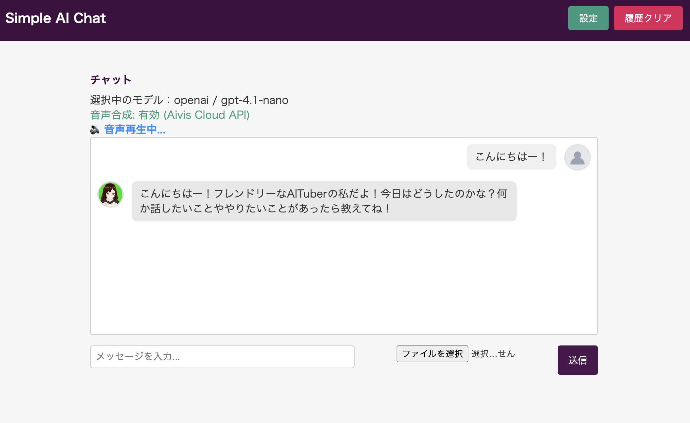

# React Basic Example - AITuber OnAir Core



A comprehensive React-based AI chat application demonstrating the full capabilities of [AITuber OnAir Core](https://www.npmjs.com/package/@aituber-onair/core). This example showcases multi-provider LLM integration, advanced voice synthesis, and real-time streaming features in a modern web interface.

## 🎯 Overview

This example application serves as a practical implementation guide for integrating AITuber OnAir Core into React applications. It demonstrates how to build a fully-featured AI chat interface with support for multiple LLM providers, various TTS engines, and advanced configuration options including GPT-5 support.

### Key Features

- **🤖 Multi-Provider LLM Support**
  - OpenAI (GPT-3.5, GPT-4, GPT-5 series)
  - Google Gemini (Pro, Flash, Thinking models)
  - Anthropic Claude (3.5 Sonnet, 3.5 Haiku)
  - Seamless provider switching

- **🎙️ Comprehensive Voice Synthesis**
  - 7 different TTS engines with unique capabilities
  - Real-time voice streaming
  - Speaker selection for each engine
  - Emotion-aware synthesis support

- **💬 Advanced Chat Features**
  - Text and image (vision) chat support
  - Real-time streaming responses
  - Adjustable response length (40-5000 tokens)
  - Chat history management

- **⚙️ GPT-5 Specific Features**
  - Quick presets (Casual, Balanced, Expert)
  - Custom configuration options
  - Verbosity and reasoning effort control
  - Endpoint preference selection

- **🔧 Developer Tools**
  - Tool integration framework
  - MCP (Model Context Protocol) support
  - DeepWiki integration example

## 🚀 Getting Started

### Prerequisites

- Node.js 18+ 
- npm or yarn
- API keys for your chosen LLM provider(s)
- (Optional) API keys for voice engines

### Installation

1. Clone the repository and navigate to the example:
```bash
git clone https://github.com/shinshin86/aituber-onair.git
cd aituber-onair/packages/core/examples/react-basic
```

2. Install dependencies:
```bash
npm install
```

3. Start the development server:
```bash
npm run dev
```

4. Open your browser and navigate to `http://localhost:5173`

### Available Scripts

```bash
npm run dev      # Start development server with hot reload
npm run build    # Build for production
npm run preview  # Preview production build locally
npm run lint     # Run ESLint
npm run fmt      # Format code with Biome
```

## 🛠️ Configuration

### LLM Provider Setup

Click the "設定" (Settings) button to configure your AI provider:

1. **Select Provider**: Choose from OpenAI, Gemini, or Claude
2. **Enter API Key**: Provide your provider's API key
3. **Choose Model**: Select the specific model to use
4. **System Prompt**: Customize the AI's behavior and personality

#### Provider-Specific Models

**OpenAI:**
- GPT-4.1 series (Nano, Mini, Standard)
- GPT-5 series (Nano, Mini, Standard, Chat Latest)
- o3-mini
- GPT-4o, GPT-4o Mini
- GPT-4.5 Preview

**Gemini:**
- Gemini 2.5 series (Flash Lite, Flash, Pro)
- Gemini 2.5 Flash Lite Preview (06-17)
- Gemini 2.0 series (Flash Lite, Flash)
- Gemini 1.5 series (Flash, Pro)

**Claude:**
- Claude 3 Haiku
- Claude 3.5 series (Haiku, Sonnet)
- Claude 3.7 Sonnet
- Claude 4 series (Sonnet, Opus)

### GPT-5 Configuration

When using GPT-5 models, additional configuration options become available:

#### Response Length
- Very Short: ~40 tokens
- Short: ~100 tokens
- Medium: ~200 tokens (default)
- Long: ~500 tokens
- Very Long: ~1000 tokens
- Deep: ~5000 tokens

#### Presets
- **Casual**: Fast, conversational responses
- **Balanced**: General purpose with good reasoning
- **Expert**: Deep analysis and complex problem solving
- **Custom**: Manual configuration

#### Custom Settings
- **Verbosity**: Low, Medium, High
- **Reasoning Effort**: Minimal, Low, Medium, High
- **Endpoint**: Chat Completions API or Responses API

## 🎤 Voice Engine Configuration

### Supported TTS Engines

The application supports 7 different Text-to-Speech engines:

#### 1. **OpenAI TTS**
- Requires OpenAI API key
- Voices: alloy, echo, fable, onyx, nova, shimmer
- High-quality neural voices

#### 2. **VOICEVOX**
- Free, open-source Japanese TTS
- No API key required
- Requires local VOICEVOX server running
- Dynamic speaker fetching

#### 3. **Aivis Speech**
- Local TTS engine
- No API key required
- Requires Aivis Speech server
- Multiple character voices

#### 4. **Aivis Cloud API**
- Cloud-based TTS service
- Requires API key
- Advanced voice parameters
- Emotion control support

#### 5. **VoicePeak**
- Local TTS engine
- No API key required
- 6 built-in speakers
- Natural Japanese voices

#### 6. **にじボイス (NijiVoice)**
- Commercial Japanese TTS
- Requires API key
- Anime/game character voices
- Dynamic voice actor fetching

#### 7. **MiniMax**
- Chinese TTS service
- Requires API key and Group ID
- Multiple voice options
- Global endpoint support

### Voice Engine Setup

1. Navigate to the Voice tab in settings
2. Select your preferred engine
3. Enter API key if required
4. Choose speaker/voice from available options
5. Click "設定を反映" to apply

## 📁 Project Structure

```
react-basic/
├── src/
│   ├── App.tsx                 # Main application component
│   ├── main.tsx               # Application entry point
│   ├── index.css              # Global styles
│   ├── constants/             # Configuration constants
│   │   ├── openai.ts          # OpenAI models and settings
│   │   ├── gemini.ts          # Gemini models
│   │   ├── claude.ts          # Claude models
│   │   ├── voiceEngines.ts    # TTS engine configurations
│   │   ├── tools.ts           # Tool definitions
│   │   ├── mcp.ts             # MCP server configs
│   │   └── speakers/          # Speaker configurations
│   │       ├── openaiTts.ts
│   │       ├── voicevox.ts
│   │       ├── aivisCloud.ts
│   │       ├── aivisSpeech.ts
│   │       ├── voicepeak.ts
│   │       └── minimax.ts
│   ├── mcpClient.ts           # MCP client implementation
│   └── assets/                # Static assets
│       └── icons/             # UI icons
├── index.html                 # HTML template
├── package.json               # Dependencies and scripts
├── vite.config.ts            # Vite configuration
└── tsconfig.json             # TypeScript configuration
```

## 🔌 Advanced Features

### Tool Integration

The example includes a sample tool implementation (`randomInt`) that demonstrates how to extend the AI's capabilities:

```typescript
// Define tool schema
const randomIntTool = {
  name: 'randomInt',
  description: 'Generate a random integer',
  parameters: { /* ... */ }
};

// Implement tool handler
const randomIntHandler = async (args) => {
  // Tool logic here
};
```

### MCP (Model Context Protocol) Support

Enable DeepWiki MCP integration for enhanced knowledge access:

1. Check "Enable DeepWiki MCP" in settings
2. The AI can then access DeepWiki for additional context
3. Uncomment MCP client code for custom MCP servers

### Image Chat Support

Upload images for vision-enabled models:
1. Click the image attachment button
2. Select an image file
3. The AI will analyze and respond to image content

## 🎨 Customization

### Styling

The application uses inline styles for simplicity. Key style customization points:

- Header styling in `App.tsx`
- Chat message bubbles
- Settings modal appearance
- Button themes

### Adding New Features

To extend the application:

1. **New LLM Provider**: Add model definitions in `constants/`
2. **New TTS Engine**: Update `voiceEngines.ts` and add speaker configs
3. **Custom Tools**: Define in `tools.ts` with handler implementation
4. **UI Components**: Modify `App.tsx` or create new components

## 🐛 Troubleshooting

### Common Issues

**"API Keyを入力してください"**
- Ensure you've entered a valid API key in settings

**Voice not working**
- Check if the selected TTS engine server is running (for local engines)
- Verify API key for cloud-based engines
- Ensure speaker is selected

**Streaming not working**
- Verify your LLM provider supports streaming
- Check network connectivity

**CORS errors with local TTS**
- Ensure local TTS servers are configured to allow CORS
- Check server is running on the correct port

### Local TTS Server Endpoints

- VOICEVOX: `http://localhost:50021`
- VoicePeak: `http://localhost:19000`
- Aivis Speech: `http://localhost:10101`

## 🔗 Related Resources

- [AITuber OnAir Core Documentation](https://github.com/shinshin86/aituber-onair/tree/main/packages/core)
- [AITuber OnAir Main Repository](https://github.com/shinshin86/aituber-onair)
- [NPM Package](https://www.npmjs.com/package/@aituber-onair/core)
- [OpenAI API Documentation](https://platform.openai.com/docs)
- [Google AI Studio](https://aistudio.google.com/)
- [Anthropic Console](https://console.anthropic.com/)

## 📄 License

This example is part of the AITuber OnAir project and follows the same license terms.

## 🤝 Contributing

Contributions are welcome! Feel free to submit issues or pull requests to improve this example.
