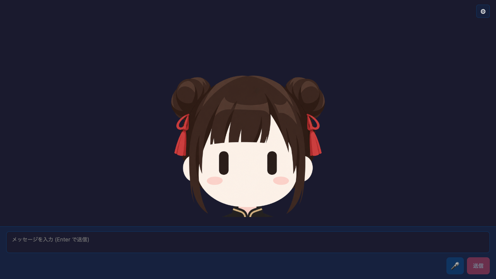

# Bouncy Avatar Chat



A React chat example built with `@aituber-onair/core` and a single-image
bouncy avatar. Instead of swapping mouth images, it maps real TTS output volume
to small jumps, alternating tilts, and a squash effect on landing.

## Features

- Uses one transparent PNG or JPG
- Normalizes the TTS audio RMS level and turns voice peaks into jump impulses
- Alternates the tilt direction for successive impulses
- Adds landing squash and settles naturally when speech stops
- Supports image replacement and a motion preview from Settings
- Retains the LLM, TTS, streaming, and emotion-effect controls from the
  PNGTuber example

## Setup

```bash
cd packages/core/examples/react-bouncy-avatar-app
npm install
npm run dev
```

Open **Settings** to configure the LLM and TTS engines. The visual section
accepts a single avatar image. **Preview motion** works without an API key or a
configured TTS engine.

Settings are stored in `localStorage` under
`react-bouncy-avatar-app-settings`. Uploaded images remain in memory only and
reset to the bundled image after a reload.

## Audio-driven motion

`src/hooks/useAudioMotion.ts` plays TTS output through the Web Audio API and
measures its RMS level each frame. `src/hooks/useBouncyAvatarMotion.ts` converts
the normalized level into impulses, while `src/lib/bouncyAvatarMotion.ts`
calculates vertical movement, rotation, and squash.

The browser Web Speech API plays audio directly and does not expose audio
bytes, so it cannot drive motion from the real waveform. The Settings motion
preview remains available with that engine.

## Bundled image

The default image is `public/avatar/bouncy-avatar.png`. It was losslessly
re-encoded as PNG with embedded metadata removed. It was generated with
ChatGPT from a Miko image using a
[prompt shared by Serio_ai (@Multi_Serio_Ai / APG)](https://x.com/Multi_Serio_Ai/status/2100800237619347535).
Thank you to the author for sharing the prompt.
