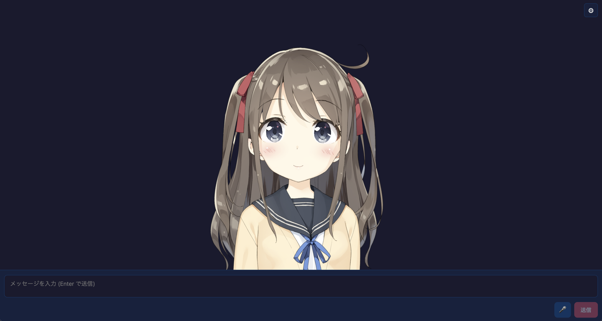

# Live2D Chat

Web Speech API TTS is available with browser voice selection and rate, pitch,
volume, and language controls. Because the browser plays it directly without
exposing audio bytes, lip sync is not supported when this engine is selected.



A React example app built on `@aituber-onair/core` that renders Live2D models
from the local `models/` folder, plays audio generated by
`@aituber-onair/core`, and drives mouth movement from that playback.

## What this example does

- Includes built-in settings for LLM / TTS providers
- Chat providers include `deepseek`, `mistral`, disabled `sakana`, and `plamo` in addition to the existing OpenAI, Gemini, Claude, Z.ai, Kimi, xAI, OpenRouter, Gemini Nano, and OpenAI-compatible options
- xAI Grok 4.5 exposes `reasoning_effort` and defaults to `low`; Grok 4.3 defaults to `none` for lower latency
- Provider model lists are sourced from `@aituber-onair/core`, so newly synced
  chat models such as Claude Opus 4.8, Gemini 3.5 Flash, and GPT-5.6 are available automatically
  in Settings
- Gemini 3.5 Flash automatically uses minimal thinking for chat-style responses
- `gpt-5.5-pro` is intentionally omitted because OpenAI documents it as
  non-streaming, while this example uses the standard streaming chat flow
- Loads a Live2D model from the local `models/` folder
- Keeps model files in memory only, so no app-specific persistent storage is
  required
- Supports drag to move and mouse wheel to zoom on the avatar stage
- Supports green screen background mode and a solo broadcast layout with
  avatar-only captions from Settings → Visual
- Uses audio generated by `@aituber-onair/core` for lip-sync
- Use TTS engines: `openai`, `geminiTts`, `openaiCompatible`, `voicevox`,
  `voicepeak`, `aivisSpeech`, `aivisCloud`, `minimax`, `xai`,
  `unrealSpeech`, `elevenLabs`, `inworld`, `gradium`, `piperPlus`, `webSpeech`, `none`
- Fetch and select speaker lists dynamically for supported providers,
  including ElevenLabs voices from `/v2/voices` and Inworld voices from
  `/voices/v1/voices` after API key input
- Use fixed Gradium flagship voice presets with readable labels
- Fetches live chat comments from YouTube Live or Twitch, analyzes them with
  `@aituber-onair/comment-intelligence`, and sends only selected comments into
  the LLM pipeline
  - YouTube uses the YouTube Data API v3 (requires a Google Cloud API key)
  - Twitch uses EventSub WebSocket with a browser-based implicit OAuth flow
- Captures one frame from OBS Virtual Camera in **Settings → Screen Vision**
  and sends it to a vision-capable model for an avatar comment
- Detects repetitive conversation patterns with `@aituber-onair/manneri` and
  adds an internal topic-diversification instruction before the next response

## Screen Vision

Start OBS Virtual Camera, choose it from **Settings → Screen Vision**, then press
**画面を見る** to send the current frame to the selected vision-capable model.
You can also choose an automatic interval such as 30 seconds, 1 minute,
2 minutes, or 5 minutes.

## Broadcast visuals

Use **Settings → Visual** to switch the background to green screen and select
the solo broadcast layout. In solo broadcast layout, the normal chat log is
hidden and only the avatar's latest spoken text is shown as a lower caption.
The user input field is hidden by default, but can be enabled in the same
Visual settings section.

## Where to put Live2D assets

This example does not include any Live2D assets. Place your model under
`packages/core/examples/react-live2d-app/models/<your-model>/`.

Also place the Cubism Core runtime here:

- `packages/core/examples/react-live2d-app/public/scripts/live2dcubismcore.min.js`

This repository does not bundle `live2dcubismcore.min.js`.
Per the Live2D license, download `Cubism Core for Web` or
`Cubism SDK for Web` yourself from the official Live2D website, then place
the extracted `live2dcubismcore.min.js` at the path above.

- Download page:
  https://www.live2d.com/en/sdk/download/web/
- Reference:
  https://docs.live2d.com/en/cubism-sdk-manual/cubism-core/
  https://docs.live2d.com/en/cubism-sdk-manual/cubism-sdk-for-web/

This example targets Cubism 4 models, so `live2d.min.js` is not required.

The example expects the whole model folder, including the `.model3.json` file
and every referenced asset beneath it.

Example:

```text
packages/core/examples/react-live2d-app/models/Hiyori/
├── Hiyori.model3.json
├── Hiyori.moc3
├── Hiyori.physics3.json
├── textures/
│   ├── texture_00.png
│   └── texture_01.png
└── motions/
    └── idle.motion3.json
```

```text
packages/core/examples/react-live2d-app/public/scripts/
└── live2dcubismcore.min.js
```

## Setup

```bash
cd packages/core/examples/react-live2d-app
npm install
npm run dev
```

Open `http://localhost:5173`, open `設定`, then:

1. Set your LLM / TTS provider values
2. If you placed models under `models/`, choose one from the list and click
   `読み込む`

The LLM section also lets you edit the system prompt. It is applied when the
field loses focus and is saved with the other settings.

## Stream comments (YouTube Live / Twitch)

This app can analyze live chat comments from YouTube Live or Twitch before
forwarding selected comments into the LLM.
Configure it from **Settings → Stream**.

Only one platform can be active at a time.

Comment Intelligence is enabled by default. It batches comments while the AI is
processing or speaking, filters unsafe or disruptive comments, ranks the
remaining comments, summarizes ignored comments, and sends compact live-chat
context to the AITuber. Rules mode runs without an additional LLM call. Hybrid
and LLM-assisted modes reuse the provider, model, API key, and endpoint from the
LLM settings tab for comment analysis and fall back to rules when unavailable.

Manneri is enabled by default. It watches recent user and assistant messages,
and when conversation patterns become repetitive, it injects a hidden
topic-diversification instruction into the next LLM request. You can adjust the
similarity threshold, lookback window, cooldown, and minimum message length in
Settings → Stream.

### YouTube Live

1. Create an API key in Google Cloud Console with **YouTube Data API v3** enabled.
2. Open Settings → Stream, choose `YouTube`, paste the API key, and enter the live
   video ID (the `v=` parameter of the YouTube Live URL).
3. Adjust the polling interval if needed (default: 20s), then enable the toggle.

### Twitch

This app uses the Twitch browser-based implicit OAuth flow (`response_type=token`,
scope `user:read:chat`). The access token lives only in `localStorage` inside
your browser. No server is involved.

1. Register an application in the
   [Twitch Developer Console](https://dev.twitch.tv/console/apps) and copy the
   Client ID.
2. Add **`http://localhost:5173/`** as an OAuth Redirect URL for that app
   (use the exact URL shown in Settings → Stream → Twitch; for Vite this is
   typically `http://localhost:5173/`).
3. In Settings → Stream, choose `Twitch`, paste the Client ID, then click
   **Connect to Twitch** and approve the OAuth prompt.
4. Enter the channel login name (the name in the Twitch URL, lowercase), set
   the dequeue interval, and enable the toggle.

**Deploying to a non-localhost origin:** if you host this sample app anywhere
other than `http://localhost:5173/`, register the deployed origin
(for example `https://your-domain.example/`) as an additional OAuth Redirect
URL in the Twitch Developer Console, then re-run the OAuth flow from that
origin. The Redirect URL displayed in the Settings panel is derived from
`window.location` and updates automatically.

### Security note on stored credentials

This is a sample app. The YouTube API key, Twitch Client ID, and Twitch access
token are stored **unencrypted in `localStorage`** (same place as the other
provider API keys used by this sample). Any script running on the app's origin
can read them. Do not use production-scope credentials here, do not deploy this
sample on a shared or public origin, and rotate keys if the browser storage is
shared with other users.

## Notes

- This example does not bundle any Live2D models
- This example does not bundle `live2dcubismcore.min.js`
- Model data is memory-only and is cleared on page reload
- LLM / TTS / stream settings are persisted in `localStorage`
- The `models/` list is resolved when the dev server starts, so restart it
  after adding a new local model there
- The example uses `pixi-live2d-display-lipsyncpatch` for Live2D rendering
