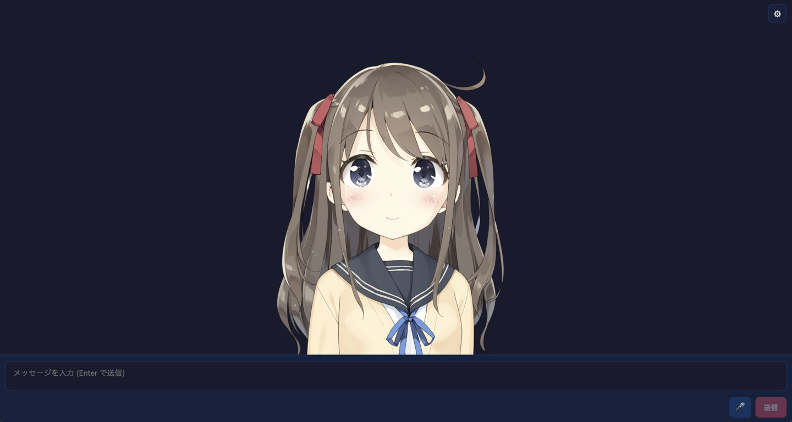

# Live2D Chat

Web Speech API TTS is available with browser voice selection and rate, pitch,
volume, and language controls. Because the browser plays it directly without
exposing audio bytes, lip sync is not supported when this engine is selected.

Fish Audio and Cartesia are available with API-key-backed voice selectors.
Fish Audio uses the Vite development/preview proxy because its official API
does not support direct browser CORS; production apps should keep the API key
server-side and route requests through their own backend.



A React example app built on `@aituber-onair/core` that renders Live2D models
from the local `models/` folder, plays audio generated by
`@aituber-onair/core`, and drives mouth movement from that playback.

## Chat and Voice model updates

This example uses Chat 0.62.0 and Voice 0.26.0 through Core. Select a
supported model such as `gpt-6-sol`, `gpt-6-luna`, `claude-opus-5-5`,
`claude-sonnet-5-5`,
`grok-4.7`, or `deepseek-flash` in
the model selector; the new OpenRouter models are also listed. OpenAI reasoning
models use the Casual preset, with Astra routed through Responses and its
reasoning effort normalized to `low`.

Gemini 3.8 Flash TTS and Flash-Lite TTS are selectable; the preview TTS
model remains the default. Gemini 3.8 uses the style prompt and ignores
language code.

The Inworld model selector includes `inworld-tts-2-flash`. Models that do not
support Delivery Mode, currently Flash, disable that control and omit it from
speech options, including when a previous value is stored. The default remains
`inworld-tts-2`, and voice-list selection is unchanged. Native DeepSeek tool
calling requires non-thinking mode.

## What this example does

- Includes built-in settings for LLM / TTS providers
- Chat providers include `deepseek`, `mistral`, disabled `sakana`, and `plamo` in addition to the existing OpenAI, Gemini, Claude, Z.ai, Kimi, xAI, OpenRouter, Gemini Nano, and OpenAI-compatible options
- xAI Grok 4.6 supports `low`, `medium`, `high`, and `xhigh`
  `reasoning_effort` and defaults to `low`; Grok 4.3 defaults to `none` for
  lower latency
- Provider model lists are sourced from `@aituber-onair/core`, so newly synced
  chat models such as GLM-5.3 / GLM-5.3 Flash, DeepSeek V4 Flash Vision Exp,
  Sakana Namazu, Qwen3.8 Flash, Claude Sonnet 5 / Opus 4.8, and Kimi K2.6 are
  available automatically in Settings
- GLM-5.3 models always use thinking and default to `low`; DeepSeek Vision and
  Sakana Namazu keep optional thinking disabled by default for responsive chat
- Gemini 3 Flash-family models use minimal thinking by default for chat-style
  responses; Gemini 3 Pro uses low
- `gpt-5.5-pro` is intentionally omitted because OpenAI documents it as
  non-streaming, while this example uses the standard streaming chat flow
- Loads a Live2D model from the local `models/` folder
- Assigns motions in the loaded model to response emotions per model, with a
  preview button for each assignment in the Avatar & Motion settings category
- Selects one or more idle motions per model; the model's `Idle` group is
  selected by default, and selected motions play randomly while waiting
- Keeps model files in memory only, so no app-specific persistent storage is
  required
- Supports drag to move and mouse wheel to zoom on the avatar stage
- Supports green screen background mode and a solo broadcast layout with
  avatar-only captions from Settings → Visual
- Uses audio generated by `@aituber-onair/core` for lip-sync
- Maps response emotions to model-independent visual effects in
  **Settings → アバター・モーション → 感情表現エフェクト**
- Uses the same layered background auras and foreground effect designs as the
  PSD/PuruPuru samples
- Supports disabled, manual preview, and response-emotion-linked effect
  control; linked effects start before TTS playback
- Adjust face and eye anchors and effect size in manual mode; anchors follow
  model dragging and zoom and are saved per model
- Use TTS engines: `openai`, `geminiTts`, `openaiCompatible`, `voicevox`,
  `voicepeak`, `aivisSpeech`, `aivisCloud`, `minimax`, `xai`,
  `unrealSpeech`, `elevenLabs`, `inworld`, `gradium`, `piperPlus`, `webSpeech`, `none`
- Fetch and select speaker lists dynamically for supported providers,
  including ElevenLabs voices from `/v2/voices` and Inworld voices from
  `/voices/v1/voices` after API key input
- Use fixed Gradium flagship voice presets with readable labels
- Fetches live chat comments from YouTube Live or Twitch, analyzes them with
  `@aituber-onair/comment-intelligence`, and sends only selected comments into
  the LLM pipeline
  - YouTube uses the YouTube Data API v3 (requires a Google Cloud API key)
  - Twitch uses EventSub WebSocket with a browser-based implicit OAuth flow
- Captures one frame from OBS Virtual Camera in **Settings → Screen Vision**
  and sends it to a vision-capable model for an avatar comment
- Detects repetitive conversation patterns with `@aituber-onair/manneri` and
  adds an internal topic-diversification instruction before the next response

## Voice input

Press the microphone button on the left of the chat form to start voice input,
and press it again to stop. The `⌃` button next to it opens the listening mode
and service options. The choices are saved in the browser.

- Listening mode: **一回だけ** (once) sends one utterance and stops.
  **継続して会話** (continuous) listens again after the reply has been generated
  and spoken
- Service: **ブラウザ** (Web Speech API), **OpenAI**, or **Gemini**. The example
  uses `@aituber-onair/transcription` and sends each confirmed utterance as a
  chat message
- OpenAI and Gemini use the same API keys as the LLM settings, and the keys can
  also be entered from the menu. Keys are sent from the browser directly to each
  service, so avoid shared devices. Listening is billed by each service
- OpenAI and Gemini do not accept audio until the connection is ready. Right
  after pressing the microphone the form shows a connecting status, and the
  button changes once you can speak

## Screen Vision

Start OBS Virtual Camera, choose it from **Settings → Screen Vision**, then press
**画面を見る** to send the current frame to the selected vision-capable model.
You can also choose an automatic interval such as 30 seconds, 1 minute,
2 minutes, or 5 minutes.

## Broadcast visuals

Use **Settings → Visual** to switch the background to green screen and select
the solo broadcast layout. In solo broadcast layout, the normal chat log is
hidden and only the avatar's latest spoken text is shown as a lower caption.
The user input field is hidden by default, but can be enabled in the same
Visual settings section.

## Where to put Live2D assets

This example does not include any Live2D assets. Place your model under
`packages/core/examples/react-live2d-app/models/<your-model>/`.

Also place the Cubism Core runtime here:

- `packages/core/examples/react-live2d-app/public/scripts/live2dcubismcore.min.js`

This repository does not bundle `live2dcubismcore.min.js`.
Per the Live2D license, download `Cubism Core for Web` or
`Cubism SDK for Web` yourself from the official Live2D website, then place
the extracted `live2dcubismcore.min.js` at the path above.

- Download page:
  https://www.live2d.com/en/sdk/download/web/
- Reference:
  https://docs.live2d.com/en/cubism-sdk-manual/cubism-core/
  https://docs.live2d.com/en/cubism-sdk-manual/cubism-sdk-for-web/

This example targets Cubism 4 models, so `live2d.min.js` is not required.

The example expects the whole model folder, including the `.model3.json` file
and every referenced asset beneath it.

Example:

```text
packages/core/examples/react-live2d-app/models/Hiyori/
├── Hiyori.model3.json
├── Hiyori.moc3
├── Hiyori.physics3.json
├── textures/
│   ├── texture_00.png
│   └── texture_01.png
└── motions/
    └── idle.motion3.json
```

```text
packages/core/examples/react-live2d-app/public/scripts/
└── live2dcubismcore.min.js
```

## Setup

For `openai-compatible`, choose a local-server preset or enter an origin, a
`/v1` base URL, or a full `/chat/completions` URL. Fetch the model list, select
a model, and run **Test connection** before chatting. See the
[Local LLM setup guide](https://github.com/shinshin86/aituber-onair/blob/main/docs/local-llm.md).

For `OpenAI-Compatible TTS`, enter an origin, a `/v1` base URL, or a full
`/audio/speech` URL. **Detect server** fills in the model and voice lists when
the server provides them, and **Test speech** plays a short sample. See the
[Local TTS setup guide](https://github.com/shinshin86/aituber-onair/blob/main/docs/local-tts.md).


```bash
cd packages/core/examples/react-live2d-app
npm install
npm run dev
```

Open `http://localhost:5173`, open `設定`, then:

1. Set your LLM / TTS provider values
2. If you placed models under `models/`, choose one from the list and click
   `読み込む`

In `アバター・モーション`, select the motions to play while idle. Motions in the
model's `Idle` group are selected by default. You can select any combination
from the loaded model; the app saves your choice per model in the browser and
uses an in-memory motion group without editing the model files or Live2D
library. The idle motions are picked randomly between plays.

Assign motions from the loaded model's `.model3.json` to response emotions such
as `happy` and `sad`. Unassigned emotions do not start a motion. An assigned
motion repeats in full only during audio playback alongside lip-sync. After
playback, the selected idle motions resume. Visual effect settings do not
control model motions.

The LLM section also lets you edit the system prompt. It is applied when the
field loses focus and is saved with the other settings.

## Stream comments (YouTube Live / Twitch)

This app can analyze live chat comments from YouTube Live or Twitch before
forwarding selected comments into the LLM.
Configure it from **Settings → Stream**.

Only one platform can be active at a time.

Comment Intelligence is enabled by default. It batches comments while the AI is
processing or speaking, filters unsafe or disruptive comments, ranks the
remaining comments, summarizes ignored comments, and sends compact live-chat
context to the AITuber. Rules mode runs without an additional LLM call. Hybrid
and LLM-assisted modes reuse the provider, model, API key, and endpoint from the
LLM settings tab for comment analysis and fall back to rules when unavailable.

Choose **Jev** as the analysis engine to use Jev for comment analysis in Hybrid
and LLM-assisted modes. In one request it also judges the reply style (one
line, light, or careful), rude comments, reports that the stream got something
wrong, and safety risks, and passes a matching instruction for the selected
comment to the avatar's LLM. Comments with a safety risk are not read out and
go to a moderator alert, and error reports from three or more viewers within
two minutes raise a flare-up alert. Alerts in this sample are a console-only
mock; to send them for real, post them from `notifyModerator()` in
`useLiveCommentIntelligence.ts` to your own backend. Jev connects through
OpenRouter (using the OpenRouter API key from the LLM settings tab) or TypeSafe
AI. TypeSafe AI rejects browser origins, so requests go through the
`npm run dev` / `npm run preview` server.

Manneri is enabled by default. It watches recent user and assistant messages,
and when conversation patterns become repetitive, it injects a hidden
topic-diversification instruction into the next LLM request. You can adjust the
similarity threshold, lookback window, cooldown, and minimum message length in
Settings → Stream.

### YouTube Live

1. Create an API key in Google Cloud Console with **YouTube Data API v3** enabled.
2. Open Settings → Stream, choose `YouTube`, paste the API key, and enter the live
   video ID (the `v=` parameter of the YouTube Live URL).
3. Adjust the polling interval if needed (default: 20s), then enable the toggle.

### Twitch

This app uses the Twitch browser-based implicit OAuth flow (`response_type=token`,
scope `user:read:chat`). The access token lives only in `localStorage` inside
your browser. No server is involved.

1. Register an application in the
   [Twitch Developer Console](https://dev.twitch.tv/console/apps) and copy the
   Client ID.
2. Add **`http://localhost:5173/`** as an OAuth Redirect URL for that app
   (use the exact URL shown in Settings → Stream → Twitch; for Vite this is
   typically `http://localhost:5173/`).
3. In Settings → Stream, choose `Twitch`, paste the Client ID, then click
   **Connect to Twitch** and approve the OAuth prompt.
4. Enter the channel login name (the name in the Twitch URL, lowercase), set
   the dequeue interval, and enable the toggle.

**Deploying to a non-localhost origin:** if you host this sample app anywhere
other than `http://localhost:5173/`, register the deployed origin
(for example `https://your-domain.example/`) as an additional OAuth Redirect
URL in the Twitch Developer Console, then re-run the OAuth flow from that
origin. The Redirect URL displayed in the Settings panel is derived from
`window.location` and updates automatically.

### Security note on stored credentials

This is a sample app. The YouTube API key, Twitch Client ID, and Twitch access
token are stored **unencrypted in `localStorage`** (same place as the other
provider API keys used by this sample). Any script running on the app's origin
can read them. Do not use production-scope credentials here, do not deploy this
sample on a shared or public origin, and rotate keys if the browser storage is
shared with other users.

## Notes

- This example does not bundle any Live2D models
- This example does not bundle `live2dcubismcore.min.js`
- Model data is memory-only and is cleared on page reload
- LLM / TTS / stream settings are persisted in `localStorage`
- The `models/` list is resolved when the dev server starts, so restart it
  after adding a new local model there
- The example uses `pixi-live2d-display-lipsyncpatch` for Live2D rendering

## Updated Chat and Voice options

This example uses published Chat 0.62.0 and Voice 0.26.0 through Core.
New Chat models are available in the model selector, including GPT-6.1 Sol,
GLM-5.3 FlashX, Mistral GLM-5.3, and the new OpenRouter options. Models use
Chat's capability checks and model-specific reasoning defaults. The avatar
examples keep their existing reasoning UI; OpenAI's casual preset selects
`low` for GPT-6.1 Sol. Mistral GLM-5.3 and OpenRouter Nemotron are text-only;
the new OpenRouter Qwen models support images. Mistral GLM-5.3 requires an
eligible subscription tier, and native Z.ai browser calls may fail on CORS.

Select **Deepgram Flux** for English-only, one-shot MP3 speech. Enter a
Deepgram API key and select a named voice from the public v2 catalog.
Haley is always available; refreshes preserve the selected voice and keep
the previous list on empty or failed responses. Optional Speed is 0.5–1.5
in 0.05 steps. Vite development and preview proxy `/api/deepgram/v2/speak`
and `/api/deepgram/v2/models` to Deepgram. Production needs equivalent
authenticated backend routes with API keys kept server-side.

ElevenLabs `eleven_v4` retains Stability and Similarity but disables Style,
Speed, and Speaker Boost. Cartesia offers `sonic-3.6` and
`sonic-3.6-2026-08-27` while keeping `sonic-3.5` as the default. Gradium's
model selector defaults to production; `gradium-tts-beta` is an explicit
opt-in, and switching back to Gradium resets the model to production.
Chat 0.62.0 adds the OpenRouter options Ling 3.1 Flash, Solar Pro 4, Solar
Mini4, MiMo V2.6 Flash, Apodex 1.1 Mini Free, and Pareto 26.10 Preview. MiMo
and Pareto accept images; the others are text-only. Core now lists Ling 3.1
Flash first, so switching the provider to OpenRouter selects it.

Select **OpenRouter** as the TTS engine for the public-preview
`microsoft/mai-voice-2.1` and `microsoft/mai-voice-2.1-flash` models. No model
or voice is preselected: choose a model to load its voices, and then choose a
voice. Changing the model clears the voice. Speech uses the same OpenRouter API
key as the LLM settings; when the LLM provider is OpenRouter, the TTS settings
do not ask for the key again. Both models are previews without an SLA and are not recommended for
production; catalogs checked on October 1, 2026 had no Japanese voices. The
sample calls OpenRouter directly from the browser, so the API key is visible to
the page; deploy shared apps behind your own backend.

See the [Core model update notes](../../README.md#chat-and-voice-model-updates)
for endpoint details and limitations.

## OpenRouter model catalog

The sample reads `GET https://openrouter.ai/api/v1/models` without an API key or
generation probes. Search covers model IDs and names; filters distinguish zero
published price, paid, and unknown pricing. These labels do not guarantee
availability, account access, quotas, routing, or actual charges.

A fresh catalog replaces curated choices. Failed refreshes retain last-good
metadata with a warning; without metadata, curated and legacy IDs are clearly
unverified fallback choices. Refresh never changes the selected model or API
keys. Saved legacy probe results are treated only as IDs. Removed selections
block new generation invocations, and changed pricing requires explicit
acknowledgement. An invocation already inside an SDK retry or rate-limit wait
cannot be cancelled by a later catalog refresh.
Vision and advanced options require both catalog metadata and SDK support.
Unknown dynamic models keep advanced features off. SDK request defaults,
including the 5000-token limit and `reasoning.exclude=true`, still apply and can
exceed a model's limits; this sample does not modify the public SDK registry.
