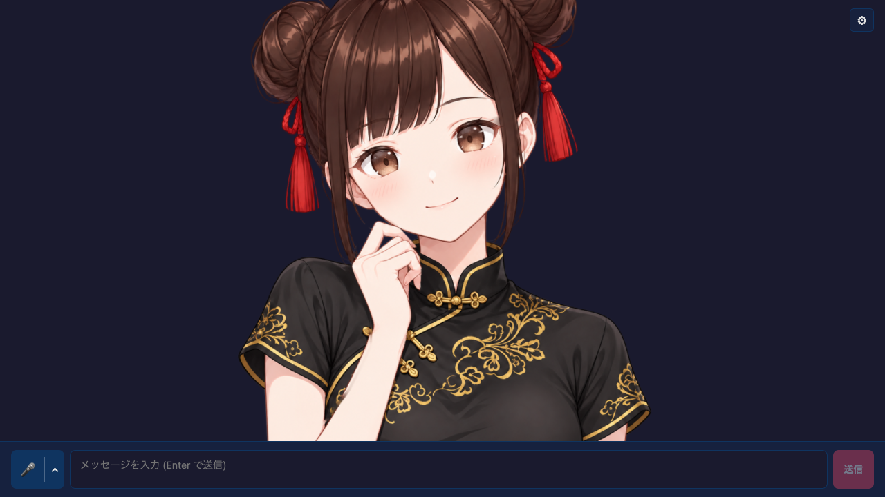

# Mesh Avatar Chat



`@aituber-onair/core` を使った、1枚絵をメッシュ変形で Live2D 風に動かすアバター付きチャットサンプルです。
`react-single-image-avatar-app` と同じ LLM、TTS、ライブコメント、配信表示を使い、アバター部分だけを WebGL2 のメッシュアバターに置き換えています。

## 特徴

- 1枚絵を「素体・手・房飾り・目のパーツ」に分けたレイヤーを、WebGL2 のメッシュで変形
- 顔の向き・傾き、呼吸、まばたき、視線、眉、毛束ごとの髪の揺れ、房飾りの振り子
- 待機中はアイドルモーション（11種）とリアクション（9種）をランダム再生
- TTS 音声の音量で口パクし、話している間はアイドルを止めて声に合わせて軽くうなずく
- 返答の感情タグ（`[happy]` `[sad]` `[angry]` `[surprised]` `[relaxed]` `[neutral]`）に合わせて表情とモーションを切り替え
- Settings の「アバター・モーション」から、揺れやすさの調整、モーションの再生、API キーなしでの話し方プレビューが可能

## 音声入力

入力欄の左にあるマイクボタンで音声入力を始め、もう一度押すと止まります。
隣の `⌃` から聞き取り方と使うサービスを選べます。設定はブラウザに保存されます。

- 聞き取り方: **一回だけ** は一度話すと送信して終わります。**継続して会話**
  は返答の生成と読み上げが終わると、また聞き取ります
- 使うサービス: **ブラウザ**（Web Speech API）、**OpenAI**、**Gemini**。
  `@aituber-onair/transcription` を使い、話し終えて確定した文をそのまま送信します
- OpenAI と Gemini は LLM 設定と同じ API キーを使い、メニューからも入力できます。
  キーはブラウザから各サービスへ直接送られるため、共有端末では使わないでください。
  聞き取り中は利用料金がかかります
- OpenAI と Gemini は接続が済むまで声を受け付けません。マイクを押した直後は
  「接続しています」と表示され、話せる状態になると表示とボタンが切り替わります

## セットアップ

`openai-compatible` では、ローカルサーバーのプリセットを選ぶか、origin、
`/v1` ベース URL、`/chat/completions` の完全 URL を入力できます。モデル一覧を
取得してモデルを選び、チャット前に **Test connection** を実行してください。
詳しくは [ローカル LLM セットアップガイド](https://github.com/shinshin86/aituber-onair/blob/main/docs/local-llm.ja.md) を参照してください。

```bash
# リポジトリのルートで、ローカルパッケージを先にビルド
npm install
npm run build

cd packages/core/examples/react-mesh-avatar-app
npm install
npm run dev
```

`OpenAI-Compatible TTS` では、origin、`/v1` ベース URL、`/audio/speech` の
完全 URL を入力できます。**Detect server** でサーバーが提供するモデルと voice の
一覧を取得し、**Test speech** で短い音声を再生して確認できます。
詳しくは [ローカル TTS セットアップガイド](https://github.com/shinshin86/aituber-onair/blob/main/docs/local-tts.ja.md) を参照してください。

## アバターの API

`src/meshAvatar/createMeshAvatar.js` は React に依存しない単体のエンジンです。

```ts
import { createMeshAvatar } from './meshAvatar/createMeshAvatar.js';

const avatar = await createMeshAvatar(canvas, { assetsBase: '/avatar/qipao/' });
avatar.setSpeaking(true);       // TTS 再生中
avatar.setVoiceLevel(0.6);      // 0〜1 の音量（RMS を正規化した値）
avatar.setEmotion('happy');     // 感情タグ
avatar.play('nod');             // モーション / アイドルモーションの再生
avatar.setAutoIdle(false);      // ランダム再生の切り替え
avatar.setSwayGain(1.5);        // 髪・髪飾りの揺れやすさ
avatar.destroy();
```

React からは `src/meshAvatar/MeshAvatarCanvas.tsx` を使います。
`useAudioMotion` の `voiceLevel` / `isSpeaking` と、`onSpeechStart` で受け取った感情タグを渡すだけで動きます。

## 同梱画像

`public/avatar/qipao/` には、チャイナドレス姿のミコの1枚絵から分割したレイヤー画像
（素体・手・房飾り・目のパーツ・髪のマスク）、閉じ目や口の差分画像、`layers.json` を
同梱しています。元の1枚絵はミコの画像を元に ChatGPT で生成し、閉じ目・口の差分は
その絵に合わせて画像生成で描き足しました。

現在のリグ（手の輪郭、目の形、毛束の位置など）はこの画像に合わせて指定しているため、
別の画像を使うにはレイヤーの作り直しとリグの調整が必要です。

## 素材利用条件とクレジット

同梱のミコ由来のアバター画像の著作権表記は © Yuki Shindo (AITuber OnAir) です。
このアバター画像はリポジトリの MIT License 対象外です。作品・コンテンツの一部として
一体で再配布できますが、素材単体・素材集としての再配布は禁止です。正式な日本語
ガイドラインへのリンクは [Miko Asset Terms](./MIKO_ASSET_TERMS.md) を参照してください。

## 制限

- 口の中や閉じた目は元の絵にないため、計算で作っています。大きく口を開けると違和感が出ることがあります。
- ブラウザ内蔵の Web Speech API は音声バッファを公開しないため、口パクには対応しません（プレビューは使えます）。
- 感情エフェクト（キラキラなど）の表示位置は、同梱画像に合わせた調整がまだです。
- 同梱画像は上端でお団子の頭頂部が切れているため、初期表示では画像の上端を表示範囲の外に出しています。
