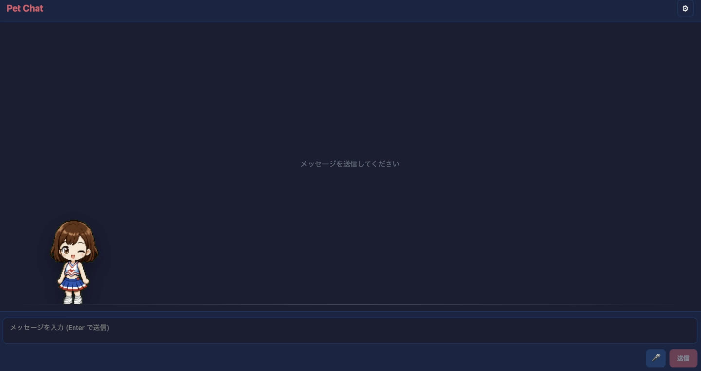

# Pet Chat



An AITuber chat sample that renders a Codex-style animated pet instead of a
static PNGTuber avatar.

The app keeps the same basic structure as the other React core samples:

- LLM chat through `@aituber-onair/core`
- TTS playback and real-time audio analysis
- Speech input through Web Speech API
- YouTube Live / Twitch comment ingestion
- Comment intelligence and manneri detection

## Pet animation

The pet is loaded from:

```text
public/pet/pet.json
public/pet/spritesheet.webp
```

The included sample uses an 8x9 Codex Pet spritesheet with 192x208 cells.
Rows are interpreted as:

| Row | State |
| --- | --- |
| 0 | idle |
| 1 | running-right |
| 2 | running-left |
| 3 | waving |
| 4 | jumping |
| 5 | failed |
| 6 | waiting |
| 7 | running |
| 8 | review |

During chat, the pet reacts to app state:

- Processing: review animation
- Speaking: waving / jumping based on audio volume
- Happy replies: runs around the stage
- Failed or apologetic replies: failed animation

## Setup

```bash
cd packages/core/examples/react-pet-app
npm install
npm run dev
```

Open Settings and configure LLM / TTS providers.
Settings are saved in `localStorage` under `react-pet-app-settings`.

## Replacing the pet

Open the Pet section in Settings to register another Codex Pet-compatible
package. Select `pet.json` and the spritesheet image, then press Register. The
custom pet is stored in the browser and remains active after a reload.

Use the reset button to return to the bundled Miko pet.

The manifest should look like this:

```json
{
  "id": "miko",
  "displayName": "Miko",
  "description": "A tiny animated pet.",
  "spritesheetPath": "spritesheet.webp"
}
```

For development-time defaults, replace `public/pet/pet.json` and
`public/pet/spritesheet.webp`.

Keep generated or local-only pet assets out of commits unless you have the
right to redistribute them.
