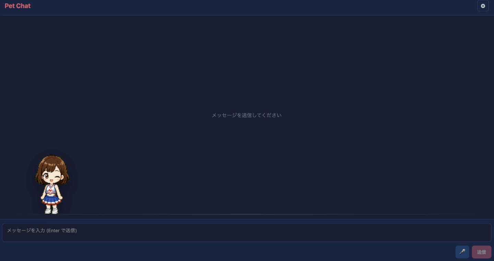

# Pet Chat

Web Speech API TTS is available with browser voice selection and rate, pitch,
volume, and language controls. Because the browser plays it directly without
exposing audio bytes, lip sync is not supported when this engine is selected.

Fish Audio and Cartesia are available with API-key-backed voice selectors.
Fish Audio uses the Vite development/preview proxy because its official API
does not support direct browser CORS; production apps should keep the API key
server-side and route requests through their own backend.



An AITuber chat sample that renders a Codex-style animated pet instead of a
static PNGTuber avatar.

The app keeps the same basic structure as the other React core samples:

- LLM chat through `@aituber-onair/core`
- xAI Grok 4.6 supports `low`, `medium`, `high`, and `xhigh`
  `reasoning_effort` and defaults to `low`; Grok 4.3 defaults to `none` for
  lower latency
- Provider model lists are sourced from `@aituber-onair/core`, so GLM-5.3 /
  GLM-5.3 Flash, DeepSeek V4 Flash Vision Exp, Sakana Namazu, Qwen3.8 Flash,
  Claude Sonnet 5 / Opus 4.8, and Kimi K2.6 are available automatically
- GLM-5.3 models always use thinking and default to `low`; DeepSeek Vision and
  Sakana Namazu keep optional thinking disabled by default for responsive chat
- TTS playback and real-time audio analysis
- Speech input through Web Speech API
- YouTube Live / Twitch comment ingestion
- Manual OBS Virtual Camera frame capture through **Settings → Screen Vision**
  for vision-capable model comments
- Green screen background mode and a solo broadcast layout with pet-only
  captions from **Settings → Visual**
- Comment intelligence and manneri detection

## Chat and Voice model updates

This example uses Chat 0.62.0 and Voice 0.26.0 through Core. Select a
supported model such as `gpt-6-sol`, `gpt-6-luna`, `claude-opus-5-5`,
`claude-sonnet-5-5`,
`grok-4.7`, or `deepseek-flash` in
the model selector; the new OpenRouter models are also listed. OpenAI reasoning
models use the Casual preset, with Astra routed through Responses and its
reasoning effort normalized to `low`.

Gemini 3.8 Flash TTS and Flash-Lite TTS are selectable; the preview TTS
model remains the default. Gemini 3.8 uses the style prompt and ignores
language code.

The Inworld model selector includes `inworld-tts-2-flash`. Models that do not
support Delivery Mode, currently Flash, disable that control and omit it from
speech options, including when a previous value is stored. The default remains
`inworld-tts-2`, and voice-list selection is unchanged. Native DeepSeek tool
calling requires non-thinking mode.

## Voice input

Press the microphone button on the left of the chat form to start voice input,
and press it again to stop. The `⌃` button next to it opens the listening mode
and service options. The choices are saved in the browser.

- Listening mode: **一回だけ** (once) sends one utterance and stops.
  **継続して会話** (continuous) listens again after the reply has been generated
  and spoken
- Service: **ブラウザ** (Web Speech API), **OpenAI**, or **Gemini**. The example
  uses `@aituber-onair/transcription` and sends each confirmed utterance as a
  chat message
- OpenAI and Gemini use the same API keys as the LLM settings, and the keys can
  also be entered from the menu. Keys are sent from the browser directly to each
  service, so avoid shared devices. Listening is billed by each service
- OpenAI and Gemini do not accept audio until the connection is ready. Right
  after pressing the microphone the form shows a connecting status, and the
  button changes once you can speak

## Screen Vision

Start OBS Virtual Camera, choose it from **Settings → Screen Vision**, then press
**画面を見る** to send the current frame to the selected vision-capable model.
You can also choose an automatic interval such as 30 seconds, 1 minute,
2 minutes, or 5 minutes.

## Broadcast visuals

Use **Settings → Visual** to switch the background to green screen and select
the solo broadcast layout. In solo broadcast layout, the normal chat log is
hidden and only the pet's latest spoken text is shown as a lower caption. The
user input field is hidden by default, but can be enabled in the same Visual
settings section.

## Pet animation

The pet is loaded from:

```text
public/pet/pet.json
public/pet/spritesheet.webp
```

The included sample uses an 8x9 Codex Pet spritesheet with 192x208 cells.
Rows are interpreted as:

| Row | State |
| --- | --- |
| 0 | idle |
| 1 | running-right |
| 2 | running-left |
| 3 | waving |
| 4 | jumping |
| 5 | failed |
| 6 | waiting |
| 7 | running |
| 8 | review |

During chat, the pet reacts to app state:

- Processing: review animation
- Speaking: waving / jumping based on audio volume
- Happy replies: runs around the stage
- Failed or apologetic replies: failed animation

## Setup

For `openai-compatible`, choose a local-server preset or enter an origin, a
`/v1` base URL, or a full `/chat/completions` URL. Fetch the model list, select
a model, and run **Test connection** before chatting. See the
[Local LLM setup guide](https://github.com/shinshin86/aituber-onair/blob/main/docs/local-llm.md).

For `OpenAI-Compatible TTS`, enter an origin, a `/v1` base URL, or a full
`/audio/speech` URL. **Detect server** fills in the model and voice lists when
the server provides them, and **Test speech** plays a short sample. See the
[Local TTS setup guide](https://github.com/shinshin86/aituber-onair/blob/main/docs/local-tts.md).


```bash
cd packages/core/examples/react-pet-app
npm install
npm run dev
```

Open Settings and configure LLM / TTS providers.
Settings are saved in `localStorage` under `react-pet-app-settings`.
The LLM section also lets you edit the system prompt. It is applied when the
field loses focus and is saved with the other settings.

## Replacing the pet

Open the Pet section in Settings to register another Codex Pet-compatible
package. Select `pet.json` and the spritesheet image, then press Register. The
custom pet is stored in the browser and remains active after a reload.

Use the reset button to return to the bundled Miko pet.

The manifest should look like this:

```json
{
  "id": "miko",
  "displayName": "Miko",
  "description": "A tiny animated pet.",
  "spritesheetPath": "spritesheet.webp"
}
```

For development-time defaults, replace `public/pet/pet.json` and
`public/pet/spritesheet.webp`.

Keep generated or local-only pet assets out of commits unless you have the
right to redistribute them.

## Bundled Miko asset terms

The default Pet spritesheet depicts Miko, the official character of AITuber
OnAir. It is not covered by the software's MIT License. See
[Miko Asset Terms](./MIKO_ASSET_TERMS.md) for a link to the
authoritative Japanese guidelines. The asset may be distributed as an integral part of a
work or other content, but standalone redistribution and asset collections are
prohibited.

## Updated Chat and Voice options

This example uses published Chat 0.62.0 and Voice 0.26.0 through Core.
New Chat models are available in the model selector, including GPT-6.1 Sol,
GLM-5.3 FlashX, Mistral GLM-5.3, and the new OpenRouter options. Models use
Chat's capability checks and model-specific reasoning defaults. The avatar
examples keep their existing reasoning UI; OpenAI's casual preset selects
`low` for GPT-6.1 Sol. Mistral GLM-5.3 and OpenRouter Nemotron are text-only;
the new OpenRouter Qwen models support images. Mistral GLM-5.3 requires an
eligible subscription tier, and native Z.ai browser calls may fail on CORS.

Select **Deepgram Flux** for English-only, one-shot MP3 speech. Enter a
Deepgram API key and select a named voice from the public v2 catalog.
Haley is always available; refreshes preserve the selected voice and keep
the previous list on empty or failed responses. Optional Speed is 0.5–1.5
in 0.05 steps. Vite development and preview proxy `/api/deepgram/v2/speak`
and `/api/deepgram/v2/models` to Deepgram. Production needs equivalent
authenticated backend routes with API keys kept server-side.

ElevenLabs `eleven_v4` retains Stability and Similarity but disables Style,
Speed, and Speaker Boost. Cartesia offers `sonic-3.6` and
`sonic-3.6-2026-08-27` while keeping `sonic-3.5` as the default. Gradium's
model selector defaults to production; `gradium-tts-beta` is an explicit
opt-in, and switching back to Gradium resets the model to production.
Chat 0.62.0 adds the OpenRouter options Ling 3.1 Flash, Solar Pro 4, Solar
Mini4, MiMo V2.6 Flash, Apodex 1.1 Mini Free, and Pareto 26.10 Preview. MiMo
and Pareto accept images; the others are text-only. Core now lists Ling 3.1
Flash first, so switching the provider to OpenRouter selects it.

Select **OpenRouter** as the TTS engine for the public-preview
`microsoft/mai-voice-2.1` and `microsoft/mai-voice-2.1-flash` models. No model
is preselected. After you choose one, its voices load and an English voice is
selected; you can pick another. A voice from the previous model is never reused.
The TTS API key field shares the OpenRouter key from the LLM settings, so a key
entered there appears here as well. Both models are previews without an SLA and are not recommended for
production; catalogs checked on October 1, 2026 had no Japanese voices. The
sample calls OpenRouter directly from the browser, so the API key is visible to
the page; deploy shared apps behind your own backend.

See the [Core model update notes](../../README.md#chat-and-voice-model-updates)
for endpoint details and limitations.

## OpenRouter model catalog

The sample reads `GET https://openrouter.ai/api/v1/models` without an API key or
generation probes. Search covers model IDs and names; filters distinguish zero
published price, paid, and unknown pricing. These labels do not guarantee
availability, account access, quotas, routing, or actual charges.

A fresh catalog replaces curated choices. Failed refreshes retain last-good
metadata with a warning; without metadata, curated and legacy IDs are clearly
unverified fallback choices. Refresh never changes the selected model or API
keys. Saved legacy probe results are treated only as IDs. Removed selections
block new generation invocations, and changed pricing requires explicit
acknowledgement. An invocation already inside an SDK retry or rate-limit wait
cannot be cancelled by a later catalog refresh.
Vision and advanced options require both catalog metadata and SDK support.
Unknown dynamic models keep advanced features off. SDK request defaults,
including the 5000-token limit and `reasoning.exclude=true`, still apply and can
exceed a model's limits; this sample does not modify the public SDK registry.
