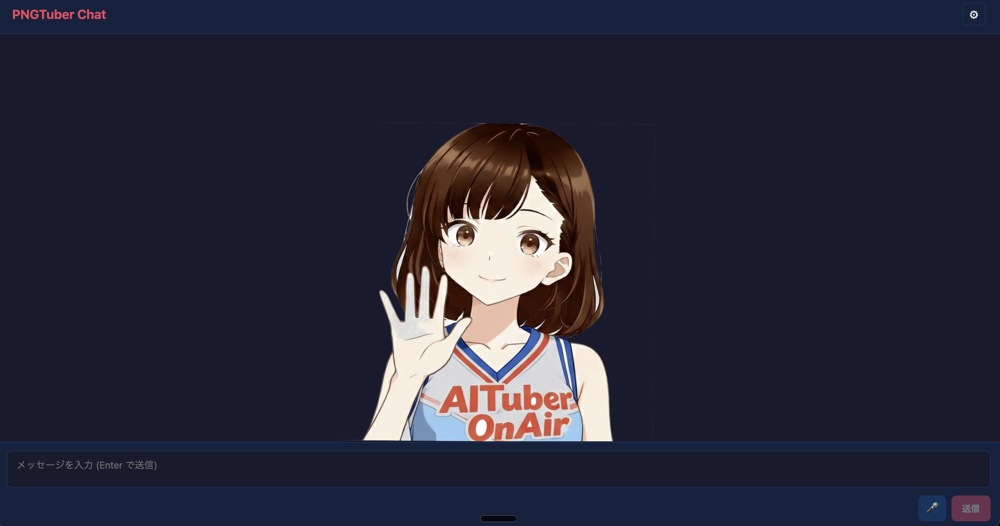

# PNGTuber Chat



A PNGTuber-style chat app built with `@aituber-onair/core`.  
Speech input uses Web Speech API, and lip-sync is driven in real time from actual audio output volume.

## What this app can do

- Chat with LLM providers: `openai`, `openai-compatible`, `openrouter`, `gemini`, `claude`, `zai`
- Use TTS engines: `openai`, `voicevox`, `voicepeak`, `aivisSpeech`, `aivisCloud`, `minimax`, `none`
- Fetch and select speaker lists dynamically:
  - `voicevox` / `aivisSpeech`: from `/speakers`
  - `minimax`: from `query/tts_speakers` after API key input
- Use fixed Aivis Cloud voice presets (CORS-safe UI):
  - `コハク` (`22e8ed77-94fe-4ef2-871f-a86f94e9a579`)
  - `まお` (`a59cb814-0083-4369-8542-f51a29e72af7`)
- Real-time lip-sync + random blink animation
- Set visuals directly in Settings:
  - Background image (1 file)
  - Avatar images (4 states: mouth/eyes open/close)
- Visual image settings are memory-only (reset on page reload)

## Setup

```bash
cd packages/core/examples/react-pngtuber-app
npm install
npm run dev
```

After launch, open **Settings** and set API keys / provider options there.  
All settings are saved in `localStorage` (`react-pngtuber-app-settings`).

For `openai-compatible`, set:
- `Endpoint URL` (required, full `/v1/chat/completions` URL)
- `Model` (required, e.g. `local-model`)
- `API Key` (optional; omitted when empty)

## Settings persistence

- LLM/TTS/API key settings are persisted in `localStorage`
- Visual uploaded images are memory-only and reset on page reload

## Avatar base images (`public/avatar`)

Place these files in `public/avatar/`:

| File | Meaning |
|---|---|
| `mouth_close_eyes_open.png` | Mouth closed + eyes open |
| `mouth_close_eyes_close.png` | Mouth closed + eyes closed |
| `mouth_open_eyes_open.png` | Mouth open + eyes open |
| `mouth_open_eyes_close.png` | Mouth open + eyes closed |

If files are missing, an SVG fallback avatar is shown.  
Images uploaded from Settings take priority during the current session.

The PNGTuber assets prepared for this sample were created using [Easy PNGTuber](https://github.com/rotejin/EasyPNGTuber).

## Lip-sync tuning

You can tune constants in `src/hooks/useAudioLipsync.ts`:

| Constant | Default | Description |
|---|---|---|
| `SMOOTH_FACTOR` | `0.5` | Smoothing factor (higher = smoother, 0.0–1.0) |
| `RMS_CEILING` | `0.12` | RMS normalization ceiling (lower = more sensitive mouth movement) |
| `MOUTH_LEVELS` | `5` | Number of mouth levels (match your image set) |

## Notes for Web Speech API

- Works on **Chrome / Edge** (Chrome recommended)
- Firefox and Safari are not supported
- Mic button is disabled on unsupported browsers
- Requires HTTPS or localhost

## Troubleshooting

If you see:

`Cannot find package '@vitejs/plugin-react'`

run:

```bash
cd packages/core/examples/react-pngtuber-app
npm install
```

If it still fails, check whether your npm config/environment omits
`devDependencies` (e.g. `NODE_ENV=production` or `omit=dev`).

## Tech stack

- Vite + React + TypeScript
- `@aituber-onair/core` (LLM + TTS)
- Web Speech API (speech input)
- Web Audio API + `AnalyserNode` (lip-sync analysis)
