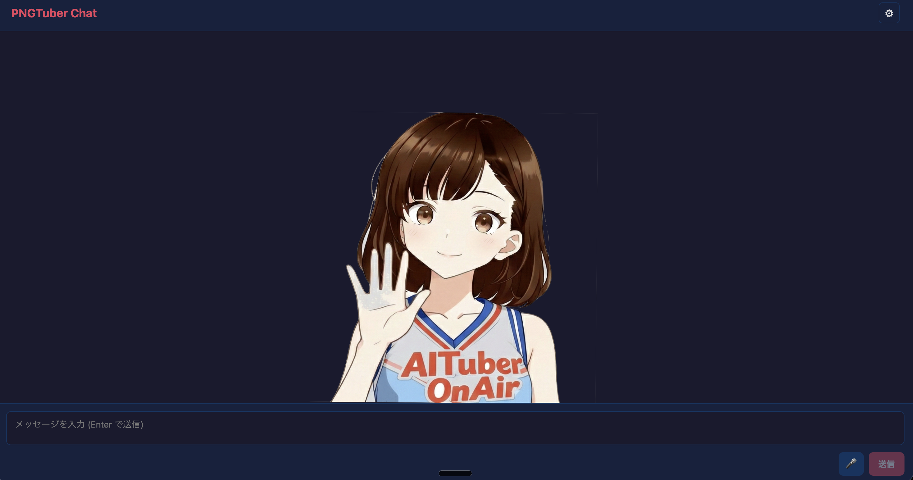

# PNGTuber Chat

Web Speech API TTS is available with browser voice selection and rate, pitch,
volume, and language controls. Because the browser plays it directly without
exposing audio bytes, lip sync is not supported when this engine is selected.



A PNGTuber-style chat app built with `@aituber-onair/core`.  
Speech input uses Web Speech API, and lip-sync is driven in real time from actual audio output volume.

## What this app can do

- Chat with LLM providers: `openai`, `openai-compatible`, `openrouter`, `gemini`, `gemini-nano`, `claude`, `zai`, `kimi`, `xai`, `deepseek`, `mistral`, `sakana` (disabled in browser UI), `plamo`
- xAI Grok 4.5 exposes `reasoning_effort` and defaults to `low`; Grok 4.3 defaults to `none` for lower latency
- Provider model lists are sourced from `@aituber-onair/core`, so newly synced
  chat models such as Claude Opus 4.8, Gemini 3.5 Flash, and GPT-5.6 are available automatically
  in Settings
- Gemini 3.5 Flash automatically uses minimal thinking for chat-style responses
- `gpt-5.5-pro` is intentionally omitted because OpenAI documents it as
  non-streaming, while this example uses the standard streaming chat flow
- For `openrouter`, fetch currently working `:free` models from Settings:
  - `Fetch free models` probes candidates and appends working models to the model list
  - `Max candidates` is the maximum number of `:free` candidates to probe
    (not a target number of working models)
- Use TTS engines: `openai`, `geminiTts`, `openaiCompatible`, `voicevox`, `voicepeak`, `aivisSpeech`, `aivisCloud`, `minimax`, `xai`, `unrealSpeech`, `elevenLabs`, `inworld`, `gradium`, `piperPlus`, `webSpeech`, `none`
- `geminiTts` defaults to `gemini-3.1-flash-tts-preview` and exposes 30 prebuilt voices plus style/audio-tag prompt input
- Fetch and select speaker lists dynamically:
  - `voicevox` / `aivisSpeech`: from `/speakers`
  - `minimax`: from `query/tts_speakers` after API key input
  - `elevenLabs`: from `/v2/voices` after API key input
  - `inworld`: from `/voices/v1/voices` after API key input
- Use fixed Gradium flagship voice presets with readable labels
- Use fixed Aivis Cloud voice presets (CORS-safe UI):
  - `コハク` (`22e8ed77-94fe-4ef2-871f-a86f94e9a579`)
  - `まお` (`a59cb814-0083-4369-8542-f51a29e72af7`)
- `piperPlus` expects browser assets under `public/piper/`
- Real-time lip-sync + random blink animation
- Set visuals directly in Settings:
  - Background image (1 file)
  - Green screen background mode
  - Broadcast layout with avatar-only captions
  - Avatar images (4 states: mouth/eyes open/close)
- Visual display settings are saved in `localStorage`; uploaded images are
  memory-only and reset on page reload
- Fetch live chat comments from YouTube Live or Twitch and feed them into the
  LLM pipeline
  - YouTube uses the YouTube Data API v3 (requires a Google Cloud API key)
  - Twitch uses EventSub WebSocket with a browser-based implicit OAuth flow
- Capture one frame from OBS Virtual Camera in **Settings → Screen Vision** and
  send it to a vision-capable model for an avatar comment
- Detect repetitive conversation patterns with `@aituber-onair/manneri` and
  add an internal topic-diversification instruction before the next response

## Setup

```bash
cd packages/core/examples/react-pngtuber-app
npm install
npm run dev
```

After launch, open **Settings** and set API keys / provider options there.  
All settings are saved in `localStorage` (`react-pngtuber-app-settings`).

For `openai-compatible`, set:
- `Endpoint URL` (required, full `/v1/chat/completions` URL)
- `Model` (required, e.g. `local-model`)
- `API Key` (optional; omitted when empty)

For `gemini-nano`, set:
- Chrome 138+ with Built-in AI flags enabled
- `#optimization-guide-on-device-model`
- `#prompt-api-for-gemini-nano`
- No API key is required

## Stream comments (YouTube Live / Twitch)

This app can forward live chat comments from YouTube Live or Twitch into the LLM.
Configure it from **Settings → Stream**.

## Screen Vision

Start OBS Virtual Camera, choose it from **Settings → Screen Vision**, then press
**画面を見る** to send the current frame to the selected vision-capable model.
You can also choose an automatic interval such as 30 seconds, 1 minute,
2 minutes, or 5 minutes.

## Broadcast visuals

Use **Settings → Visual** to switch the background to green screen and select
the solo broadcast layout. In solo broadcast layout, the normal chat log is
hidden and only the avatar's latest spoken text is shown as a lower caption.
The user input field is hidden by default, but can be enabled in the same
Visual settings section.

Only one platform can be active at a time.

Manneri is enabled by default. It watches recent user and assistant messages,
and when conversation patterns become repetitive, it injects a hidden
topic-diversification instruction into the next LLM request. You can adjust the
similarity threshold, lookback window, cooldown, and minimum message length in
Settings → Stream.

### YouTube Live

1. Create an API key in Google Cloud Console with **YouTube Data API v3** enabled.
2. Open Settings → Stream, choose `YouTube`, paste the API key, and enter the live
   video ID (the `v=` parameter of the YouTube Live URL).
3. Adjust the polling interval if needed (default: 20s), then enable the toggle.

### Twitch

This app uses the Twitch browser-based implicit OAuth flow (`response_type=token`,
scope `user:read:chat`). The access token lives only in `localStorage` inside
your browser. No server is involved.

1. Register an application in the
   [Twitch Developer Console](https://dev.twitch.tv/console/apps) and copy the
   Client ID.
2. Add **`http://localhost:5173/`** as an OAuth Redirect URL for that app
   (use the exact URL shown in Settings → Stream → Twitch; for Vite this is
   typically `http://localhost:5173/`).
3. In Settings → Stream, choose `Twitch`, paste the Client ID, then click
   **Connect to Twitch** and approve the OAuth prompt.
4. Enter the channel login name (the name in the Twitch URL, lowercase), set
   the dequeue interval, and enable the toggle.

**Deploying to a non-localhost origin:** if you host this sample app anywhere
other than `http://localhost:5173/`, register the deployed origin
(for example `https://your-domain.example/`) as an additional OAuth Redirect
URL in the Twitch Developer Console, then re-run the OAuth flow from that
origin. The Redirect URL displayed in the Settings panel is derived from
`window.location` and updates automatically.

### Security note on stored credentials

This is a sample app. The YouTube API key, Twitch Client ID, and Twitch access
token are stored **unencrypted in `localStorage`** (same place as the other
provider API keys used by this sample). Any script running on the app's origin
can read them. Do not use production-scope credentials here, do not deploy this
sample on a shared or public origin, and rotate keys if the browser storage is
shared with other users.

## Piper Plus Setup

`piperPlus` is a browser-side WASM TTS engine using ONNX Runtime Web and
OpenJTalk. Its runtime assets are not bundled with this example because of
their size and third-party license requirements. You need to prepare
`public/piper/` before selecting `Piper Plus` in Settings.

### Quick setup (recommended)

Download the prebuilt asset bundle from the `chrome-on-aituber` release and
extract it into this example:

```bash
cd packages/core/examples/react-pngtuber-app
curl -L -o piper-assets.tar.gz \
  https://github.com/shinshin86/chrome-on-aituber/releases/download/piper-assets-v1/piper-assets.tar.gz
mkdir -p public
tar -xzf piper-assets.tar.gz -C public/
rm piper-assets.tar.gz
npm run dev
```

This downloads and extracts the full asset set (about 85 MB) into
`public/piper/`. After extraction, select `Piper Plus` in Settings.

### Reuse an existing asset directory

If you already prepared assets for the voice example, you can copy them:

```bash
cd packages/core/examples/react-pngtuber-app
mkdir -p public
cp -R ../../../voice/examples/react-basic/public/piper public/
```

### Manual setup

If you prefer to collect assets yourself, you need files from these 3 sources:

1. [piper-plus](https://github.com/ayutaz/piper-plus) (`dev` branch):
   `piper-global-loader.js`, `src/`, OpenJTalk WASM/dictionary, HTS voice
2. [onnxruntime-web](https://www.npmjs.com/package/onnxruntime-web):
   `ort.min.js`, `ort-wasm-simd.wasm`, `ort-wasm.wasm`
3. [piper-plus-tsukuyomi-chan](https://huggingface.co/ayousanz/piper-plus-tsukuyomi-chan):
   ONNX model and config JSON

Place them under `public/piper/` following this layout:

```text
public/piper/
├── piper-global-loader.js
├── dist/
│   ├── ort.min.js
│   ├── ort-wasm-simd.wasm
│   ├── openjtalk.js
│   └── openjtalk.wasm
├── src/
├── assets/
│   ├── dict/
│   └── voice/
└── models/
    ├── tsukuyomi-wavlm-300epoch.onnx
    └── tsukuyomi-config.json
```

For the original setup script, detailed asset sources, and license notes, see
[`packages/voice/examples/react-basic/README.md`](../../../voice/examples/react-basic/README.md).

## Settings persistence

- LLM/TTS/API key settings are persisted in `localStorage`
- OpenRouter dynamic free model cache
  (`models`, `fetchedAt`, `maxCandidates`) is also persisted in the same key
- Visual uploaded images are memory-only and reset on page reload

### Comment Intelligence

This example uses `@aituber-onair/comment-intelligence` to analyze live chat comments before sending them to `@aituber-onair/core`.

Instead of forwarding every YouTube or Twitch comment directly to the LLM, the app batches incoming comments, filters unsafe ones, ranks them, summarizes ignored comments, and sends compact live-chat context to the AITuber.

The chat UI shows only the selected viewer comment, while the LLM receives additional context such as greetings, first-time viewers, repeated comments, and safety instructions.

Rules mode runs without an additional LLM call. Hybrid and LLM-assisted modes reuse the LLM provider, model, API key, and endpoint configured in the LLM settings tab for comment analysis, and fall back to rules if that provider is unavailable.

## Avatar base images (`public/avatar`)

Place these files in `public/avatar/`:

| File | Meaning |
|---|---|
| `mouth_close_eyes_open.png` | Mouth closed + eyes open |
| `mouth_close_eyes_close.png` | Mouth closed + eyes closed |
| `mouth_open_eyes_open.png` | Mouth open + eyes open |
| `mouth_open_eyes_close.png` | Mouth open + eyes closed |

If files are missing, an SVG fallback avatar is shown.  
Images uploaded from Settings take priority during the current session.

The PNGTuber assets prepared for this sample were created using [Easy PNGTuber](https://github.com/rotejin/EasyPNGTuber).

## Lip-sync tuning

You can tune constants in `src/hooks/useAudioLipsync.ts`:

| Constant | Default | Description |
|---|---|---|
| `SMOOTH_FACTOR` | `0.5` | Smoothing factor (higher = smoother, 0.0–1.0) |
| `RMS_CEILING` | `0.12` | RMS normalization ceiling (lower = more sensitive mouth movement) |
| `MOUTH_LEVELS` | `5` | Number of mouth levels (match your image set) |

## Notes for Web Speech API

- Works on **Chrome / Edge** (Chrome recommended)
- Firefox and Safari are not supported
- Mic button is disabled on unsupported browsers
- Requires HTTPS or localhost

## Troubleshooting

If you see:

`Cannot find package '@vitejs/plugin-react'`

run:

```bash
cd packages/core/examples/react-pngtuber-app
npm install
```

If it still fails, check whether your npm config/environment omits
`devDependencies` (for example `NODE_ENV=production` or `omit=dev`).

## Tech stack

- Vite + React + TypeScript
- `@aituber-onair/core` (LLM + TTS)
- Web Speech API (speech input)
- Web Audio API + `AnalyserNode` (lip-sync analysis)
