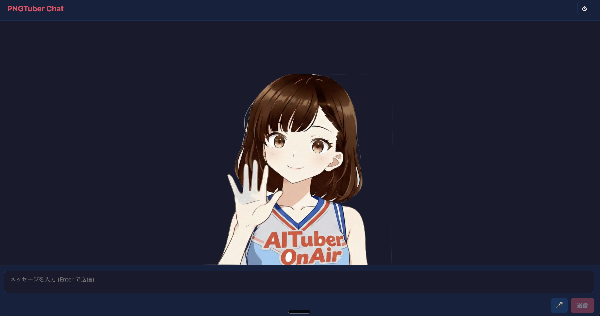

# PNGTuber Chat

Web Speech API TTS is available with browser voice selection and rate, pitch,
volume, and language controls. Because the browser plays it directly without
exposing audio bytes, lip sync is not supported when this engine is selected.

Fish Audio and Cartesia are available with API-key-backed voice selectors.
Fish Audio uses the Vite development/preview proxy because its official API
does not support direct browser CORS; production apps should keep the API key
server-side and route requests through their own backend.



A PNGTuber-style chat app built with `@aituber-onair/core`.  
Speech input uses Web Speech API, and lip-sync is driven in real time from actual audio output volume.

## Chat and Voice model updates

This example uses Chat 0.61.0 and Voice 0.25.0 through Core. Select a
supported model such as `gpt-6-sol`, `gpt-6-luna`, `claude-opus-5-5`,
`claude-sonnet-5-5`,
`grok-4.7`, or `deepseek-flash` in
the model selector; the new OpenRouter models are also listed. OpenAI reasoning
models use the Casual preset, with Astra routed through Responses and its
reasoning effort normalized to `low`.

Gemini 3.8 Flash TTS and Flash-Lite TTS are selectable; the preview TTS
model remains the default. Gemini 3.8 uses the style prompt and ignores
language code.

The Inworld model selector includes `inworld-tts-2-flash`. Models that do not
support Delivery Mode, currently Flash, disable that control and omit it from
speech options, including when a previous value is stored. The default remains
`inworld-tts-2`, and voice-list selection is unchanged. Native DeepSeek tool
calling requires non-thinking mode.

## What this app can do

- Chat with LLM providers: `openai`, `openai-compatible`, `openrouter`, `gemini`, `gemini-nano`, `claude`, `zai`, `kimi`, `xai`, `deepseek`, `mistral`, `sakana` (disabled in browser UI), `plamo`
- xAI Grok 4.6 supports `low`, `medium`, `high`, and `xhigh`
  `reasoning_effort` and defaults to `low`; Grok 4.3 defaults to `none` for
  lower latency
- Provider model lists are sourced from `@aituber-onair/core`, so newly synced
  chat models such as GLM-5.3 / GLM-5.3 Flash, DeepSeek V4 Flash Vision Exp,
  Sakana Namazu, Qwen3.8 Flash, Claude Sonnet 5 / Opus 4.8, and Kimi K2.6 are
  available automatically in Settings
- GLM-5.3 models always use thinking and default to `low`; DeepSeek Vision and
  Sakana Namazu keep optional thinking disabled by default for responsive chat
- Gemini 3 Flash-family models use minimal thinking by default for chat-style
  responses; Gemini 3 Pro uses low
- `gpt-5.5-pro` is intentionally omitted because OpenAI documents it as
  non-streaming, while this example uses the standard streaming chat flow
- For `openrouter`, search the live model catalog in Settings and review published pricing before selecting a model.
- Use TTS engines: `openai`, `geminiTts`, `openaiCompatible`, `voicevox`, `voicepeak`, `aivisSpeech`, `aivisCloud`, `minimax`, `xai`, `unrealSpeech`, `elevenLabs`, `fishAudio`, `cartesia`, `inworld`, `gradium`, `piperPlus`, `webSpeech`, `none`
- `geminiTts` defaults to `gemini-3.1-flash-tts-preview` and exposes 30 prebuilt voices plus style/audio-tag prompt input
- Fetch and select speaker lists dynamically:
  - `voicevox` / `aivisSpeech`: from `/speakers`
  - `fishAudio`: from `/model` through the local Vite proxy after API key input
  - `cartesia`: from `/voices` after API key input, filtered by language
  - `elevenLabs`: from `/v2/voices` after API key input
  - `inworld`: from `/voices/v1/voices` after API key input
- Use fixed Gradium flagship voice presets with readable labels
- Use fixed Aivis Cloud voice presets (CORS-safe UI):
  - `コハク` (`22e8ed77-94fe-4ef2-871f-a86f94e9a579`)
  - `まお` (`a59cb814-0083-4369-8542-f51a29e72af7`)
- `piperPlus` expects browser assets under `public/piper/`
- Real-time lip-sync + random blink animation
- Canvas-based emotion effects for happy, surprised, sad, angry, relaxed, and
  thinking responses, with disabled, manual preview, and linked control modes
- Emotion effects start when the response emotion is received and do not depend
  on TTS playback
- Uses the same layered background auras and foreground effect designs as the
  PSD/PuruPuru samples
- Face and eye anchors and effect size can be adjusted in manual mode and are
  saved for the current avatar image set
- Set visuals directly in Settings:
  - Background image (1 file)
  - Green screen background mode
  - Broadcast layout with avatar-only captions
  - Avatar images (4 states: mouth/eyes open/close)
- Visual display settings are saved in `localStorage`; uploaded images are
  memory-only and reset on page reload
- Fetch live chat comments from YouTube Live or Twitch and feed them into the
  LLM pipeline
  - YouTube uses the YouTube Data API v3 (requires a Google Cloud API key)
  - Twitch uses EventSub WebSocket with a browser-based implicit OAuth flow
- Capture one frame from OBS Virtual Camera in **Settings → Screen Vision** and
  send it to a vision-capable model for an avatar comment
- Detect repetitive conversation patterns with `@aituber-onair/manneri` and
  add an internal topic-diversification instruction before the next response
- Optionally track each viewer's relationship with `@aituber-onair/kizuna`:
  form input uses a stable local owner identity, while YouTube and Twitch use
  separate identities based on the commenter's name
  - Each message and the avatar's response emotion update the relationship
  - Positive replies can grow the bond; an `angry` reply cools it and produces
    a decrease notification, while later calm exchanges repair it gradually
  - The current relationship context is added to the system prompt before the
    response
  - A top-right notification shows the viewer name, points, intimacy change,
    and any relationship stage or level change

## Voice input

Press the microphone button on the left of the chat form to start voice input,
and press it again to stop. The `⌃` button next to it opens the listening mode
and service options. The choices are saved in the browser.

- Listening mode: **一回だけ** (once) sends one utterance and stops.
  **継続して会話** (continuous) listens again after the reply has been generated
  and spoken
- Service: **ブラウザ** (Web Speech API), **OpenAI**, or **Gemini**. The example
  uses `@aituber-onair/transcription` and sends each confirmed utterance as a
  chat message
- OpenAI and Gemini use the same API keys as the LLM settings, and the keys can
  also be entered from the menu. Keys are sent from the browser directly to each
  service, so avoid shared devices. Listening is billed by each service
- OpenAI and Gemini do not accept audio until the connection is ready. Right
  after pressing the microphone the form shows a connecting status, and the
  button changes once you can speak

## Setup

For `openai-compatible`, choose a local-server preset or enter an origin, a
`/v1` base URL, or a full `/chat/completions` URL. Fetch the model list, select
a model, and run **Test connection** before chatting. See the
[Local LLM setup guide](https://github.com/shinshin86/aituber-onair/blob/main/docs/local-llm.md).

For `OpenAI-Compatible TTS`, enter an origin, a `/v1` base URL, or a full
`/audio/speech` URL. **Detect server** fills in the model and voice lists when
the server provides them, and **Test speech** plays a short sample. See the
[Local TTS setup guide](https://github.com/shinshin86/aituber-onair/blob/main/docs/local-tts.md).


```bash
cd packages/core/examples/react-pngtuber-app
npm install
npm run dev
```

After launch, open **Settings** and set API keys / provider options there.  
All settings are saved in `localStorage` (`react-pngtuber-app-settings`).
The LLM section also lets you edit the system prompt. It is applied when the
field loses focus and is saved with the other settings.
The same section includes the disabled-by-default Kizuna toggle. Enable it to
record relationship changes for form, YouTube, and Twitch conversations.

For `openai-compatible`, set:
- `Endpoint URL` (required, full `/v1/chat/completions` URL)
- `Model` (required, e.g. `local-model`)
- `API Key` (optional; omitted when empty)

For `gemini-nano`, set:
- Chrome 138+ with Built-in AI flags enabled
- `#optimization-guide-on-device-model`
- `#prompt-api-for-gemini-nano`
- No API key is required

## Stream comments (YouTube Live / Twitch)

This app can forward live chat comments from YouTube Live or Twitch into the LLM.
Configure it from **Settings → Stream**.

## Screen Vision

Start OBS Virtual Camera, choose it from **Settings → Screen Vision**, then press
**画面を見る** to send the current frame to the selected vision-capable model.
You can also choose an automatic interval such as 30 seconds, 1 minute,
2 minutes, or 5 minutes.

## Broadcast visuals

Use **Settings → Visual** to switch the background to green screen and select
the solo broadcast layout. In solo broadcast layout, the normal chat log is
hidden and only the avatar's latest spoken text is shown as a lower caption.
The user input field is hidden by default, but can be enabled in the same
Visual settings section.

Only one platform can be active at a time.

Manneri is enabled by default. It watches recent user and assistant messages,
and when conversation patterns become repetitive, it injects a hidden
topic-diversification instruction into the next LLM request. You can adjust the
similarity threshold, lookback window, cooldown, and minimum message length in
Settings → Stream.

### YouTube Live

1. Create an API key in Google Cloud Console with **YouTube Data API v3** enabled.
2. Open Settings → Stream, choose `YouTube`, paste the API key, and enter the live
   video ID (the `v=` parameter of the YouTube Live URL).
3. Adjust the polling interval if needed (default: 20s), then enable the toggle.

### Twitch

This app uses the Twitch browser-based implicit OAuth flow (`response_type=token`,
scope `user:read:chat`). The access token lives only in `localStorage` inside
your browser. No server is involved.

1. Register an application in the
   [Twitch Developer Console](https://dev.twitch.tv/console/apps) and copy the
   Client ID.
2. Add **`http://localhost:5173/`** as an OAuth Redirect URL for that app
   (use the exact URL shown in Settings → Stream → Twitch; for Vite this is
   typically `http://localhost:5173/`).
3. In Settings → Stream, choose `Twitch`, paste the Client ID, then click
   **Connect to Twitch** and approve the OAuth prompt.
4. Enter the channel login name (the name in the Twitch URL, lowercase), set
   the dequeue interval, and enable the toggle.

**Deploying to a non-localhost origin:** if you host this sample app anywhere
other than `http://localhost:5173/`, register the deployed origin
(for example `https://your-domain.example/`) as an additional OAuth Redirect
URL in the Twitch Developer Console, then re-run the OAuth flow from that
origin. The Redirect URL displayed in the Settings panel is derived from
`window.location` and updates automatically.

### Security note on stored credentials

This is a sample app. The YouTube API key, Twitch Client ID, and Twitch access
token are stored **unencrypted in `localStorage`** (same place as the other
provider API keys used by this sample). Any script running on the app's origin
can read them. Do not use production-scope credentials here, do not deploy this
sample on a shared or public origin, and rotate keys if the browser storage is
shared with other users.

## Piper Plus Setup

`piperPlus` is a browser-side WASM TTS engine using ONNX Runtime Web and
OpenJTalk. Its runtime assets are not bundled with this example because of
their size and third-party license requirements. You need to prepare
`public/piper/` before selecting `Piper Plus` in Settings.

### Quick setup (recommended)

Download the prebuilt asset bundle from the `chrome-on-aituber` release and
extract it into this example:

```bash
cd packages/core/examples/react-pngtuber-app
curl -L -o piper-assets.tar.gz \
  https://github.com/shinshin86/chrome-on-aituber/releases/download/piper-assets-v1/piper-assets.tar.gz
mkdir -p public
tar -xzf piper-assets.tar.gz -C public/
rm piper-assets.tar.gz
npm run dev
```

This downloads and extracts the full asset set (about 85 MB) into
`public/piper/`. After extraction, select `Piper Plus` in Settings.

### Reuse an existing asset directory

If you already prepared assets for the voice example, you can copy them:

```bash
cd packages/core/examples/react-pngtuber-app
mkdir -p public
cp -R ../../../voice/examples/react-basic/public/piper public/
```

### Manual setup

If you prefer to collect assets yourself, you need files from these 3 sources:

1. [piper-plus](https://github.com/ayutaz/piper-plus) (`dev` branch):
   `piper-global-loader.js`, `src/`, OpenJTalk WASM/dictionary, HTS voice
2. [onnxruntime-web](https://www.npmjs.com/package/onnxruntime-web):
   `ort.min.js`, `ort-wasm-simd.wasm`, `ort-wasm.wasm`
3. [piper-plus-tsukuyomi-chan](https://huggingface.co/ayousanz/piper-plus-tsukuyomi-chan):
   ONNX model and config JSON

Place them under `public/piper/` following this layout:

```text
public/piper/
├── piper-global-loader.js
├── dist/
│   ├── ort.min.js
│   ├── ort-wasm-simd.wasm
│   ├── openjtalk.js
│   └── openjtalk.wasm
├── src/
├── assets/
│   ├── dict/
│   └── voice/
└── models/
    ├── tsukuyomi-wavlm-300epoch.onnx
    └── tsukuyomi-config.json
```

For the original setup script, detailed asset sources, and license notes, see
[`packages/voice/examples/react-basic/README.md`](../../../voice/examples/react-basic/README.md).

## Settings persistence

- LLM/TTS/API key settings are persisted in `localStorage`
- OpenRouter catalog metadata and pricing acknowledgements use separate,
  versioned `localStorage` entries; old probe results in the settings key are
  retained only as legacy IDs, never as current pricing or availability
- Visual uploaded images are memory-only and reset on page reload

### Comment Intelligence

This example uses `@aituber-onair/comment-intelligence` to analyze live chat comments before sending them to `@aituber-onair/core`.

Instead of forwarding every YouTube or Twitch comment directly to the LLM, the app batches incoming comments, filters unsafe ones, ranks them, summarizes ignored comments, and sends compact live-chat context to the AITuber.

The chat UI shows only the selected viewer comment, while the LLM receives additional context such as greetings, first-time viewers, repeated comments, and safety instructions.

Rules mode runs without an additional LLM call. Hybrid and LLM-assisted modes reuse the LLM provider, model, API key, and endpoint configured in the LLM settings tab for comment analysis, and fall back to rules if that provider is unavailable.

Choose **Jev** as the analysis engine to use Jev for comment analysis in Hybrid and LLM-assisted modes. In one request it also judges the reply style (one line, light, or careful), rude comments, reports that the stream got something wrong, and safety risks, and passes a matching instruction for the selected comment to the avatar's LLM. Comments with a safety risk are not read out and go to a moderator alert, and error reports from three or more viewers within two minutes raise a flare-up alert. Alerts in this sample are a console-only mock; to send them for real, post them from `notifyModerator()` in `useLiveCommentIntelligence.ts` to your own backend. Jev connects through OpenRouter (using the OpenRouter API key from the LLM settings tab) or TypeSafe AI. TypeSafe AI rejects browser origins, so requests go through the `npm run dev` / `npm run preview` server.

## Avatar base images (`public/avatar`)

Place these files in `public/avatar/`:

| File | Meaning |
|---|---|
| `mouth_close_eyes_open.png` | Mouth closed + eyes open |
| `mouth_close_eyes_close.png` | Mouth closed + eyes closed |
| `mouth_open_eyes_open.png` | Mouth open + eyes open |
| `mouth_open_eyes_close.png` | Mouth open + eyes closed |

If files are missing, an SVG fallback avatar is shown.  
Images uploaded from Settings take priority during the current session.

The PNGTuber assets prepared for this sample were created using [Easy PNGTuber](https://github.com/rotejin/EasyPNGTuber).

## Lip-sync tuning

You can tune constants in `src/hooks/useAudioLipsync.ts`:

| Constant | Default | Description |
|---|---|---|
| `SMOOTH_FACTOR` | `0.5` | Smoothing factor (higher = smoother, 0.0–1.0) |
| `RMS_CEILING` | `0.12` | RMS normalization ceiling (lower = more sensitive mouth movement) |
| `MOUTH_LEVELS` | `5` | Number of mouth levels (match your image set) |

## Notes for Web Speech API

- Works on **Chrome / Edge** (Chrome recommended)
- Firefox and Safari are not supported
- Mic button is disabled on unsupported browsers
- Requires HTTPS or localhost

## Troubleshooting

If you see:

`Cannot find package '@vitejs/plugin-react'`

run:

```bash
cd packages/core/examples/react-pngtuber-app
npm install
```

If it still fails, check whether your npm config/environment omits
`devDependencies` (for example `NODE_ENV=production` or `omit=dev`).

## Tech stack

- Vite + React + TypeScript
- `@aituber-onair/core` (LLM + TTS)
- Web Speech API (speech input)
- Web Audio API + `AnalyserNode` (lip-sync analysis)

## Bundled Miko asset terms

The four default PNGTuber images depict Miko, the official character of
AITuber OnAir. They are not covered by the software's MIT License. See
[Miko Asset Terms](./MIKO_ASSET_TERMS.md) for a link to the
authoritative Japanese guidelines. The assets may be distributed as an integral part of a
work or other content, but standalone redistribution and asset collections are
prohibited.

## Updated Chat and Voice options

This example uses published Chat 0.61.0 and Voice 0.25.0 through Core.
New Chat models are available in the model selector, including GPT-6.1 Sol,
GLM-5.3 FlashX, Mistral GLM-5.3, and the new OpenRouter options. Models use
Chat's capability checks and model-specific reasoning defaults. The avatar
examples keep their existing reasoning UI; OpenAI's casual preset selects
`low` for GPT-6.1 Sol. Mistral GLM-5.3 and OpenRouter Nemotron are text-only;
the new OpenRouter Qwen models support images. Mistral GLM-5.3 requires an
eligible subscription tier, and native Z.ai browser calls may fail on CORS.

Select **Deepgram Flux** for English-only, one-shot MP3 speech. Enter a
Deepgram API key and select a named voice from the public v2 catalog.
Haley is always available; refreshes preserve the selected voice and keep
the previous list on empty or failed responses. Optional Speed is 0.5–1.5
in 0.05 steps. Vite development and preview proxy `/api/deepgram/v2/speak`
and `/api/deepgram/v2/models` to Deepgram. Production needs equivalent
authenticated backend routes with API keys kept server-side.

ElevenLabs `eleven_v4` retains Stability and Similarity but disables Style,
Speed, and Speaker Boost. Cartesia offers `sonic-3.6` and
`sonic-3.6-2026-08-27` while keeping `sonic-3.5` as the default. Gradium's
model selector defaults to production; `gradium-tts-beta` is an explicit
opt-in, and switching back to Gradium resets the model to production.
See the [Core model update notes](../../README.md#chat-and-voice-model-updates)
for endpoint details and limitations.

## OpenRouter model catalog

The sample reads `GET https://openrouter.ai/api/v1/models` without an API key or
generation probes. Search covers model IDs and names; filters distinguish zero
published price, paid, and unknown pricing. These labels do not guarantee
availability, account access, quotas, routing, or actual charges.

A fresh catalog replaces curated choices. Failed refreshes retain last-good
metadata with a warning; without metadata, curated and legacy IDs are clearly
unverified fallback choices. Refresh never changes the selected model or API
keys. Saved legacy probe results are treated only as IDs. Removed selections
block new generation invocations, and changed pricing requires explicit
acknowledgement. An invocation already inside an SDK retry or rate-limit wait
cannot be cancelled by a later catalog refresh.
Vision and advanced options require both catalog metadata and SDK support.
Unknown dynamic models keep advanced features off. SDK request defaults,
including the 5000-token limit and `reasoning.exclude=true`, still apply and can
exceed a model's limits; this sample does not modify the public SDK registry.
