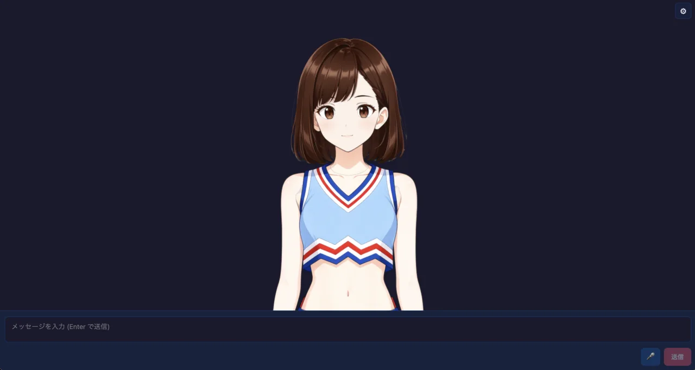

# PSD Tachie Chat

Web Speech API TTS is available with browser voice selection and rate, pitch,
volume, and language controls. Because the browser plays it directly without
exposing audio bytes, lip sync is not supported when this engine is selected.

Fish Audio and Cartesia are available with API-key-backed voice selectors.
Fish Audio uses the Vite development/preview proxy because its official API
does not support direct browser CORS; production apps should keep the API key
server-side and route requests through their own backend.



A PSD-based tachie chat app built with `@aituber-onair/core`.
It keeps the same LLM, TTS, stream-comment, screen-vision, lip-sync, blink,
green-screen, and broadcast UI flow as `react-pngtuber-app`, but renders the
avatar from one runtime-loaded PSD file on a canvas.

The bundled `public/avatar/miko-anime25drig-cheer.psd` features Miko, the
official AITuber OnAir character, so the app animates with zero setup. The Miko
asset is governed by [separate usage terms](./MIKO_ASSET_TERMS.md).

## Chat and Voice model updates

This example uses Chat 0.63.0 and Voice 0.26.0 through Core. Select a
supported model such as `gpt-6-sol`, `gpt-6-luna`, `claude-opus-5-5`,
`claude-sonnet-5-5`,
`grok-4.7`, or `deepseek-flash` in
the model selector; the new OpenRouter models are also listed. OpenAI reasoning
models use the Casual preset, with Astra routed through Responses and its
reasoning effort normalized to `low`.

Gemini 3.8 Flash TTS and Flash-Lite TTS are selectable; the preview TTS
model remains the default. Gemini 3.8 uses the style prompt and ignores
language code.

The Inworld model selector includes `inworld-tts-2-flash`. Models that do not
support Delivery Mode, currently Flash, disable that control and omit it from
speech options, including when a previous value is stored. The default remains
`inworld-tts-2`, and voice-list selection is unchanged. Native DeepSeek tool
calling requires non-thinking mode.

## What this app can do

- Chat with the LLM providers exposed by `@aituber-onair/core`
- Use the same TTS engines and audio-driven lip-sync as the PNGTuber example
- Load a PSD avatar at runtime with `@webtoon/psd`
- Composite visible PSD pixel layers to a canvas only when avatar state changes
- Auto-load `public/avatar/miko-anime25drig-cheer.psd` on first run
- Toggle PSD layers in Settings with PSDTool-style forced/radio behavior
- Bind PSD layers to `mouthOpen`, `mouthClosed`, `eyesOpen`, and `eyesClosed`
- Auto-detect mouth and eye role bindings from Japanese/English layer names
- Auto-detect Anime2.5DRig-compatible PSD layer names for motion mode
- Animate supported PSDs with idle motion, blink fallback, hair physics, and
  audio-driven mouth movement
- Tune motion-mode pose, eyes, brows, mouth, hair, and physics in real time
- Auto-save motion profiles by PSD SHA-256 and transfer them as JSON sidecars
- Overlay model-independent emotion effects in both static and motion modes
- Drag, wheel-zoom, and reset the avatar view from the canvas / Settings
- Persist visibility overrides and role bindings in `localStorage`, keyed by
  `${fileName}:${fileSize}`
- Keep uploaded PSD pixel data in memory only; re-select the same file after
  reload to restore the saved setup

## Voice input

Press the microphone button on the left of the chat form to start voice input,
and press it again to stop. The `⌃` button next to it opens the listening mode
and service options. The choices are saved in the browser.

- Listening mode: **一回だけ** (once) sends one utterance and stops.
  **継続して会話** (continuous) listens again after the reply has been generated
  and spoken
- Service: **ブラウザ** (Web Speech API), **OpenAI**, or **Gemini**. The example
  uses `@aituber-onair/transcription` and sends each confirmed utterance as a
  chat message
- OpenAI and Gemini use the same API keys as the LLM settings, and the keys can
  also be entered from the menu. Keys are sent from the browser directly to each
  service, so avoid shared devices. Listening is billed by each service
- OpenAI and Gemini do not accept audio until the connection is ready. Right
  after pressing the microphone the form shows a connecting status, and the
  button changes once you can speak

## Setup

For `openai-compatible`, choose a local-server preset or enter an origin, a
`/v1` base URL, or a full `/chat/completions` URL. Fetch the model list, select
a model, and run **Test connection** before chatting. See the
[Local LLM setup guide](https://github.com/shinshin86/aituber-onair/blob/main/docs/local-llm.md).

For `OpenAI-Compatible TTS`, enter an origin, a `/v1` base URL, or a full
`/audio/speech` URL. **Detect server** fills in the model and voice lists when
the server provides them, and **Test speech** plays a short sample. See the
[Local TTS setup guide](https://github.com/shinshin86/aituber-onair/blob/main/docs/local-tts.md).


```bash
cd packages/core/examples/react-psd-app
npm install
npm run dev
```

After launch, open **Settings** and set API keys / provider options there.
General app settings are saved in `localStorage` under
`react-psd-app-settings`.
The LLM section also lets you edit the system prompt. It is applied when the
field loses focus and is saved with the other settings.

## PSD avatar

Open **Settings → Visual** and use **PSD avatar** to select a local `.psd`
file. The file itself is not stored. Visibility and role settings are stored
only as layer IDs for that exact file name and size.

For supported PSD formats, motion/static mode selection, Anime2.5DRig layer
names, PSDTool notation, limitations, and troubleshooting, see
**[PSD-FORMATS.md](./PSD-FORMATS.md)**.

An additional procedural motion fixture can be generated locally with:

```bash
uv run --with pillow python scripts/draw_doodle_parts.py local-assets/doodle-parts
npm run build:doodle-sample
```

The Python script draws 10 transparent part PNGs with supersampled
antialiasing. `build:doodle-sample` assembles those parts into the untracked
`local-assets/sample.psd` with `ag-psd`. It does not replace the bundled Miko
avatar.

## PSD modes

The app first tries motion auto-rig detection with the vendored
Anime2.5DRig-compatible rigger. A flat PSD with a detected `face` part uses
motion mode. Missing optional eye, mouth, or hair parts remain diagnostic
warnings and only disable the corresponding motion capability. PSDs without a
`face` motion part fall back to static PSDTool mode.

Static mode supports PSDTool-style `!` forced visibility, `*` radio items, and
role auto-detection for mouth and eye layers. Runtime static PSD parsing uses
`@webtoon/psd`.

Motion settings are in **Settings -> Visual**:

| Control | Behavior |
|---|---|
| `PSD motion` | Enables or disables idle motion, blink, and physics for motion-mode PSDs. |
| `Motion intensity` | Scales idle sway, breathing, and hair motion from `0.0` to `2.0`; the default is `0.6`. |
| `Avatar view reset` | Restores avatar position and scale to `{ x: 0, y: 0, scale: 1 }`. |

Wheel zoom scales around the avatar's own center. Dragging is the only operation
that changes avatar position, and offsets are clamped so the avatar cannot be
lost completely off-screen.

### PSD motion tuning and transfer

When a motion-mode PSD is loaded, expand **PSD motion tuning** under
**Settings -> Visual**. The sliders update the existing renderer in real time;
they do not rebuild the rig or WebGL textures. The `PSD motion` control remains
the master switch, and `Motion intensity` remains an additional multiplier for
automatic motion and physics. The mouth baseline is combined with audio lip
sync by using whichever value is larger.

Changes are saved automatically for the PSD content SHA-256 in
`react-psd-app-psd-motion-profiles-v1`. Selecting identical PSD content under a
different file name restores the same profile. **Reset to defaults** removes
that PSD's saved entry and restores the original motion-mode behavior.

Use **Export motion settings** to download a formatted
`<PSD-name>.motion.json` sidecar, then use **Import motion settings** in another
browser or on another PC. The sidecar contains only the versioned motion
profile and PSD identity; it does not contain PSD pixels, API keys, paths,
chat/voice settings, camera/microphone state, or XMP metadata, and it is never
embedded into the PSD itself.

Imports with the same SHA-256 apply immediately. A different SHA-256 with the
same canvas and layer signature requires explicit confirmation. A mismatched
layer signature is rejected. Motion profile controls are not available in
static PSDTool mode. See [PSD-FORMATS.md](./PSD-FORMATS.md) for the parameter,
identity, and sidecar details.

## Emotion expression effects

Open **Settings -> Emotion expression effects** and choose one of these modes:

| Mode | Behavior |
|---|---|
| `None` | Preserves the original display: no controls and no effects. |
| `Manual buttons + anchor settings` | Shows preview buttons and an anchor editor over the avatar. |
| `Link to speech emotions only` | Maps screenplay emotion tags such as `happy` and `sad` to effects during speech. |

The effects are procedural canvas overlays rather than PSD layers, so the same
sparkles, surprise lines, tears, anger mark, bubbles, and thinking mark work for
both static PSDTool avatars and Anime2.5DRig motion avatars. The mapping from
emotion tags to effects can be changed in Settings.

In manual mode, use **Anchor settings** to place the face center and both eyes,
and to adjust effect size. Anchor values are saved per PSD profile
(`${fileName}:${fileSize}`) in `react-psd-app-settings`. The PSD pixels and PSD
file itself are never copied into this setting.

## Credits

- Anime2.5DRig-compatible auto-rigging is based on
  [Anime2.5DRig](https://github.com/852wa/Anime2.5DRig) by 852wa (hakoniwa),
  MIT License. The vendored files live in `src/vendor/anime25drig/`.
- The bundled Miko PSD is © Yuki Shindo (AITuber OnAir) and is not covered by
  the repository's MIT License. See
  [Miko Asset Terms](./MIKO_ASSET_TERMS.md).

## Stream comments and Screen Vision

This app inherits the PNGTuber example's YouTube Live / Twitch comment intake
and OBS Virtual Camera screen-vision flow. Configure both from **Settings**.

## Lip-sync tuning

You can tune constants in `src/hooks/useAudioLipsync.ts`:

| Constant | Default | Description |
|---|---|---|
| `SMOOTH_FACTOR` | `0.5` | Smoothing factor (higher = smoother, 0.0-1.0) |
| `RMS_CEILING` | `0.12` | RMS normalization ceiling (lower = more sensitive mouth movement) |
| `MOUTH_LEVELS` | `5` | Number of mouth levels; this PSD example currently maps it to binary open/closed state |

## Notes for Web Speech API

- Works on **Chrome / Edge** (Chrome recommended)
- Firefox and Safari are not supported
- Mic button is disabled on unsupported browsers
- Requires HTTPS or localhost

## Updated Chat and Voice options

This example uses published Chat 0.63.0 and Voice 0.26.0 through Core.
New Chat models are available in the model selector, including GPT-6.1 Sol,
GLM-5.3 FlashX, Mistral GLM-5.3, and the new OpenRouter options. Models use
Chat's capability checks and model-specific reasoning defaults. The avatar
examples keep their existing reasoning UI; OpenAI's casual preset selects
`low` for GPT-6.1 Sol. Mistral GLM-5.3 and OpenRouter Nemotron are text-only;
the new OpenRouter Qwen models support images. Mistral GLM-5.3 requires an
eligible subscription tier, and native Z.ai browser calls may fail on CORS.

Select **Deepgram Flux** for English-only, one-shot MP3 speech. Enter a
Deepgram API key and select a named voice from the public v2 catalog.
Haley is always available; refreshes preserve the selected voice and keep
the previous list on empty or failed responses. Optional Speed is 0.5–1.5
in 0.05 steps. Vite development and preview proxy `/api/deepgram/v2/speak`
and `/api/deepgram/v2/models` to Deepgram. Production needs equivalent
authenticated backend routes with API keys kept server-side.

ElevenLabs `eleven_v4` retains Stability and Similarity but disables Style,
Speed, and Speaker Boost. Cartesia offers `sonic-3.6` and
`sonic-3.6-2026-08-27` while keeping `sonic-3.5` as the default. Gradium's
model selector defaults to production; `gradium-tts-beta` is an explicit
opt-in, and switching back to Gradium resets the model to production.
Chat 0.63.0 adds Claude Haiku 5.5 at the end of the Claude model list; the
model selected when switching to Claude is unchanged. Claude requests now use
`low` effort for faster replies.

Chat 0.62.0 adds the OpenRouter options Ling 3.1 Flash, Solar Pro 4, Solar
Mini4, MiMo V2.6 Flash, Apodex 1.1 Mini Free, and Pareto 26.10 Preview. MiMo
and Pareto accept images; the others are text-only. Core now lists Ling 3.1
Flash first, so switching the provider to OpenRouter selects it.

Select **OpenRouter** as the TTS engine for the public-preview
`microsoft/mai-voice-2.1` and `microsoft/mai-voice-2.1-flash` models. No model
is preselected. After you choose one, its voices load and an English voice is
selected; you can pick another. A voice from the previous model is never reused.
The TTS API key field shares the OpenRouter key from the LLM settings, so a key
entered there appears here as well. Both models are previews without an SLA and are not recommended for
production; catalogs checked on October 1, 2026 had no Japanese voices. The
sample calls OpenRouter directly from the browser, so the API key is visible to
the page; deploy shared apps behind your own backend.

See the [Core model update notes](../../README.md#chat-and-voice-model-updates)
for endpoint details and limitations.

## OpenRouter model catalog

The sample reads `GET https://openrouter.ai/api/v1/models` without an API key or
generation probes. Search covers model IDs and names; filters distinguish zero
published price, paid, and unknown pricing. These labels do not guarantee
availability, account access, quotas, routing, or actual charges.

A fresh catalog replaces curated choices. Failed refreshes retain last-good
metadata with a warning; without metadata, curated and legacy IDs are clearly
unverified fallback choices. Refresh never changes the selected model or API
keys. Saved legacy probe results are treated only as IDs. Removed selections
block new generation invocations, and changed pricing requires explicit
acknowledgement. An invocation already inside an SDK retry or rate-limit wait
cannot be cancelled by a later catalog refresh.
Vision and advanced options require both catalog metadata and SDK support.
Unknown dynamic models keep advanced features off. SDK request defaults,
including the 5000-token limit and `reasoning.exclude=true`, still apply and can
exceed a model's limits; this sample does not modify the public SDK registry.
