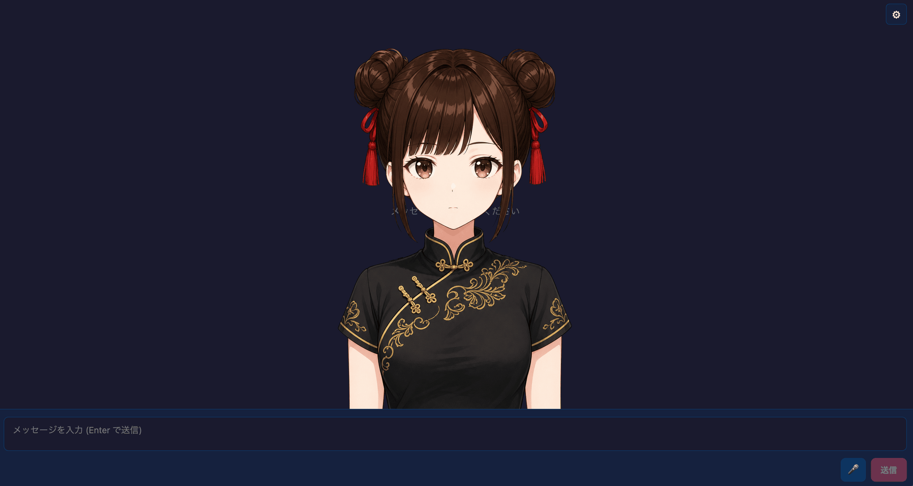

# PuruPuru PNGTuber Chat

Web Speech API TTS is available with browser voice selection and rate, pitch,
volume, and language controls. Because the browser plays it directly without
exposing audio bytes, lip sync is not supported when this engine is selected.

Fish Audio and Cartesia are available with API-key-backed voice selectors.
Fish Audio uses the Vite development/preview proxy because its official API
does not support direct browser CORS; production apps should keep the API key
server-side and route requests through their own backend.



A React example app that combines `@aituber-onair/core` chat/TTS with a
PNGTuber-style avatar renderer for `.purupuru` avatar packages.

## Chat and Voice model updates

This example uses Chat 0.62.0 and Voice 0.26.0 through Core. Select a
supported model such as `gpt-6-sol`, `gpt-6-luna`, `claude-opus-5-5`,
`claude-sonnet-5-5`,
`grok-4.7`, or `deepseek-flash` in
the model selector; the new OpenRouter models are also listed. OpenAI reasoning
models use the Casual preset, with Astra routed through Responses and its
reasoning effort normalized to `low`.

Gemini 3.8 Flash TTS and Flash-Lite TTS are selectable; the preview TTS
model remains the default. Gemini 3.8 uses the style prompt and ignores
language code.

The Inworld model selector includes `inworld-tts-2-flash`. Models that do not
support Delivery Mode, currently Flash, disable that control and omit it from
speech options, including when a previous value is stored. The default remains
`inworld-tts-2`, and voice-list selection is unchanged. Native DeepSeek tool
calling requires non-thinking mode.

## Features

- Load the bundled Miko `.purupuru` package as the default avatar.
- Replace the default from the Visual section in Settings.
- Render the 6 face states from the package:
  - eyes open/closed
  - mouth closed/half/open
- Draw the package layers in order: back hair, face, front hair, and optional
  item layers.
- Apply subtle idle breathing and roll sway from the package settings.
- Apply spring-driven hair lag and bounce to front/back hair layers.
- Add occasional idle gaze turns with subtle layer parallax.
- Reposition the avatar by dragging and resize it with the mouse wheel.
- React to speech emotion tags from `SPEECH_START`.
- Preview emotion direction composed from color, aura, symbols, and particles.
- Disable emotion effects, show manual controls, or link effects to speech
  emotions, and customize the emotion-to-effect mapping.
- Adjust face and eye anchors for emotion effects without editing the avatar
  package.
- Blink at random 2-6 second intervals.
- Drive mouth states from TTS audio lip-sync while speech is playing.
- Keep the rich React example shell features: chat, TTS settings, stream comment
  panels, screen vision, broadcast layout, and background image selection.
- Edit the system prompt from the LLM section in Settings. Changes are applied
  when the field loses focus. Keep the default emotion-tag instruction to retain
  avatar reactions.

## Voice input

Press the microphone button on the left of the chat form to start voice input,
and press it again to stop. The `⌃` button next to it opens the listening mode
and service options. The choices are saved in the browser.

- Listening mode: **一回だけ** (once) sends one utterance and stops.
  **継続して会話** (continuous) listens again after the reply has been generated
  and spoken
- Service: **ブラウザ** (Web Speech API), **OpenAI**, or **Gemini**. The example
  uses `@aituber-onair/transcription` and sends each confirmed utterance as a
  chat message
- OpenAI and Gemini use the same API keys as the LLM settings, and the keys can
  also be entered from the menu. Keys are sent from the browser directly to each
  service, so avoid shared devices. Listening is billed by each service
- OpenAI and Gemini do not accept audio until the connection is ready. Right
  after pressing the microphone the form shows a connecting status, and the
  button changes once you can speak

## `.purupuru` Format

A `.purupuru` file is an uncompressed ZIP package. This example supports format
version 1 packages with:

- `manifest.json`
- `settings.json`
- 8 avatar PNG files:
  - `backHair`
  - `frontHair`
  - `eyesOpenMouthClosed`
  - `eyesOpenMouthHalf`
  - `eyesOpenMouthOpen`
  - `eyesClosedMouthClosed`
  - `eyesClosedMouthHalf`
  - `eyesClosedMouthOpen`
- optional `thumbnail.png`
- optional visible item layers referenced by `settings.json`

The browser loader accepts only ZIP_STORED packages. It rejects compressed ZIPs,
ZIP64-like oversized packages, unsafe paths, too many entries, oversized
expanded content, and CRC32 mismatches.

## Usage

For `openai-compatible`, choose a local-server preset or enter an origin, a
`/v1` base URL, or a full `/chat/completions` URL. Fetch the model list, select
a model, and run **Test connection** before chatting. See the
[Local LLM setup guide](https://github.com/shinshin86/aituber-onair/blob/main/docs/local-llm.md).

For `OpenAI-Compatible TTS`, enter an origin, a `/v1` base URL, or a full
`/audio/speech` URL. **Detect server** fills in the model and voice lists when
the server provides them, and **Test speech** plays a short sample. See the
[Local TTS setup guide](https://github.com/shinshin86/aituber-onair/blob/main/docs/local-tts.md).


```bash
cd packages/core/examples/react-purupuru-app
npm install
npm run dev
```

Open the local Vite URL. The bundled Miko avatar loads automatically. To use a
different `.purupuru` file, open Settings and choose a package in the Visual
section. If the bundled avatar cannot be loaded, the canvas stays empty until an
avatar package is loaded.

If you want to create your own `.purupuru` avatar, the ImageGen-based
[asset production kit](https://github.com/shinshin86/PuruPuruPNGTuber/tree/codex/add-imagegen-asset-production-kit/asset-production)
for PuruPuruPNGTuber may be a helpful starting point.

Drag the avatar on the canvas to reposition it and use the mouse wheel to zoom.
Double-click the canvas, or use the Visual section's
`アバター位置をリセット` button, to reset the placement. The app persists the
drag/zoom placement across reloads.

In manual mode, use the emotion controls in the upper-left to preview happy,
surprised, sad, angry, relaxed, and thinking direction. The renderer keeps the
avatar rooted while combining small impulses, idle behavior, color grading,
aura, particles, and manga-style symbols. Previews fade automatically.

In manual mode, select `アンカー調整` to place the face center, left eye, and
right eye directly on the canvas and to resize the effects. These settings are
saved per avatar in the browser. The app identifies the package from an
anonymous fingerprint of its contents, so it does not store the local file name
or modify the `.purupuru` package and PNG files.

In Settings > `感情表現エフェクト`, `操作方法` selects one of three
exclusive modes: no controls or automatic effects, manual emotion and anchor
controls, or automatic speech-emotion linking without buttons. The default is
no effects. `感情とエフェクトの対応` maps inputs such as `happy` and `sad`
to effects such as sparkles and tears. Manual previews and automatic reactions
share the same mapping.

For local manual testing, use a `.purupuru` file from a separate checkout or
your own exported avatar package. Keep additional binary avatar packages out of
this repository.

## Bundled Default Avatar

This example ships with `public/avatar/miko.purupuru`, Miko, the official
character of AITuber OnAir. It is loaded automatically as the default avatar
when the app starts.

You can replace it anytime from Settings > Visual. When a user-selected package
is loaded, the `クリア` button returns the app to Miko. The `クリア` button is
hidden while the bundled Miko avatar is already active.

© Yuki Shindo (AITuber OnAir). The bundled avatar is not covered by the
software's MIT License. See [Miko Asset Terms](./MIKO_ASSET_TERMS.md) for a link to the
authoritative Japanese guidelines. The asset may be distributed
as an integral part of a work or other content, but standalone redistribution
and asset collections are prohibited.

## Build and Lint

```bash
npm run build
npm run lint
```

## Tunables Used by the Renderer

This example's renderer reads these values from `settings.json`:

- `avatarSize`
- `avatarX`
- `avatarY`
- `breathStrength`
- `rollStrength`
- `hairSpring`
- `idleMotionEnabled` (parsed for compatibility; the app-level Visual setting
  controls runtime idle motion)
- `bgColor` (loaded for compatibility; the app background controls the final
  presentation)

`hairSpring` scales the hair spring response. A value of `0` disables physics and
keeps hair rigidly attached to the head. Visible item layers in hair slots use
their `followStrength` value (0-200) to follow the spring transform.

Supported item layer slots follow the original PuruPuruPNGTuber draw order:
`stageBack`, `characterBack`, `faceBack`, `faceFront`, `frontHairFront`, and
`stageFront`. Unknown slots fall back to `frontHairFront` so future package
exports still render.

This example intentionally does not implement face tracking, mesh deformation,
eye highlights, or OBS preset export.

## Emotion Reactions

The core parses leading emotion tags such as `[happy]` into
`screenplay = { emotion, text }` and emits them through `SPEECH_START`. This app
stores the reaction draft at that event, then applies it when TTS playback
actually starts so the motion is synchronized with audible speech.
Automatic playback runs only when the Visual setting is set to speech-emotion
linking.

| Emotion | Reaction |
| --- | --- |
| `happy` | Warm aura, sparkles, and a hair bounce |
| `surprised` | Bright ring, radial marks, and a brief scale pop |
| `sad` | Blue color grade, tears, and softer idle motion |
| `angry` | Red aura, anger symbol, and a brief shake |
| `relaxed` | Soft cool aura, bubbles, and slower idle motion |
| `neutral` | No extra reaction |

Tune the mapping in `src/lib/purupuruReactions.ts` and Canvas drawing in
`src/lib/purupuruEmotionEffects.ts`. Renderer sustain and impulse handling lives
in `src/lib/purupuruRenderer.ts`. The default system prompt does not request
`thinking`, but it remains available to manual preview and custom emotion tags.
Face/eye anchor overrides are stored only in the browser and existing PNG files
and `.purupuru` packages are not modified.

## Idle Gaze

While idle, a loaded avatar occasionally glances left or right. The motion feeds
into the same target pose used by breathing and roll, so existing pose easing and
hair spring physics make the hair swing naturally. The renderer also applies
subtle horizontal parallax: face moves the most, front hair follows, and back hair
moves the least.

Tune the scheduler in `src/lib/idleGaze.ts` and the turn/parallax ratios in
`src/lib/purupuruRenderer.ts`.

## Motion Tuning

Renderer constants in `src/lib/purupuruRenderer.ts`:

| Value | Default | Increasing it makes... |
| --- | ---: | --- |
| `GAZE_TURN_OFFSET_RATIO` | `0.014` | the head/face drift farther sideways during idle gaze |
| `GAZE_TURN_TILT` | `0.026` | the head tilt more during idle gaze |
| `FACE_PARALLAX_RATIO` | `0.034` | the face layer move farther with gaze parallax |
| `FRONT_HAIR_PARALLAX_RATIO` | `0.01` | front hair follow gaze parallax more strongly |
| `BACK_HAIR_PARALLAX_RATIO` | `0.006` | back hair follow gaze parallax more strongly |

Keep parallax ordered as `face > frontHair > backHair` so depth reads
naturally.

Idle gaze scheduler constants in `src/lib/idleGaze.ts`:

| Value | Default | Increasing it makes... |
| --- | ---: | --- |
| `MIN_WAIT_SECONDS` / `MAX_WAIT_SECONDS` | `5` / `14` | idle gaze turns less frequent |
| `MIN_HOLD_SECONDS` / `MAX_HOLD_SECONDS` | `0.6` / `1.8` | gaze holds longer before returning |
| `FULL_TURN_MIN` / `FULL_TURN_MAX` | `0.65` / `1` | full turns reach farther left/right |
| `SMALL_TURN_MAX` / `SMALL_TURN_CHANCE` | `0.3` / `0.3` | small turns become wider / more common |

Package values in `settings.json`:

| Value | Effect when increased |
| --- | --- |
| `breathStrength` | stronger vertical breathing motion |
| `rollStrength` | stronger side sway and head roll |
| `hairSpring` | more visible spring lag and bounce |
| `avatarSize` | larger rendered avatar |
| `avatarX` | moves the avatar right |
| `avatarY` | moves the avatar down |
| `idleMotionEnabled` | ignored at runtime in favor of the app-level Visual setting, because camera-tracking-authored packages often ship this as `false` |
| `faceParallaxRatio` | overrides `FACE_PARALLAX_RATIO` for this avatar; valid range is `0`-`0.1` |
| `frontHairParallaxRatio` | overrides `FRONT_HAIR_PARALLAX_RATIO` for this avatar; valid range is `0`-`0.1` |
| `backHairParallaxRatio` | overrides `BACK_HAIR_PARALLAX_RATIO` for this avatar; valid range is `0`-`0.1` |

Visible `itemLayers` use `followStrength` (`0`-`200`) to decide how strongly
they follow the hair spring transform.

## Attribution

The `.purupuru` package format and the renderer behavior were created by
rotejin in [PuruPuruPNGTuber](https://github.com/rotejin/PuruPuruPNGTuber)
(Apache-2.0) — a local web app that combines expression-swap PNGs with
front/back hair layers to create rich PNGTubers. This example is an
AITuber-oriented reimplementation of that work, adapted to run without camera
tracking. Many thanks to the original project. This example supports package
loading, face-state selection, idle motion, hair physics, emotion reactions, item
layers, drag/zoom placement, blink, and audio mouth-state behavior.

## Updated Chat and Voice options

This example uses published Chat 0.62.0 and Voice 0.26.0 through Core.
New Chat models are available in the model selector, including GPT-6.1 Sol,
GLM-5.3 FlashX, Mistral GLM-5.3, and the new OpenRouter options. Models use
Chat's capability checks and model-specific reasoning defaults. The avatar
examples keep their existing reasoning UI; OpenAI's casual preset selects
`low` for GPT-6.1 Sol. Mistral GLM-5.3 and OpenRouter Nemotron are text-only;
the new OpenRouter Qwen models support images. Mistral GLM-5.3 requires an
eligible subscription tier, and native Z.ai browser calls may fail on CORS.

Select **Deepgram Flux** for English-only, one-shot MP3 speech. Enter a
Deepgram API key and select a named voice from the public v2 catalog.
Haley is always available; refreshes preserve the selected voice and keep
the previous list on empty or failed responses. Optional Speed is 0.5–1.5
in 0.05 steps. Vite development and preview proxy `/api/deepgram/v2/speak`
and `/api/deepgram/v2/models` to Deepgram. Production needs equivalent
authenticated backend routes with API keys kept server-side.

ElevenLabs `eleven_v4` retains Stability and Similarity but disables Style,
Speed, and Speaker Boost. Cartesia offers `sonic-3.6` and
`sonic-3.6-2026-08-27` while keeping `sonic-3.5` as the default. Gradium's
model selector defaults to production; `gradium-tts-beta` is an explicit
opt-in, and switching back to Gradium resets the model to production.
Chat 0.62.0 adds the OpenRouter options Ling 3.1 Flash, Solar Pro 4, Solar
Mini4, MiMo V2.6 Flash, Apodex 1.1 Mini Free, and Pareto 26.10 Preview. MiMo
and Pareto accept images; the others are text-only. Core now lists Ling 3.1
Flash first, so switching the provider to OpenRouter selects it.

Select **OpenRouter** as the TTS engine for the public-preview
`microsoft/mai-voice-2.1` and `microsoft/mai-voice-2.1-flash` models. No model
or voice is preselected: choose a model to load its voices, and then choose a
voice. Changing the model clears the voice. Speech uses the same OpenRouter API
key as the LLM settings; when the LLM provider is OpenRouter, the TTS settings
do not ask for the key again. Both models are previews without an SLA and are not recommended for
production; catalogs checked on October 1, 2026 had no Japanese voices. The
sample calls OpenRouter directly from the browser, so the API key is visible to
the page; deploy shared apps behind your own backend.

See the [Core model update notes](../../README.md#chat-and-voice-model-updates)
for endpoint details and limitations.

## OpenRouter model catalog

The sample reads `GET https://openrouter.ai/api/v1/models` without an API key or
generation probes. Search covers model IDs and names; filters distinguish zero
published price, paid, and unknown pricing. These labels do not guarantee
availability, account access, quotas, routing, or actual charges.

A fresh catalog replaces curated choices. Failed refreshes retain last-good
metadata with a warning; without metadata, curated and legacy IDs are clearly
unverified fallback choices. Refresh never changes the selected model or API
keys. Saved legacy probe results are treated only as IDs. Removed selections
block new generation invocations, and changed pricing requires explicit
acknowledgement. An invocation already inside an SDK retry or rate-limit wait
cannot be cancelled by a later catalog refresh.
Vision and advanced options require both catalog metadata and SDK support.
Unknown dynamic models keep advanced features off. SDK request defaults,
including the 5000-token limit and `reasoning.exclude=true`, still apply and can
exceed a model's limits; this sample does not modify the public SDK registry.
