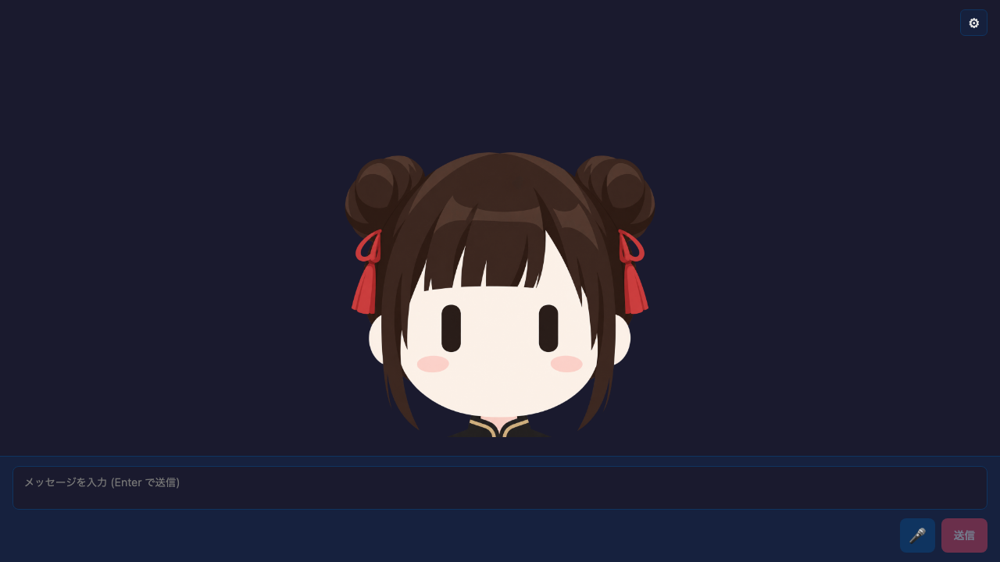

# Single Image Avatar Chat



`@aituber-onair/core` を使った、1枚画像のアバター付きReactチャットサンプルです。
口の差分画像は使わず、TTSの実音声から取得した音量に合わせて画像全体を動かします。

## 特徴

- 透過PNGまたはJPGを1枚だけ使用
- イラスト版とフェルト製パペット風のMiko画像を同梱
- TTS音声のRMSを0〜1へ正規化してモーションへ反映
- 跳ねて着地する「Bounce」モーション
- 小さく上下しながら左右へ揺れる「Puppet Wobble」モーション
- 発話終了後は元の位置で静止
- Settingsから画像の差し替えと「動きをプレビュー」が可能
- PNGTuberサンプルと同じLLM、TTS、配信、感情エフェクト設定を利用可能

## セットアップ

```bash
cd packages/core/examples/react-single-image-avatar-app
npm install
npm run dev
```

起動後に **Settings** を開き、LLMとTTSを設定してください。見た目の設定では
付属のMiko画像を2種類から選ぶか、手元の画像を1枚アップロードできます。
モーションは画像とは別に「Bounce」と「Puppet Wobble」から選択できます。
「動きをプレビュー」はAPIキーやTTS設定なしで確認できます。

設定値は `localStorage` の `react-single-image-avatar-app-settings` に保存されます。
アップロードした画像はメモリ上だけに保持され、リロードすると同梱画像へ戻ります。

## 音声連動

`src/hooks/useAudioMotion.ts` がTTS音声をWeb Audio APIで再生し、RMS音量を
毎フレーム計測します。`src/hooks/useSingleImageAvatarMotion.ts` は選択中の
モーションに応じて `src/lib/bouncyAvatarMotion.ts` または
`src/lib/puppetWobbleMotion.ts` の計算結果を画像全体へ反映します。

ブラウザ内蔵のWeb Speech APIは音声バッファを公開しないため、実音声に同期した
動きには対応しません。このエンジンを選んだ場合でも、Settingsのプレビュー機能は
利用できます。

## 同梱画像

`public/avatar/miko-avatar.png` と
`public/avatar/miko-puppet-avatar.png` を同梱しています。どちらも透過PNGです。
パペット版は同じMikoのデザインを、口のないフェルト人形風に仕上げています。
元のイラスト版はミコの画像を元に、
Serio_ai（[@Multi_Serio_Ai](https://x.com/Multi_Serio_Ai) / APG）さんが
[公開したプロンプト](https://x.com/Multi_Serio_Ai/status/2100800237619347535)
を参考にChatGPTで生成しました。プロンプトを公開してくださったことに感謝します。
