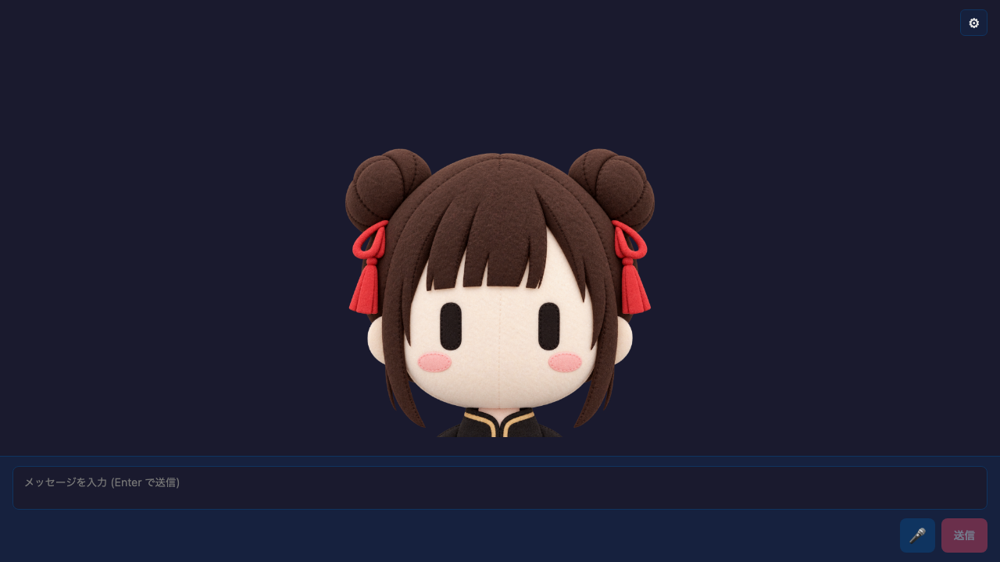

# Single Image Avatar Chat

<p align="center">
  
  
</p>

A React chat example built with `@aituber-onair/core` and one avatar image.
Instead of swapping mouth images, it maps real TTS output volume to motion
applied to the whole image.

## Features

- Uses one transparent PNG or JPG
- Includes illustration and felt-puppet Miko variants
- Normalizes the TTS audio RMS level and maps it to motion
- Includes Bounce motion with jumps, alternating tilts, and landing squash
- Includes Puppet Wobble motion with smaller vertical and side-to-side movement
- Settles at the original position when speech stops
- Supports image replacement and a motion preview from Settings
- Retains the LLM, TTS, streaming, and emotion-effect controls from the
  PNGTuber example

Gemini 3.8 Flash TTS and Flash-Lite TTS are selectable in Voice settings.
The existing preview model remains the default; Gemini 3.8 uses the style
prompt and ignores language code.

## Setup

```bash
cd packages/core/examples/react-single-image-avatar-app
npm install
npm run dev
```

Open **Settings** and use the **Avatar & Motion** tab to choose a bundled avatar
or upload one image, then select Bounce or Puppet Wobble independently. LLM,
TTS, and streaming settings are under **AI, Voice & Streaming**.
**Preview motion** works without an API key or a configured TTS engine.

Settings are stored in `localStorage` under
`react-single-image-avatar-app-settings`. Uploaded images remain in memory only and
reset to the bundled image after a reload.

## Audio-driven motion

`src/hooks/useAudioMotion.ts` plays TTS output through the Web Audio API and
measures its RMS level each frame. `src/hooks/useSingleImageAvatarMotion.ts`
applies either `src/lib/bouncyAvatarMotion.ts` or
`src/lib/puppetWobbleMotion.ts` to the whole image.

The browser Web Speech API plays audio directly and does not expose audio
bytes, so it cannot drive motion from the real waveform. The Settings motion
preview remains available with that engine.

## Bundled image

The bundled images are `public/avatar/miko-avatar.png` and
`public/avatar/miko-puppet-avatar.png`. Both have transparent backgrounds. The
puppet version converts the same Miko design into a felt-doll style without
adding a mouth. The original illustration was generated with ChatGPT from a
Miko image using a
[prompt shared by Serio_ai (@Multi_Serio_Ai / APG)](https://x.com/Multi_Serio_Ai/status/2100800237619347535).
Thank you to the author for sharing the prompt.
