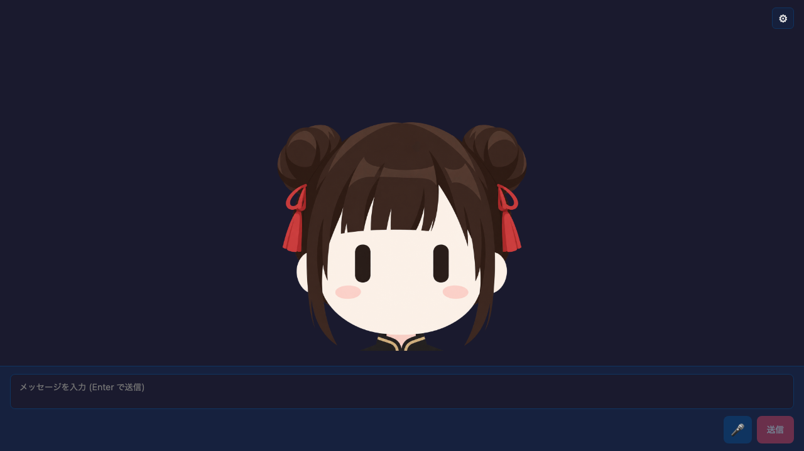
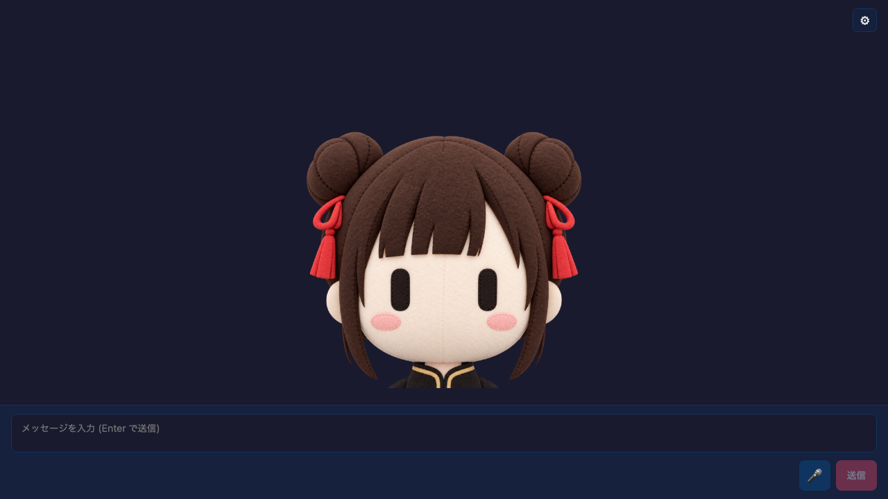

# Single Image Avatar Chat

<p align="center">
  
  
</p>

A React chat example built with `@aituber-onair/core` and one avatar image.
Instead of swapping mouth images, it maps real TTS output volume to motion
applied to the whole image.

## Features

- Uses one transparent PNG or JPG
- Includes illustration and felt-puppet Miko variants
- Normalizes the TTS audio RMS level and maps it to motion
- Includes Bounce motion with jumps, alternating tilts, and landing squash
- Includes Puppet Wobble motion with smaller vertical and side-to-side movement
- Settles at the original position when speech stops
- Supports image replacement and a motion preview from Settings
- Retains the LLM, TTS, streaming, and emotion-effect controls from the
  PNGTuber example

Gemini 3.8 Flash TTS and Flash-Lite TTS are selectable in Voice settings.
The existing preview model remains the default; Gemini 3.8 uses the style
prompt and ignores language code.

## Setup

For `openai-compatible`, choose a local-server preset or enter an origin, a
`/v1` base URL, or a full `/chat/completions` URL. Fetch the model list, select
a model, and run **Test connection** before chatting. See the
[Local LLM setup guide](https://github.com/shinshin86/aituber-onair/blob/main/docs/local-llm.md).

For `OpenAI-Compatible TTS`, enter an origin, a `/v1` base URL, or a full
`/audio/speech` URL. **Detect server** fills in the model and voice lists when
the server provides them, and **Test speech** plays a short sample. See the
[Local TTS setup guide](https://github.com/shinshin86/aituber-onair/blob/main/docs/local-tts.md).


```bash
cd packages/core/examples/react-single-image-avatar-app
npm install
npm run dev
```

Open **Settings** and use the **Avatar & Motion** tab to choose a bundled avatar
or upload one image, then select Bounce or Puppet Wobble independently. LLM,
TTS, and streaming settings are under **AI, Voice & Streaming**.
**Preview motion** works without an API key or a configured TTS engine.

Settings are stored in `localStorage` under
`react-single-image-avatar-app-settings`. Uploaded images remain in memory only and
reset to the bundled image after a reload.

## Audio-driven motion

`src/hooks/useAudioMotion.ts` plays TTS output through the Web Audio API and
measures its RMS level each frame. `src/hooks/useSingleImageAvatarMotion.ts`
applies either `src/lib/bouncyAvatarMotion.ts` or
`src/lib/puppetWobbleMotion.ts` to the whole image.

The browser Web Speech API plays audio directly and does not expose audio
bytes, so it cannot drive motion from the real waveform. The Settings motion
preview remains available with that engine.

## Bundled image

The bundled images are `public/avatar/miko-avatar.png` and
`public/avatar/miko-puppet-avatar.png`. Both have transparent backgrounds. The
puppet version converts the same Miko design into a felt-doll style without
adding a mouth. The original illustration was generated with ChatGPT from a
Miko image using a
[prompt shared by Serio_ai (@Multi_Serio_Ai / APG)](https://x.com/Multi_Serio_Ai/status/2100800237619347535).
Thank you to the author for sharing the prompt.

## Updated Chat and Voice options

This example uses published Chat 0.61.0 and Voice 0.25.0 through Core.
New Chat models are available in the model selector, including GPT-6.1 Sol,
GLM-5.3 FlashX, Mistral GLM-5.3, and the new OpenRouter options. Models use
Chat's capability checks and model-specific reasoning defaults. The avatar
examples keep their existing reasoning UI; OpenAI's casual preset selects
`low` for GPT-6.1 Sol. Mistral GLM-5.3 and OpenRouter Nemotron are text-only;
the new OpenRouter Qwen models support images. Mistral GLM-5.3 requires an
eligible subscription tier, and native Z.ai browser calls may fail on CORS.

Select **Deepgram Flux** for English-only, one-shot MP3 speech. Enter a
Deepgram API key and select a named voice from the public v2 catalog.
Haley is always available; refreshes preserve the selected voice and keep
the previous list on empty or failed responses. Optional Speed is 0.5–1.5
in 0.05 steps. Vite development and preview proxy `/api/deepgram/v2/speak`
and `/api/deepgram/v2/models` to Deepgram. Production needs equivalent
authenticated backend routes with API keys kept server-side.

ElevenLabs `eleven_v4` retains Stability and Similarity but disables Style,
Speed, and Speaker Boost. Cartesia offers `sonic-3.6` and
`sonic-3.6-2026-08-27` while keeping `sonic-3.5` as the default. Gradium's
model selector defaults to production; `gradium-tts-beta` is an explicit
opt-in, and switching back to Gradium resets the model to production.
See the [Core model update notes](../../README.md#chat-and-voice-model-updates)
for endpoint details and limitations.
