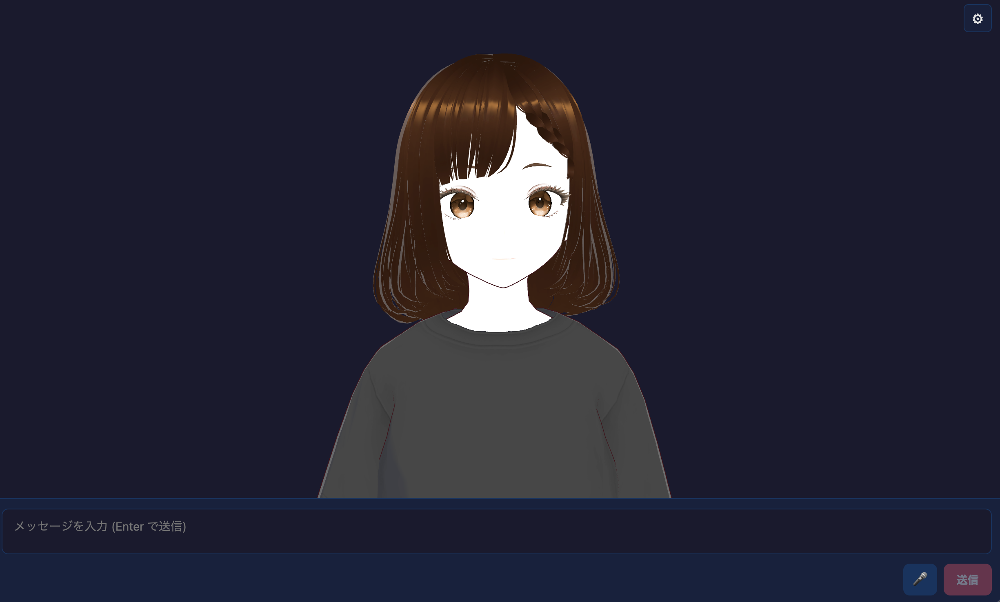

# VRM Chat



`@aituber-onair/core` を使った VRM アバターチャットアプリです。  
音声入力は Web Speech API、口パクは実際の音声出力音量を解析して
リアルタイムで動かします。

## このアプリでできること

- LLM プロバイダ切り替え:
  `openai`, `openai-compatible`, `openrouter`, `gemini`, `claude`,
  `zai`, `kimi`
- `openrouter` では Settings から現在使える `:free` モデルを取得可能:
  - `Fetch free models` で候補を疎通確認し、通ったモデルを一覧に追加
  - `Max candidates` は「疎通確認する `:free` 候補の最大件数」
    （「N件見つかるまで試行」ではありません）
- TTS エンジン切り替え:
  `openai`, `voicevox`, `voicepeak`, `aivisSpeech`, `aivisCloud`,
  `minimax`, `none`
- スピーカー一覧の動的取得と選択:
  - `voicevox` / `aivisSpeech`: `/speakers` から取得
  - `minimax`: API キー入力後に `query/tts_speakers` から取得
- Aivis Cloud は CORS 回避のため固定プリセット選択:
  - `コハク`（`22e8ed77-94fe-4ef2-871f-a86f94e9a579`）
  - `まお`（`a59cb814-0083-4369-8542-f51a29e72af7`）
- VRM アバター（`miko.vrm`）の表示と、任意の VRMA 待機モーション再生
- VRM 表情（`Aa`）へのリアルタイム口パク反映
- アバターステージのカメラ操作:
  ドラッグで回転 / ホイールでズーム / ダブルクリックでリセット
- Settings 画面から見た目を設定:
  - 背景画像アップロード（PNG/JPG、メモリ保持のみ）
  - 使用アバターパス表示（`/avatar/miko.vrm`）

## セットアップ

```bash
cd packages/core/examples/react-vrm-app
npm install
npm run dev
```

起動後に **Settings** を開き、API キーや各種設定を入力してください。  
設定値は `localStorage`（`react-vrm-app-settings`）に保存されます。

`openai-compatible` 利用時は以下を設定してください。
- `Endpoint URL`（必須。`/v1/chat/completions` まで含む URL）
- `Model`（必須。任意文字列）
- `API Key`（任意。空なら送信しません）

## 設定の保存仕様

- LLM/TTS/API キー設定は `localStorage` に保存されます
- OpenRouter の動的 free モデルキャッシュ
  （`models` / `fetchedAt` / `maxCandidates`）も同じキーに保存されます
- Visual の背景画像はメモリ保持のみで、リロード時に初期化されます

## アバターアセット（`public/avatar`）

`public/avatar/` に以下のファイルを配置してください。

| ファイル | 必須 | 説明 |
|---|---|---|
| `miko.vrm` | 必須 | ビューアーが読み込む VRM モデル |
| `idle_loop.vrma` | 任意 | 待機アニメーションクリップ（なくても動作可能） |

補足:
- `idle_loop.vrma` は `pixiv/ChatVRM` の資産を流用しています:
  https://github.com/pixiv/ChatVRM
- `miko.vrm` の詳細ドキュメント:
  https://miko.aituberonair.com/

`miko.vrm` が未配置または不正な場合、アバターステージに
ロードエラーを表示します。

## 口パクの調整パラメータ

`src/hooks/useAudioLipsync.ts` の先頭定数で調整できます。

| 定数 | デフォルト | 説明 |
|---|---|---|
| `SMOOTH_FACTOR` | `0.5` | 平滑化係数。大きいほどなめらか（0.0-1.0） |
| `RMS_CEILING` | `0.12` | RMS の正規化上限。小さいほど敏感に口が開く |
| `MOUTH_LEVELS` | `5` | VRM 表情ウェイトへマップする段階数 |

## Web Speech API について

- **Chrome / Edge** で動作（推奨: Chrome）
- Firefox, Safari は未対応
- 未対応ブラウザではマイクボタンが無効化
- HTTPS または localhost 環境が必要

## 技術スタック

- Vite + React + TypeScript
- `@aituber-onair/core`（LLM + TTS）
- `three`, `@pixiv/three-vrm`, `@pixiv/three-vrm-animation`
- Web Speech API（音声入力）
- Web Audio API + `AnalyserNode`（口パク解析）
