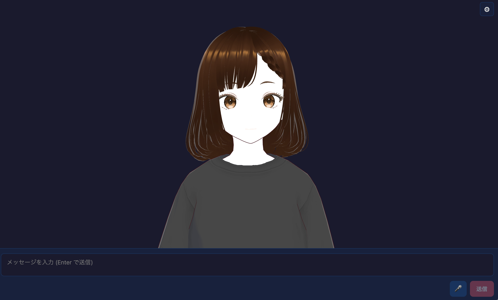

# VRM Chat

Web Speech API TTS ではブラウザ音声の選択と rate、pitch、volume、language
を設定できます。ブラウザが直接再生して音声バッファを取得できないため、
このエンジン選択時はリップシンク非対応です。



`@aituber-onair/core` を使った VRM アバターチャットアプリです。  
音声入力は Web Speech API、口パクは実際の音声出力音量を解析して
リアルタイムで動かします。

## このアプリでできること

- LLM プロバイダ切り替え:
  `openai`, `openai-compatible`, `openrouter`, `gemini`, `gemini-nano`,
  `claude`, `zai`, `kimi`, `xai`, `deepseek`, `mistral`,
  `sakana`（ブラウザ UI では disabled 表示）, `plamo`
- xAI Grok 4.5 の `reasoning_effort` は `low`、Grok 4.3 は低レイテンシ向けに `none` がデフォルトです
- モデル一覧は `@aituber-onair/core` の対応モデルから動的取得するため、
  Gemini 3.5 Flash や GPT-5.6 など chat 由来の新規モデルも Settings に
  自動反映されます
- Gemini 3.5 Flash はチャット用途向けに minimal thinking を自動適用します
- `gpt-5.5-pro` は OpenAI のドキュメント上でストリーミング非対応のため、
  ストリーミング前提の通常チャットフローを使うこの例では含めていません
- `openrouter` では Settings から現在使える `:free` モデルを取得可能:
  - `Fetch free models` で候補を疎通確認し、通ったモデルを一覧に追加
  - `Max candidates` は「疎通確認する `:free` 候補の最大件数」
    （「N件見つかるまで試行」ではありません）
- TTS エンジン切り替え:
  `openai`, `geminiTts`, `openaiCompatible`, `voicevox`, `voicepeak`,
  `aivisSpeech`, `aivisCloud`, `minimax`, `xai`, `unrealSpeech`,
  `elevenLabs`, `inworld`, `piperPlus`, `webSpeech`, `none`
- `geminiTts` は `gemini-3.1-flash-tts-preview` を既定利用し、30 種類の
  プリセットボイスとスタイル / audio-tag プロンプト入力に対応
- スピーカー一覧の動的取得と選択:
  - `voicevox` / `aivisSpeech`: `/speakers` から取得
  - `minimax`: API キー入力後に `query/tts_speakers` から取得
  - `elevenLabs`: API キー入力後に `/v2/voices` から取得
  - `inworld`: API キー入力後に `/voices/v1/voices` から取得
- Aivis Cloud は CORS 回避のため固定プリセット選択:
  - `コハク`（`22e8ed77-94fe-4ef2-871f-a86f94e9a579`）
  - `まお`（`a59cb814-0083-4369-8542-f51a29e72af7`）
- `piperPlus` は `public/piper/` 配下に browser assets を配置して利用します
- VRM アバター（`miko.vrm`）の表示と、任意の VRMA 待機モーション再生
- VRM 表情（`Aa`）へのリアルタイム口パク反映
- 応答の感情タグに応じた VRM 表情の適用
  （読み込んだ VRM にない表情は無視してフォールバック）
- 発話していない間に、控えめなランダム表情アイドルを自動再生
- アバターステージのカメラ操作:
  ドラッグで回転 / ホイールでズーム / ダブルクリックでリセット
- Settings 画面から見た目を設定:
  - 背景画像アップロード（PNG/JPG、メモリ保持のみ）
  - グリーンバック背景
  - アバター発話字幕だけを出すソロ配信表示
  - 使用アバターパス表示（`/avatar/miko.vrm`）
- YouTube Live / Twitch のライブチャットを取得し、`@aituber-onair/comment-intelligence` で分析して、選ばれたコメントだけを LLM パイプラインに流す
  - YouTube は YouTube Data API v3 を利用（Google Cloud の API キーが必要）
  - Twitch は EventSub WebSocket とブラウザ上での implicit OAuth フローを利用
- **Settings → Screen Vision** から OBS Virtual Camera の1フレームを取得し、
  Vision 対応モデルに送ってアバターがコメント
- `@aituber-onair/manneri` で会話の繰り返し傾向を検出し、次の応答前に
  内部的な話題転換指示を追加

## セットアップ

```bash
cd packages/core/examples/react-vrm-app
npm install
npm run dev
```

起動後に **Settings** を開き、API キーや各種設定を入力してください。  
設定値は `localStorage`（`react-vrm-app-settings`）に保存されます。
LLM セクションではシステムプロンプトも編集できます。入力欄からフォーカスが
外れた時に反映されます。表情連動を利用する場合は、初期値に含まれる emotion
tag の指示を残してください。

`openai-compatible` 利用時は以下を設定してください。
- `Endpoint URL`（必須。`/v1/chat/completions` まで含む URL）
- `Model`（必須。任意文字列）
- `API Key`（任意。空なら送信しません）

`gemini-nano` 利用時は以下を設定してください。
- Chrome 138+ で Built-in AI のフラグを有効化してください
- `#optimization-guide-on-device-model`
- `#prompt-api-for-gemini-nano`
- API Key は不要です

## Screen Vision

OBS Virtual Camera を開始し、**Settings → Screen Vision** で選択してから
**画面を見る** を押すと、現在のフレームを Vision 対応モデルに送信します。
30秒、1分、2分、5分ごとの自動送信も選択できます。

## 配信用表示

**Settings → Visual** から背景をグリーンバックに切り替え、表示モードを
ソロ配信にできます。ソロ配信では通常のチャットログを隠し、アバターの
最新発話だけを下部字幕として表示します。ユーザー入力欄は初期状態では
非表示ですが、同じ Visual 設定から表示できます。

## ライブコメント取得（YouTube Live / Twitch）

このサンプルでは YouTube Live / Twitch のライブチャットを分析してから、選ばれたコメントだけを LLM に流し込むことができます。
**Settings → Stream** から設定します。

同時に有効化できるのはどちらか一方だけです。

コメントインテリジェンスは初期状態で有効です。AIが処理中または発話中のコメントをまとめて、安全判定、優先度付け、未選択コメントの要約を行い、配信用コンテキストとしてAITuberへ渡します。Rules モードは追加の LLM 呼び出しなしで動作します。Hybrid / LLM-assisted モードでは、LLM 設定タブのプロバイダー、モデル、APIキー、エンドポイントをコメント分析にも利用し、使えない場合は rules にフォールバックします。

Manneri は初期状態で有効です。直近のユーザー/アシスタント発言を見て、
会話が似た流れに偏った場合、次の LLM リクエストへ非表示の話題転換指示を
追加します。類似度しきい値、直近メッセージ数、介入間隔、最小メッセージ長は
Settings → Stream から調整できます。

### YouTube Live

1. Google Cloud Console で **YouTube Data API v3** を有効化した API キーを作成します。
2. Settings → Stream で `YouTube` を選択し、API キーとライブ動画 ID（YouTube Live URL の `v=` パラメータ）を入力します。
3. 必要に応じてポーリング間隔（既定 20 秒）を調整し、トグルを有効化します。

### Twitch

このサンプルは Twitch のブラウザ implicit OAuth フロー（`response_type=token`、
スコープ `user:read:chat`）を使用します。アクセストークンはサーバを介さず、
ブラウザの `localStorage` にのみ保存されます。

1. [Twitch Developer Console](https://dev.twitch.tv/console/apps) でアプリケーションを登録し、Client ID をコピーします。
2. そのアプリケーションの OAuth Redirect URL に **`http://localhost:5173/`** を登録します（Settings → Stream → Twitch に表示されている URL を正確にコピーしてください。Vite 既定では `http://localhost:5173/`）。
3. Settings → Stream で `Twitch` を選択し、Client ID を貼り付けて **Connect to Twitch** を押し、OAuth 認可画面で承認します。
4. チャンネルの login 名（Twitch URL に含まれる小文字の名前）を入力し、dequeue 間隔を設定してトグルを有効化します。

**localhost 以外の環境にデプロイする場合:** `http://localhost:5173/` 以外のホスト
（例: `https://your-domain.example/`）で動かしたい場合は、その URL を Twitch
Developer Console に追加の OAuth Redirect URL として登録し、そのホスト上で
再度 OAuth フローを実行してください。Settings パネルに表示される Redirect URL は
`window.location` から自動計算され、開いているホストに追従します。

### 認証情報の保存に関する注意

このサンプルは開発者向けサンプルです。YouTube API キー、Twitch Client ID、
Twitch アクセストークンは **`localStorage` に平文で保存** されます（このサンプルが
既に扱っている他プロバイダの API キーと同じ扱いです）。このオリジン上で動く
スクリプトはこれらの値を読み取れます。本番権限のクレデンシャルを入れないこと、
共有オリジンや公開オリジンにこのサンプルをそのままデプロイしないこと、
共有環境で使ったブラウザではキーをローテーションすることを推奨します。

## Piper Plus のセットアップ

`piperPlus` は ONNX Runtime Web と OpenJTalk を使うブラウザ側の WASM
TTS です。runtime assets はサイズとサードパーティライセンスの都合で
この example には同梱していないため、`Piper Plus` を選ぶ前に
`public/piper/` を用意してください。

### 最短セットアップ（推奨）

`chrome-on-aituber` の release から配布済み assets を取得し、この
example に展開します。

```bash
cd packages/core/examples/react-vrm-app
curl -L -o piper-assets.tar.gz \
  https://github.com/shinshin86/chrome-on-aituber/releases/download/piper-assets-v1/piper-assets.tar.gz
mkdir -p public
tar -xzf piper-assets.tar.gz -C public/
rm piper-assets.tar.gz
npm run dev
```

これで約 85 MB の assets 一式が `public/piper/` に展開されます。
展開後、Settings で `Piper Plus` を選択してください。

### 既存 assets の再利用

すでに voice example 用に assets を用意済みなら、そのままコピーできます。

```bash
cd packages/core/examples/react-vrm-app
mkdir -p public
cp -R ../../../voice/examples/react-basic/public/piper public/
```

### 手動セットアップ

自分で assets を集める場合は、次の 3 ソースから必要ファイルを用意します。

1. [piper-plus](https://github.com/ayutaz/piper-plus)（`dev` branch）:
   `piper-global-loader.js`、`src/`、OpenJTalk WASM / 辞書、HTS voice
2. [onnxruntime-web](https://www.npmjs.com/package/onnxruntime-web):
   `ort.min.js`、`ort-wasm-simd.wasm`、`ort-wasm.wasm`
3. [piper-plus-tsukuyomi-chan](https://huggingface.co/ayousanz/piper-plus-tsukuyomi-chan):
   ONNX model、config JSON

これらを次の構成で `public/piper/` に配置してください。

```text
public/piper/
├── piper-global-loader.js
├── dist/
│   ├── ort.min.js
│   ├── ort-wasm-simd.wasm
│   ├── openjtalk.js
│   └── openjtalk.wasm
├── src/
├── assets/
│   ├── dict/
│   └── voice/
└── models/
    ├── tsukuyomi-wavlm-300epoch.onnx
    └── tsukuyomi-config.json
```

元のセットアップ script、より詳細な assets の出所、ライセンス注意点は
[`packages/voice/examples/react-basic/README.md`](../../../voice/examples/react-basic/README.md)
を参照してください。

## 設定の保存仕様

- LLM/TTS/API キー設定は `localStorage` に保存されます
- OpenRouter の動的 free モデルキャッシュ
  （`models` / `fetchedAt` / `maxCandidates`）も同じキーに保存されます
- Visual の背景画像はメモリ保持のみで、リロード時に初期化されます

## アバターアセット（`public/avatar`）

`public/avatar/` に以下のファイルを配置してください。

| ファイル | 必須 | 説明 |
|---|---|---|
| `miko.vrm` | 必須 | ビューアーが読み込む VRM モデル。このサンプル向けの任意表情プリセットを含みます |
| `idle_loop.vrma` | 任意 | 待機アニメーションクリップ（なくても動作可能） |

補足:
- `idle_loop.vrma` は `pixiv/ChatVRM` の資産を流用しています:
  https://github.com/pixiv/ChatVRM
- `miko.vrm` の詳細ドキュメント:
  https://miko.aituberonair.com/

`miko.vrm` が未配置または不正な場合、アバターステージに
ロードエラーを表示します。

同梱モデルには `happy`, `sad`, `surprised`, `mouthSmileLeft`,
`browInnerUp` などの任意表情が含まれています。別の VRM に差し替えた場合、
未対応の表情は無視し、利用可能な表情と口パクのみで動作します。

## 口パクの調整パラメータ

`src/hooks/useAudioLipsync.ts` の先頭定数で調整できます。

| 定数 | デフォルト | 説明 |
|---|---|---|
| `SMOOTH_FACTOR` | `0.5` | 平滑化係数。大きいほどなめらか（0.0-1.0） |
| `RMS_CEILING` | `0.12` | RMS の正規化上限。小さいほど敏感に口が開く |
| `MOUTH_LEVELS` | `5` | VRM 表情ウェイトへマップする段階数 |

## Web Speech API について

- **Chrome / Edge** で動作（推奨: Chrome）
- Firefox, Safari は未対応
- 未対応ブラウザではマイクボタンが無効化
- HTTPS または localhost 環境が必要

## 技術スタック

- Vite + React + TypeScript
- `@aituber-onair/core`（LLM + TTS）
- `three`, `@pixiv/three-vrm`, `@pixiv/three-vrm-animation`
- Web Speech API（音声入力）
- Web Audio API + `AnalyserNode`（口パク解析）

## 同梱ミコ素材の利用条件

デフォルトVRMモデルは、AITuber OnAir公式キャラクター「ミコ」の素材であり、
ソフトウェアのMIT License対象外です。作品・コンテンツの一部として一体で
再配布できますが、素材単体・素材集としての再配布は禁止されています。
正式版である日本語ガイドラインについては
[Miko Asset Terms](./MIKO_ASSET_TERMS.md)を参照してください。
