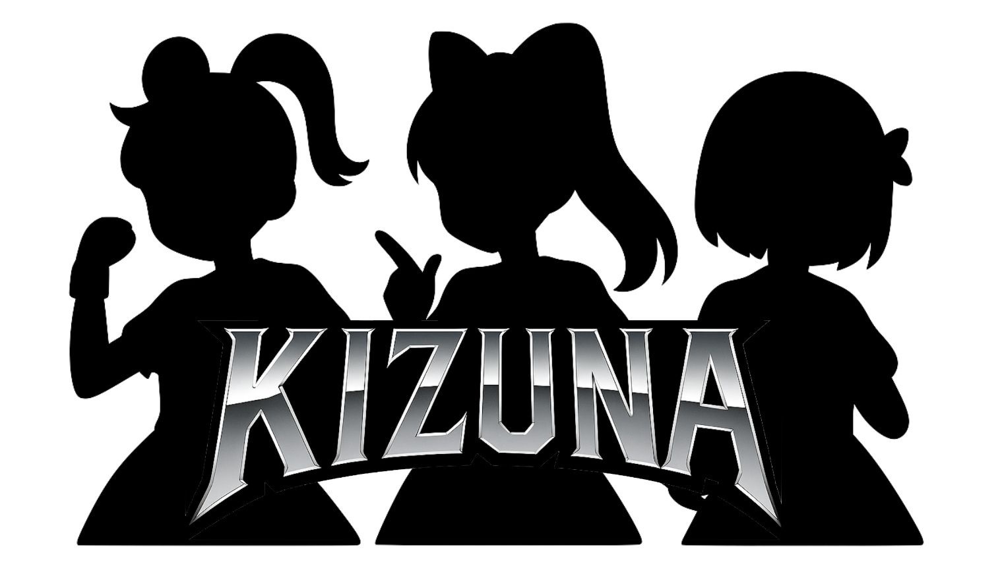

# @aituber-onair/kizuna



Kizuna turns repeated contact with an AI character into a bond the character
can actually respond to.

A first message starts at `stranger`. Continued contact can grow into
`acquaintance`, `regular`, and finally `companion`. Time apart lowers warmth
without erasing the history. A new contact warms the bond again. At every
step, `getBondContext()` converts that state into a short prompt for an LLM.

[日本語版 README](./README.ja.md)

## How it fits together

Kizuna sits between one LLM turn and the next. One message round-trip looks
like this:

```text
Viewer comment
      |
      v
chat package + LLM
  - The system prompt already includes the previous getBondContext().
  - The reply includes the character's reaction emotion.
      |
      | emotion
      v
Application
  - Calls kizuna.processInteraction({ emotion, ... }).
  - May override valence or severity with moderation results or app rules.
      |
      v
Kizuna
  - Deterministically updates bond score, warmth, and scars. No LLM runs here.
      |
      v
Updated getBondContext() -> next turn's system prompt -> changed attitude
```

The LLM is the **sensor** that reports how the character felt and the
**actuator** that changes behavior after reading the updated context. Kizuna is
the deterministic state machine between those two jobs. An LLM never chooses
the amount of a bond change. Keeping that calculation outside the LLM provides:

- Prompt-injection resistance: viewers cannot talk their intimacy score up.
- Reproducible, testable relationship changes.
- Zero additional LLM cost or latency for the bond calculation.

The classifier layer is pluggable. An app can provide `valence` and `severity`
overrides from a moderation API or its own rules. The
[`chat-bond-sample`](./examples/chat-bond-sample/) uses a small dictionary as a
no-LLM stand-in for exactly this input layer. In a real chat flow, the
character's reaction emotion is normally the valence signal.

## The bond story

With the default configuration, representative English context looks like
this:

```text
# First contact
Bond with Aki: stranger (level 1, 1 points). Trend: rising; current atmosphere: warm (warmth 1.00). Continuity: 1 buckets. Favorite emotions: curious. Respond in a way that fits this bond depth and atmosphere without inducing guilt.

# Continued contact
Bond with Aki: regular (level 3, 500 points). Trend: rising; current atmosphere: warm (warmth 1.00). Continuity: 12 buckets. Favorite emotions: happy, curious. Respond in a way that fits this bond depth and atmosphere without inducing guilt.

# After time apart
Bond with Aki: regular (level 3, 500 points). Trend: rising; current atmosphere: neutral (warmth 0.50). Continuity: 12 buckets. Favorite emotions: happy, curious. Respond in a way that fits this bond depth and atmosphere without inducing guilt.

# Contact resumes
Bond with Aki: regular (level 3, 501 points). Trend: rising; current atmosphere: warm (warmth 0.95). Continuity: 1 buckets. Favorite emotions: happy, curious. Respond in a way that fits this bond depth and atmosphere without inducing guilt.

# A lasting bond
Bond with Aki: companion (level 4, 1000 points). Trend: steady; current atmosphere: warm (warmth 1.00). Continuity: 20 buckets. Favorite emotions: happy, curious. Respond in a way that fits this bond depth and atmosphere without inducing guilt.
```

The signed bond score expresses slow-moving history. Warmth expresses the
current atmosphere. Continuity expresses repeated contact across days, weeks,
sessions, or custom buckets. These signals stay separate so an established
bond can cool, recover, or remember a serious violation without becoming a
first meeting again.

## How the relationship moves

The default `human` preset treats growth and deterioration as equally real
parts of a relationship. Applications can select `forgiving` for a
streamer-safe, faster-repairing model or `strict` for firmer boundaries.

| Contact | Bond score | Warmth and memory |
| --- | --- | --- |
| Kind contact | Grows slowly; repeated contact in one bucket has diminishing returns. | Recovers warmth, with a small bonus for continuity across buckets. |
| Light negative contact | Drops with a first-offense discount and a deeper-stage buffer. | Chills immediately, then repairs over several kind exchanges. |
| Grave violation | Drops sharply and bypasses the stage buffer. | Creates one scar per user and bucket; gifts cannot erase it. |
| Gift while warmth is low | Receives only part of its normal bond gain. | Cannot purchase immediate forgiveness. |
| Time apart | **Never lowers the bond score or stage.** | Warmth cools toward a floor and re-warms on reunion. |
| Sustained repair | Gradually restores the score and warmth. | Heals scars only after a configurable positive pattern across buckets. |
| Delayed contact | Its score effect is recorded with the original bucket's anti-farming rules. | Does not rewrite the current atmosphere, conflict history, or scar lifecycle. |

Negative emotion defaults such as `angry`, an explicit `valence`, or a
rule-provided valence can mark an interaction as negative. Use `severity:
'grave'` only for an application-confirmed integrity violation.

```typescript
config.dynamics = {
  preset: 'human', // 'human' | 'forgiving' | 'strict'
  negativityBias: 3,
  maxTrackedBuckets: 128, // bounded persisted anti-farming history
};

await kizuna.processInteraction({
  userId: 'person-42',
  kind: 'reaction',
  emotion: 'angry',
  valence: 'negative',
  severity: 'light',
  isOwner: false,
  timestamp: Date.now(),
});
```

### Design notes and ethical stance

The defaults are product heuristics grounded in relationship research, not a
claim that software can reproduce or diagnose human relationships:

- The default 3x negativity weight is informed by Baumeister et al.,
  [“Bad Is Stronger Than Good”](https://doi.org/10.1037/1089-2680.5.4.323),
  and trust asymmetry by Slovic,
  [“Perceived Risk, Trust, and Democracy”](https://doi.org/10.1111/j.1539-6924.1993.tb01329.x).
- The light/grave split and sustained repair follow the distinction between
  competence- and integrity-based trust violations studied by
  [Kim et al.](https://doi.org/10.1037/0021-9010.89.1.104).
- Per-bucket saturation is inspired by Zajonc's
  [mere-exposure work](https://doi.org/10.1037/h0025848); continuity rewards
  frequency rather than unlimited same-session intensity.
- A warmth floor and fast reunion are informed by Levin, Walter, and
  Murnighan's [dormant-ties research](https://doi.org/10.1287/orsc.1100.0576).
- Per-viewer tracking reflects evidence that parasocial connection and
  emotional attachment matter in virtual-streamer participation and support
  ([VTuber donation study](https://doi.org/10.1108/JRIM-11-2024-0512),
  [AI VTuber fandom study](https://arxiv.org/abs/2509.10427)).
- The CHI 2025
  [taxonomy of harmful AI-companion behavior](https://doi.org/10.1145/3706598.3713429)
  motivates a hard constraint: **absence never damages the bond score, Kizuna
  adds no guilt mechanics, and cooling is transparent and explainable.**

The popularized “Gottman 5:1” ratio is not used as a parameter or design
driver. The default is the documented `negativityBias: 3`, and applications
should tune it through scene tests rather than treating any social-science
ratio as a universal law.

## Features

- Generic interactions: `message`, `reaction`, `gift`, `presence`, `touch`,
  or your own string kind
- Stable roles: `owner` and `guest`
- Configurable points, rules, cooldowns, per-bucket limits, and thresholds
- Signed bond scores, stage hysteresis, fast warmth, scars, and continuity
- Structured snapshots plus English, Japanese, or custom LLM context
- A normalized `0..1` relationship value for downstream systems
- Optional persistence through browser storage or an injected adapter
- No runtime dependencies and no source-specific user ID parsing
- An injectable clock for deterministic tests and simulations

## Installation

```bash
npm install @aituber-onair/kizuna
```

## Quick start

```typescript
import {
  KizunaManager,
  createDefaultKizunaConfig,
} from '@aituber-onair/kizuna';

const config = createDefaultKizunaConfig();
const kizuna = new KizunaManager(config, undefined, 'my-character-bond');

await kizuna.processInteraction({
  userId: 'person-42',
  kind: 'message',
  message: 'Good morning!',
  emotion: 'curious',
  isOwner: false,
  timestamp: Date.now(),
  metadata: { displayName: 'Aki' },
});

const snapshot = kizuna.getBondSnapshot('person-42');
const context = kizuna.getBondContext('person-42');

console.log(snapshot?.stage); // stranger
console.log(context); // Bond with Aki: stranger ...

kizuna.destroy();
```

`processInteraction()` initializes the manager lazily. When using persistent
storage, call `await kizuna.initialize()` before reading state so saved data is
loaded first. A non-empty storage key is required even for an in-memory
manager.

Call `destroy()` during shutdown or unmount so the automatic cleanup timer and
event listeners are released.

## Configure the bond

Start from `createDefaultKizunaConfig()` so future optional fields receive safe
defaults, then override only what your character needs.

```typescript
const config = createDefaultKizunaConfig();

config.basePoints = {
  message: 10,
  reaction: 4,
  gift: 80,
  presence: 2,
  touch: 6,
};

config.stages = [
  { id: 'stranger', minPoints: 0 },
  { id: 'acquaintance', minPoints: 100 },
  { id: 'regular', minPoints: 500 },
  { id: 'companion', minPoints: 1_000 },
];

config.warmth = {
  halfLifeMs: 7 * 24 * 60 * 60 * 1_000,
  floor: 0.2,
};

config.continuity = {
  unit: 'day',
  grace: 1,
};

config.dynamics = {
  preset: 'human',
};
```

The highest stage threshold is also the normalization target used by
`toRelationshipCapital()`. The returned value is normalized points multiplied
by current warmth.

### Point rules

Rules add to the base points for an interaction kind. A cooldown limits time,
while `bucketLimit` limits applications within the configured continuity
bucket.

```typescript
config.rules = [
  {
    id: 'thoughtful-message',
    name: 'Thoughtful message',
    condition: (interaction) =>
      interaction.kind === 'message' &&
      (interaction.message?.length ?? 0) >= 80,
    points: 5,
    cooldown: 60_000,
    bucketLimit: 3,
    description: 'Recognizes a longer message without rewarding spam.',
  },
];
```

Rule points may also be a function of the interaction and current user. Rules
can provide `valence` and `severity`; explicit interaction values take
precedence. Invalid numbers are ignored. Bond scores are signed in motion but
floored at zero, while `stats.totalPointsEarned` counts positive gains only.

### Threshold actions and achievements

```typescript
config.thresholds = [
  {
    id: 'trusted-companion',
    points: 1_000,
    repeatable: false,
    action: {
      type: 'achievement',
      data: {
        id: 'trusted-companion',
        title: 'Trusted companion',
        description: 'Built a lasting bond.',
        icon: '✨',
      },
    },
  },
];
```

Use an explicit threshold `id` when possible. It keeps one-time threshold
tracking stable when display text changes.

### Session continuity

For experiences where a visit is the natural unit, use session buckets:

```typescript
config.continuity = { unit: 'session', grace: 0 };

const kizuna = new KizunaManager(config, undefined, 'session-bond');

await kizuna.beginSession('visit-1');
await kizuna.processInteraction({
  userId: 'person-42',
  kind: 'presence',
  isOwner: false,
  timestamp: Date.now(),
});
kizuna.endSession();
```

`unit` can be `day`, `week`, `session`, or a function that returns a safe
integer bucket index.

## Use the outputs

### Structured state

```typescript
const snapshot = kizuna.getBondSnapshot('person-42');

if (snapshot) {
  console.log(snapshot.stage);
  console.log(snapshot.points);
  console.log(snapshot.warmth);
  console.log(snapshot.continuity.streak);
  console.log(snapshot.favoriteEmotions);
  console.log(snapshot.achievements);
}
```

### LLM context

```typescript
const japaneseContext = kizuna.getBondContext('person-42', {
  language: 'ja',
  maxFavoriteEmotions: 2,
});
```

Custom templates can be supplied in `config.context.templates`. A template
receives the complete `BondSnapshot`.

### Relationship capital

```typescript
const relationshipCapital = kizuna.toRelationshipCapital('person-42');
```

This is useful when another system wants a single bounded value while Kizuna
retains the richer state.

## Integration patterns

### Update a Core system prompt

```typescript
await kizuna.processInteraction(interaction);

const bondContext = kizuna.getBondContext(interaction.userId);
core.updateChatOptions({
  systemPrompt: `${baseSystemPrompt}\n\nCurrent bond context:\n${bondContext}`,
});

await core.processChat(interaction.message ?? '');
```

The `react-pngtuber-app` Core example includes this integration and records
emotions from assistant response events, including negative relationship
changes.

### Control Noise relationship gates

```typescript
const result = await noise.contaminate({
  systemPrompt,
  messages,
  draft,
  relationshipCapital: kizuna.toRelationshipCapital(interaction.userId),
});
```

The Noise session example uses this bridge and keeps a manual override for
diagnostics.

### Map application events

Keep application-specific information in `metadata` and map it to generic
interaction kinds. For example, a chat line can become `message`, an emoji can
become `reaction`, and a gift can represent an item purchase or a super chat.
Kizuna does not parse or generate source-specific IDs.

## Persistence

Browser persistence uses `LocalStorageProvider`. Other runtimes can inject an
`ExternalStorageAdapter` into `ExternalStorageProvider`.

```typescript
import {
  KizunaManager,
  LocalStorageProvider,
  createDefaultKizunaConfig,
} from '@aituber-onair/kizuna';

const storage = new LocalStorageProvider();
const kizuna = new KizunaManager(
  createDefaultKizunaConfig(),
  storage,
  'character:bond:v1',
);

await kizuna.initialize();
```

Compression, encryption, adapter examples, persistence format, and security
limitations are documented in [Storage](./docs/storage.md).

## Events

```typescript
kizuna.on('points_updated', (event) => {
  console.log(event);
});

kizuna.on('achievement_earned', (event) => {
  console.log(event);
});
```

The manager currently emits `user_created`, `points_updated`, `level_up`,
`stage_down`, `scar_created`, `scar_healed`, `threshold_reached`,
`achievement_earned`, and `error`. `KizunaEventType` also retains
`user_updated` and `action_executed` for compatibility, but the manager does
not currently emit them. Listeners receive `KizunaEventData` with `type`,
`userId`, `data`, and `timestamp`.

## API reference

### `KizunaManager`

| Method | Purpose |
| --- | --- |
| `initialize()` | Load persisted state and start cleanup. |
| `processInteraction(interaction)` | Record contact, calculate points, update bond state, and persist it. |
| `getBondSnapshot(userId)` | Return structured bond state or `null`. |
| `getBondContext(userId, options?)` | Return prompt-ready context or an empty string. |
| `toRelationshipCapital(userId)` | Return a warmth-adjusted value from `0` to `1`. |
| `beginSession(id?)` / `endSession()` | Manage session continuity buckets. |
| `getUser(userId)` / `getAllUsers()` | Read user records. |
| `addPoints(userId, points)` | Apply a signed adjustment, floored at zero, to an existing user. |
| `calculateLevel(points)` | Resolve a level from the current configuration. |
| `getStats()` | Return aggregate counts and point totals. |
| `destroy()` | Stop cleanup and remove listeners. |

### Main types and helpers

- `Interaction`, `InteractionKind`, `InteractionValence`, `NegativeSeverity`,
  `UserRole`, `KizunaUser`, `PointRule`, `PointResult`, `Threshold`,
  `Achievement`
- `KizunaConfig`, `BondStage`, `WarmthConfig`, `ContinuityConfig`,
  `BondDynamicsConfig`, `BondDynamicsPreset`
- `BondSnapshot`, `BondContextOptions`, `BondContextTemplate`
- `createDefaultKizunaConfig()`, `DEFAULT_BOND_STAGES`
- `BondEvaluator`, `BondContextBuilder`, `PointCalculator`, `UserManager`
- `LocalStorageProvider`, `ExternalStorageProvider`,
  `createStorageProvider()`, `createDefaultStorageProvider()`
- `detectEnvironment()`, `isBrowser()`, `isNode()`

`PointContext` and `UserType` remain as deprecated aliases. New code should use
`Interaction` and `UserRole`.

## Migration to 0.0.3

Version 0.0.3 replaces source-specific interaction and user shapes with the
generic bond model.

```typescript
// Before
await kizuna.processInteraction({
  userId: 'person-42',
  platform: 'chat',
  message: 'Hello',
  isOwner: false,
  timestamp: Date.now(),
});

// 0.0.3
await kizuna.processInteraction({
  userId: 'person-42',
  kind: 'message',
  message: 'Hello',
  isOwner: false,
  timestamp: Date.now(),
  metadata: { source: 'chat' },
});
```

Configuration now uses `basePoints` and `rules` instead of `platforms` and
`customRules`. `KizunaUser.type` becomes `role`; message counters become
generic interaction and continuity statistics. `PointRule.dailyLimit` becomes
`bucketLimit`. The exported `ChatType` and `PlatformPointConfig` types were
removed; use `InteractionKind` and `KizunaConfig.basePoints`. The exported
`generateUserId()` and `parseUserId()` helpers were also removed because the
application now owns opaque user IDs and any source mapping.

Direct users of `UserManager` or `PointCalculator` should also review their
constructor and method changes in the changelog. `KizunaManager` remains the
recommended integration surface.

See [CHANGELOG.md](./CHANGELOG.md) for the complete breaking-change summary.

## Browser lab

From a repository checkout, run the interactive sample to explore growth,
conflict, repair, stages, warmth, scars, context output, and simulated time:

```bash
npm -w @aituber-onair/kizuna run example:kizuna-sample
```

## Development

```bash
npm -w @aituber-onair/kizuna run fmt
npm -w @aituber-onair/kizuna run lint
npm -w @aituber-onair/kizuna run test
npm -w @aituber-onair/kizuna run build
```

The test suite covers bond evaluation, point calculation, persistence,
environment detection, storage factories, output adapters, and manager
lifecycle behavior. It is not a guarantee that every integration or custom
configuration is covered.

## License

MIT
