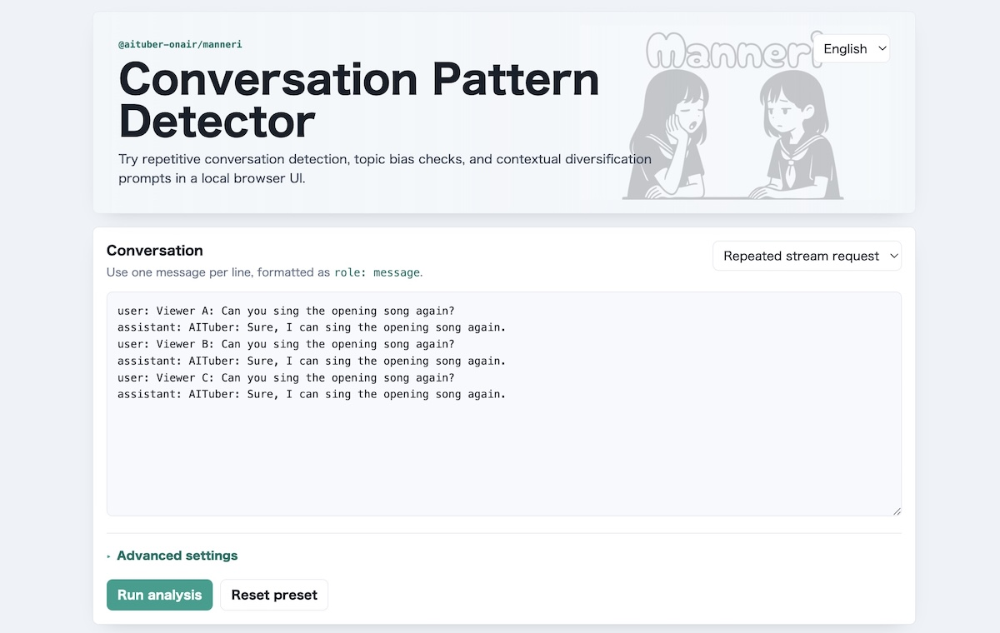

# Manneri Browser Basic Example

Browser example for trying `@aituber-onair/manneri` without connecting to an
LLM or `@aituber-onair/core`.



Run from the repository root:

```sh
npm -w @aituber-onair/manneri run example:browser-basic
```

Run from this example directory:

```sh
npm run dev
```

Open the shown local URL, choose a conversation preset or edit the conversation
log, then run analysis. The page shows:

- whether an intervention is triggered
- the suggested diversification prompt generated by the library
- human-readable labels for prompt type and intervention priority
- similarity, topic, and repeated pattern analysis results
- analyzer statistics from `getStatistics()`, with UI explanations

## What to check

Use the presets to confirm how the detector behaves in common AITuber stream
chat situations:

- repeated stream requests trigger a high-priority intervention suggestion
- balanced stream chat stays below the intervention threshold
- topic-biased chat surfaces recurring topics and repeated conversation flows

The UI uses `ManneriDetector` for the actual analysis. The example only
translates internal result values such as prompt type, priority, and detected
patterns into labels that are easier to understand in a browser sample.

Build from the repository root:

```sh
npm -w @aituber-onair/manneri run example:browser-basic:build
```

Build from this example directory:

```sh
npm run build
```
