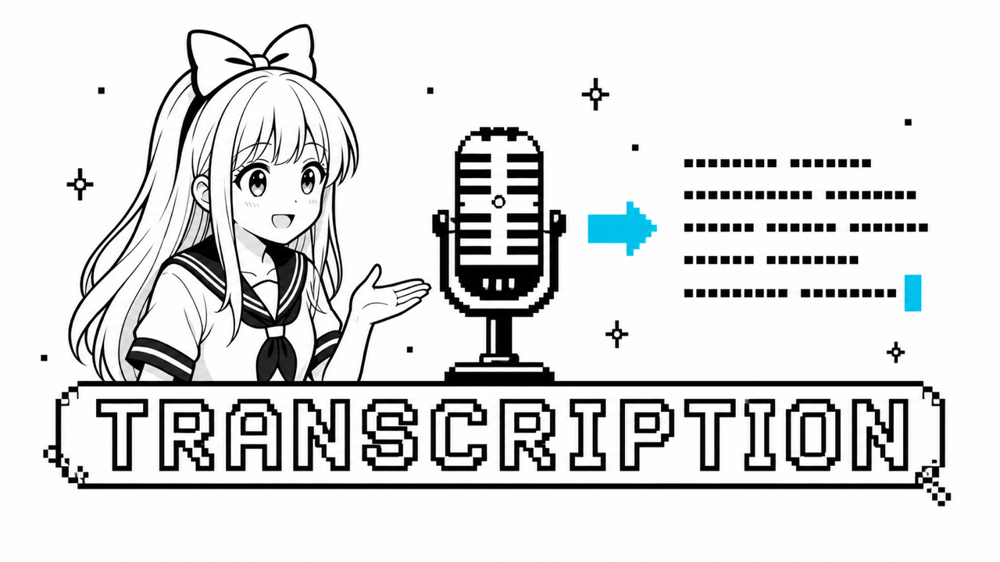

# @aituber-onair/transcription



[English](./README.md)

AITuber OnAir 向けの、プロバイダーに依存しないリアルタイムマイク文字起こしパッケージです。

> このパッケージは未リリースの検証版です。`private`、バージョン `0.0.0` で、
> npm では公開されていません。

初期実装では Web Speech と、ブラウザ WebRTC を利用する OpenAI Realtime の
文字起こしに対応しています。どちらのプロバイダーも、発話ごとに同じ形式の
スナップショットイベントを発行します。ファイルの文字起こし、サーバー WebSocket
入力、チャットへの自動送信、プロバイダーのフォールバックは、意図的に対象外と
しています。

## ブラウザサンプル

AITuber OnAir Core に依存せず、両方のプロバイダーを試せるフレームワーク非依存の
ブラウザサンプルが含まれています。

```sh
npm -w @aituber-onair/transcription run example:dev
```

表示された localhost の URL を開き、セッション開始時にマイクの使用を許可して
ください。Web Speech にキーは不要です。OpenAI を利用する場合は、エンドユーザー
自身が所有する API キーを画面に入力します。サンプルはセッション開始時にだけ入力値を
読み取り、保存しません。詳細は
[サンプルの README](./examples/browser-basic/README.md) を参照してください。

サーバーを起動せずにサンプルをビルドするには、次のコマンドを実行します。

```sh
npm -w @aituber-onair/transcription run example:build
```

## 使用方法

```ts
import { createRealtimeTranscriptionSession } from '@aituber-onair/transcription';

const session = createRealtimeTranscriptionSession({
  provider: 'web-speech',
  language: 'ja-JP',
});

session.onTranscript(({ utteranceId, text, isFinal }) => {
  console.log({ utteranceId, text, isFinal });
});

await session.start();
// Later:
await session.stop();
await session.dispose();
```

OpenAI Realtime は `gpt-live-transcribe`、ブラウザ WebRTC、サーバー VAD を
使用します。推奨する認証方式では、アプリケーションのバックエンドから短時間だけ
有効なクライアントシークレットを取得します。

```ts
const session = createRealtimeTranscriptionSession({
  provider: 'openai-realtime',
  auth: {
    type: 'client-secret',
    getClientSecret: async () => {
      const response = await fetch('/api/openai/realtime/client-secret', {
        method: 'POST',
      });
      const data = await response.json();
      return data.value;
    },
  },
  languages: ['ja', 'en'],
  keywords: ['AITuber OnAir'],
  prompt: 'An AITuber livestream.',
  delay: 'low',
});
```

フロントエンドのみで動作するセルフホスト型アプリケーションでは、エンドユーザーが
所有する標準 API キーを明示的に使用し、ブラウザ内でクライアントシークレットを
発行することもできます。

```ts
const session = createRealtimeTranscriptionSession({
  provider: 'openai-realtime',
  auth: {
    type: 'browser-api-key',
    getApiKey: async () => readEndUserKeyAtRuntime(),
    acknowledgeBrowserKeyRisk: true,
  },
  languages: ['ja'],
});
```

## セキュリティ

OpenAI は、標準 API キーをサーバーに保管し、有効期間の短いクライアント
シークレットを発行する方式を推奨しています。ブラウザ BYOK 方式は、信頼できる
フロントエンドのみのアプリケーションやセルフホスト環境向けです。この方式では、
エンドユーザー自身が所有・提供するキーを使用する必要があります。アプリケーション
所有者のキーを、ソースコードやビルド成果物に含めないでください。

このパッケージは `start()` のたびに `getApiKey()` を通じてキーを要求し、保存、
キャッシュ、返却、ログ出力は行いません。ただし、保存方法は利用側のアプリケーションが
管理します。ブラウザにキーを保存すると、XSS、拡張機能、ローカル端末へのアクセス、
侵害された依存パッケージなどを通じて漏洩する可能性があります。また、クライアント
シークレットの直接発行は、OpenAI エンドポイントの現在のブラウザ/CORS 動作にも
依存します。失敗した場合は型付きエラーを返し、別の認証方式へ自動的にフォールバック
することはありません。

## プロバイダーの違い

| 機能 | Web Speech | OpenAI Realtime |
| --- | --- | --- |
| 途中経過のスナップショット | 対応 | 対応 |
| 複数の想定言語 | 非対応 | 対応 |
| キーワードと文脈プロンプト | 非対応 | 対応 |
| 遅延の設定 | 非対応 | 対応 |
| 発話境界の判定 | ブラウザ実装 | サーバー VAD |

どちらのプロバイダーにも、対応ブラウザとマイクの使用許可が必要です。OpenAI
WebRTC では、HTTPS または localhost も必要です。Web Speech の利用可否と動作は
ブラウザによって異なります。無音中でも待機によって OpenAI の利用料金が発生する
可能性があるため、アプリケーションでは状態を明確に表示し、未使用時にはセッションを
停止してください。
